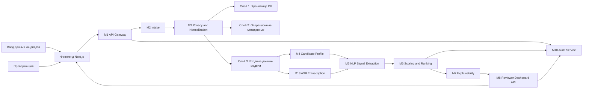

# Система отбора кандидатов inVision U

Платформа поддержки принятия решений с использованием ИИ для процесса поступления в inVision U.
Система принимает заявки кандидатов, отделяет чувствительные данные, извлекает структурированные сигналы, рассчитывает интерпретируемые оценки и формирует результаты ранжирования для проверяющих.

## Основные принципы

- Конфиденциальность, заложенная в архитектуру: персонально идентифицирующая информация (PII) отделяется до того, как данные кандидата попадут в модули ИИ или скоринга.
- Объяснимость прежде всего: каждая рекомендация должна быть прослеживаема до сигналов и подтверждающих данных.
- Человек в контуре принятия решения: система помогает проверяющим, а не заменяет окончательное человеческое суждение.
- Модульная архитектура: каждый этап конвейера изолирован как отдельный сервисный модуль.

## Обзор архитектуры

## Текущий фокус репозитория

- `backend/` содержит бэкенд на FastAPI, логику скоринга, слой конфиденциальности, сборку профиля и модели хранения.
- `frontend/` это планируемое рабочее пространство панели для загрузки данных, ранжирования и сценариев просмотра деталей кандидатуры.
- `docs/ARCHITECTURE.md` содержит полное описание архитектуры и ответственности модулей.
- `docs/API.md` описывает текущие и планируемые API-интерфейсы.

## Ключевые модули бэкенда

- `M1 Gateway`: точка входа для запросов и оркестрация конвейера.
- `M2 Intake`: валидация входящих данных кандидата и создание записи.
- `M3 Privacy`: трёхслойное разделение данных и маскирование чувствительной информации.
- `M4 Profile`: сборка единого профиля кандидата.
- `M5 NLP`: контракт извлечения сигналов и эвристический сценарий извлечения.
- `M6 Scoring`: скоринг кандидатов на основе правил и с поддержкой ML.
- `M7 Explainability`: передача объяснений и слой обоснований для проверяющих.
- `M8 Dashboard API`: эндпоинты ранжирования, шорт-листа и деталей кандидата.
- `M10 Audit`: поддержка контроля, управления и прослеживаемости.

## Минимально рабочий элемент

В репозитории уже есть минимально рабочий элемент бэкенд-скоринга для этапа 1:

- основной эндпоинт скоринга сигналов: `POST /api/v1/pipeline/score-signals`
- эндпоинт приёма данных: `POST /api/v1/candidates/intake`
- движок скоринга и тесты синтетической оценки в `backend/tests/m6_scoring/`

## Документация

- Архитектура: [docs/ARCHITECTURE.md](docs/ARCHITECTURE.md)
- Справочник API: [docs/API.md](docs/API.md)
