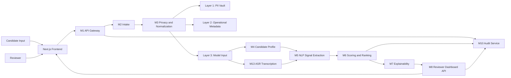

# inVision U Candidate Selection System

AI-assisted decision-support platform for the inVision U admissions process.
The system ingests candidate applications, isolates sensitive data, extracts structured signals, computes explainable scores, and prepares reviewer-facing ranking outputs.

## Core Principles

- Privacy by design: PII is separated before AI or scoring modules see candidate data.
- Explainability first: every recommendation should be traceable to signals and evidence.
- Human in the loop: the system supports reviewers and does not replace final human judgment.
- Modular architecture: each stage of the pipeline is isolated as a dedicated service module.

## Architecture Overview

## Current Repository Focus

- `backend/` contains the FastAPI backend, scoring logic, privacy layer, profile assembly, and storage models.
- `frontend/` is the planned dashboard workspace for upload, ranking, and reviewer detail flows.
- `docs/ARCHITECTURE.md` contains the full architecture definition and module responsibilities.
- `docs/API.md` describes the current and planned API surface.

## Key Backend Modules

- `M1 Gateway`: request entry point and pipeline orchestration.
- `M2 Intake`: candidate intake validation and record creation.
- `M3 Privacy`: three-layer data separation and redaction.
- `M4 Profile`: unified candidate profile assembly.
- `M5 NLP`: signal extraction contract and heuristic extraction path.
- `M6 Scoring`: rule-based and ML-assisted candidate scoring.
- `M7 Explainability`: explanation handoff and reviewer-facing reasoning layer.
- `M8 Dashboard API`: ranking, shortlist, and candidate detail endpoints.
- `M10 Audit`: governance and traceability support.

## Minimal Working Element

The repository already includes a minimally working backend scoring element for Stage 1:

- canonical signal scoring endpoint: `POST /api/v1/pipeline/score-signals`
- intake endpoint: `POST /api/v1/candidates/intake`
- scoring engine and synthetic evaluation tests under `backend/tests/m6_scoring/`

## Documentation

- Architecture: [docs/ARCHITECTURE.md](docs/ARCHITECTURE.md)
- API reference: [docs/API.md](docs/API.md)
