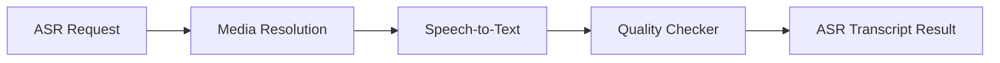

# ASR Stage

---

## Purpose

The `ASR` stage transcribes candidate interview media and produces transcript-quality signals for downstream privacy, scoring, and explanation workflows. It is responsible for audio-first processing and does not analyze visual candidate attributes.

## Module Flow

The stage:

1. resolves safe media input;
2. transcribes interview audio through the configured ASR provider;
3. normalizes transcript segments;
4. computes quality flags and human-review markers;
5. returns a structured transcript result.

### Diagram 1. ASR Flow

## Responsibilities

- resolve public media sources
- transcribe candidate media
- normalize transcript segments
- compute confidence and quality signals
- expose transcript output for downstream stages

## File Responsibilities

| File | Responsibility |
|---|---|
| `schemas.py` | ASR request and output models |
| `downloader.py` | safe media resolution and retrieval |
| `transcriber.py` | speech-to-text integration |
| `quality_checker.py` | confidence and transcript quality logic |
| `service.py` | end-to-end ASR orchestration |

## Public Stage Mapping

Internal package: `asr`  
Public stage name: `ASR`
