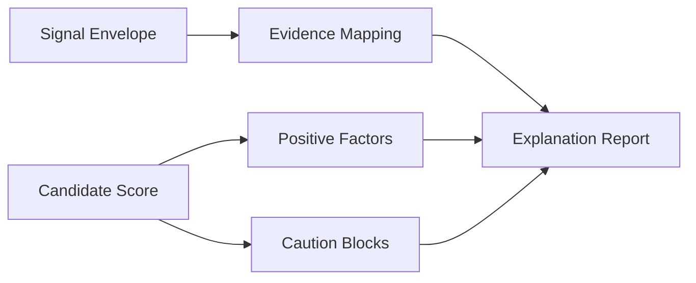

# Explanation Stage

---

## Purpose

The `Explanation` stage converts scoring output into reviewer-facing explanation content. It formats evidence, strengths, cautions, and reviewer guidance without recalculating the candidate score.

## Module Flow

The stage:

1. receives the signal envelope and candidate score;
2. maps score contributions into positive factors;
3. maps caution and review-routing signals into caution blocks;
4. attaches evidence snippets to factor blocks;
5. returns a reviewer-facing explanation report.

### Diagram 1. Explanation Flow

## Responsibilities

- produce concise candidate conclusions
- convert score drivers into readable factor blocks
- attach evidence and caution markers
- prepare explanation output for localized frontend rendering

## File Responsibilities

| File | Responsibility |
|---|---|
| `schemas.py` | explanation input and output contracts |
| `factors.py` | factor titles, factor summaries, caution policy |
| `evidence.py` | factor-to-evidence mapping and evidence selection |
| `service.py` | report construction from extraction and scoring output |

## Public Stage Mapping

Internal package: `explanation`  
Public stage name: `Explanation`
