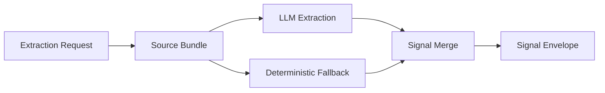

# Extraction Stage

---

## Purpose

The `Extraction` stage converts safe candidate material into the structured signal envelope consumed by scoring and explanation.

## Module Flow

The stage:

1. normalizes safe text inputs into a reusable source bundle;
2. assembles transcript, essay, and safe answer evidence;
3. runs grouped LLM extraction with the configured model path;
4. falls back to deterministic extraction when needed;
5. merges all signals into one canonical envelope.

### Diagram 1. Extraction Flow

## Responsibilities

- build reusable source bundles
- extract structured signals from safe content
- support deterministic fallback extraction
- provide the canonical signal envelope
- host the supplementary `AI Detect` helpers

## File Responsibilities

| File | Responsibility |
|---|---|
| `schemas.py` | request validation and safe input constraints |
| `source_bundle.py` | normalized source assembly |
| `groq_llm_client.py` | primary LLM integration |
| `extractor.py` | deterministic fallback extraction |
| `signal_extraction_service.py` | extraction orchestration |
| `embeddings.py` | similarity and consistency helpers |
| `ai_detector.py` | advisory authenticity and AI-risk heuristics |

## Public Stage Mapping

Internal package: `extraction`  
Public stage name: `Extraction`  
Supplementary sub-stage: `AI Detect`
