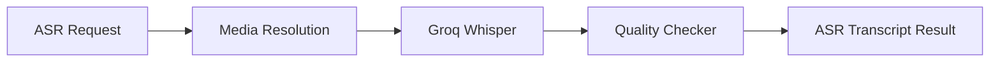

# M13 ASR Module

---

## Document Structure

- [Purpose](#purpose)
- [Module Flow](#module-flow)
- [Input Contract](#input-contract)
- [Output Contract](#output-contract)
- [File Responsibilities](#file-responsibilities)

---

## Purpose

`M13` transcribes interview media and produces transcript-quality signals for downstream privacy and scoring workflows. It is responsible for audio-first processing and does not analyze visual candidate attributes.

---

## Module Flow

The module:

1. resolves safe media input;
2. transcribes interview audio through Groq Whisper;
3. normalizes transcript segments;
4. computes quality flags and human-review markers;
5. returns a structured transcript result.

### Diagram 1. M13 ASR Flow

---

## Input Contract

`M13` consumes an ASR request with:

- candidate id
- media path or video URL
- selected program
- language hint

---

## Output Contract

`M13` emits:

- transcript text
- segment list
- confidence values
- detected languages
- duration
- quality flags
- `requires_human_review`

---

## File Responsibilities

| File | Responsibility |
|---|---|
| `schemas.py` | ASR request and output models |
| `downloader.py` | safe media resolution and retrieval |
| `transcriber.py` | Groq Whisper API integration |
| `quality_checker.py` | confidence and transcript quality logic |
| `service.py` | end-to-end ASR orchestration |

---

Projet Documentation
