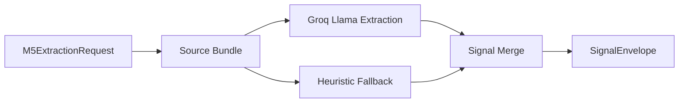

# M5 NLP Module

---

## Document Structure

- [Purpose](#purpose)
- [Module Flow](#module-flow)
- [Input Contract](#input-contract)
- [Output Contract](#output-contract)
- [File Responsibilities](#file-responsibilities)

---

## Purpose

`M5` extracts structured decision signals from safe candidate content. It operates only on Layer 3 model input and produces the canonical `SignalEnvelope` consumed by `M6`.

---

## Module Flow

The module:

1. normalizes safe text inputs into a reusable source bundle;
2. optionally transcribes interview media through the supported fallback ASR path;
3. runs grouped Groq extraction with the configured Llama model;
4. falls back to deterministic heuristic extraction when needed;
5. merges signals into a single canonical envelope with value, confidence, source, evidence, and reasoning.

### Diagram 1. M5 Signal Extraction Flow

---

## Input Contract

`M5` consumes `M5ExtractionRequest` with:

- candidate id
- selected program
- essay text
- transcript text or interview media path
- project descriptions
- internal test answers
- experience summary
- completeness
- data flags

---

## Output Contract

`M5` emits a canonical `SignalEnvelope` with:

- `candidate_id`
- `signal_schema_version`
- `m5_model_version`
- `selected_program`
- `program_id`
- `completeness`
- `data_flags`
- `signals`

Each signal contains:

- `value`
- `confidence`
- `source`
- `evidence`
- `reasoning`

---

## File Responsibilities

| File | Responsibility |
|---|---|
| `schemas.py` | request validation and safe input constraints |
| `client.py` | safe local-media transcription fallback client |
| `groq_llm_client.py` | primary Groq-based grouped extraction client |
| `llm_shared.py` | shared LLM request/response helpers |
| `source_bundle.py` | normalized source assembly and shared helpers |
| `extractor.py` | deterministic heuristic signal extraction |
| `signal_extraction_service.py` | grouped extraction orchestration and merge logic |
| `embeddings.py` | local embedding and similarity helpers |
| `ai_detector.py` | advisory authenticity and consistency heuristics |

---

Projet Documentation
