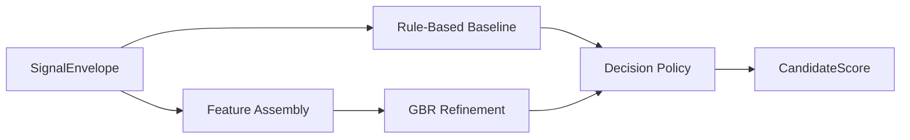

# M6 Scoring Module

---

## Document Structure

- [Purpose](#purpose)
- [Decision Flow](#decision-flow)
- [Input Contract](#input-contract)
- [Output Contract](#output-contract)
- [Scoring Formula](#scoring-formula)
- [What Program Fit Means](#what-program-fit-means)
- [Why the Weights Matter](#why-the-weights-matter)
- [File Responsibilities](#file-responsibilities)

---

## Purpose

`M6` converts structured NLP signals into auditable scoring and routing output for reviewer decision support. It does not make a final admissions decision on its own.

---

## Decision Flow

The module:

1. computes deterministic sub-scores from structured signals;
2. builds a rule-based baseline score;
3. refines the baseline with `GradientBoostingRegressor`;
4. applies calibrated decision policy and routing rules;
5. emits recommendation categories and review-routing output;
6. prepares explainability-ready fields for `M7`.

### Diagram 1. M6 Internal Decision Flow



---

## Input Contract

`M6` consumes a canonical `SignalEnvelope` containing:

- safe candidate metadata
- selected program and canonical program id
- completeness and data flags
- normalized structured signals with evidence

---

## Output Contract

`M6` emits `CandidateScore` with:

- `sub_scores`
- `review_priority_index`
- `recommendation_status`
- `manual_review_required`
- `human_in_loop_required`
- `uncertainty_flag`
- `score_breakdown`
- `top_strengths`
- `top_risks`
- `decision_summary`

Primary recommendation categories:

- `STRONG_RECOMMEND`
- `RECOMMEND`
- `WAITLIST`
- `DECLINED`

---

## Scoring Formula

The baseline score is computed from weighted sub-scores:

```text
baseline_rpi =
  w1 * leadership_potential +
  w2 * growth_trajectory +
  w3 * motivation_clarity +
  w4 * initiative_agency +
  w5 * learning_agility +
  w6 * communication_clarity +
  w7 * ethical_reasoning +
  w8 * program_fit
```

Weights and routing thresholds are configured in:

- `m6_scoring_config.yaml`

---

## What Program Fit Means

`program_fit` measures how strongly the candidate's stated goals, interests, project examples, and direction align with the selected academic track. It does not describe personality fit, social fit, or demographic fit.

At runtime, `M6` currently derives `program_fit` from the upstream `program_alignment` signal generated in `M5`.

---

## Why the Weights Matter

The weights are the policy layer that decides which dimensions should matter most when candidate evidence is mixed. The default profile intentionally prioritizes:

- leadership potential;
- growth trajectory;
- motivation clarity;
- initiative and learning ability.

This avoids over-rewarding candidates only for polished communication or keyword-heavy program language. Program-aware profiles then adjust those weights per track so that, for example, media programs emphasize communication more strongly, while governance programs emphasize ethical reasoning more strongly.

---

## File Responsibilities

| File | Responsibility |
|---|---|
| `m6_scoring_config.yaml` | weights, thresholds, program profiles, and routing rules |
| `m6_scoring_config.py` | typed config loader |
| `program_policy.py` | canonical program normalization and weight profile lookup |
| `rules.py` | deterministic baseline scoring |
| `confidence.py` | confidence and uncertainty logic |
| `decision_policy.py` | final decision routing |
| `ml_model.py` | `GradientBoostingRegressor` refinement layer |
| `service.py` | scoring orchestration |
| `evaluation.py` | synthetic evaluation helpers |
| `optimization.py` | threshold and policy search |
| `synthetic_data.py` | fixtures and synthetic labeled samples |
| `ranker.py` | batch ranking |

---

Projet Documentation
