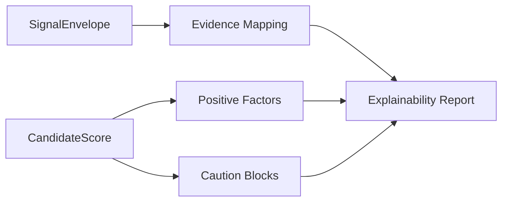

# M7 Explainability Module

---

## Document Structure

- [Purpose](#purpose)
- [Module Flow](#module-flow)
- [Input Contract](#input-contract)
- [Output Contract](#output-contract)
- [File Responsibilities](#file-responsibilities)

---

## Purpose

`M7` converts `M6` scoring output into reviewer-facing explanation content. It formats evidence, strengths, cautions, and reviewer guidance without recalculating the score.

---

## Module Flow

The module:

1. receives `SignalEnvelope + CandidateScore`;
2. maps score contributions into positive factors;
3. maps review-routing and caution flags into caution blocks;
4. attaches evidence snippets to factor blocks;
5. returns a reviewer-facing explainability report.

### Diagram 1. M7 Explainability Flow

---

## Input Contract

`M7` receives:

- `SignalEnvelope` from `M5`
- `CandidateScore` from `M6`

The module uses only structured evidence and score metadata. It does not invent evidence and does not use raw PII.

---

## Output Contract

`M7` emits:

- summary
- positive factors
- caution blocks
- evidence items
- reviewer guidance

---

## File Responsibilities

| File | Responsibility |
|---|---|
| `schemas.py` | explainability input and output contracts |
| `factors.py` | factor titles, factor summaries, caution policy |
| `evidence.py` | factor-to-evidence mapping and evidence selection |
| `service.py` | report construction from `M5 + M6` |

---

Projet Documentation
