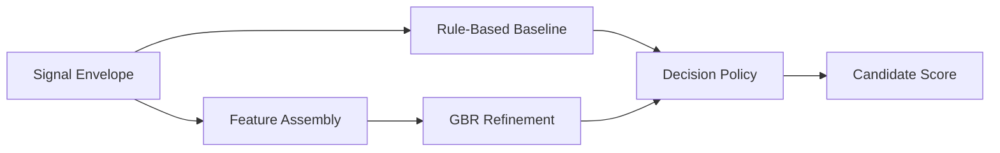

# Scoring Stage

---

## Purpose

The `Scoring` stage converts structured extraction signals into auditable candidate evaluation, ranking, and review-routing output. It does not make a final admissions decision on its own.

## Decision Flow

The stage:

1. computes deterministic dimension scores from structured signals;
2. builds a rule-based baseline score;
3. refines the baseline with `GradientBoostingRegressor`;
4. applies calibrated decision policy and routing rules;
5. emits recommendation categories and review-routing output;
6. prepares explanation-ready fields for the explanation stage.

### Diagram 1. Scoring Flow

## Responsibilities

- compute weighted dimension scores
- apply rule-based and ML refinement layers
- calculate confidence and uncertainty signals
- apply program-aware decision policies
- prepare ranking and review-routing output

## File Responsibilities

| File | Responsibility |
|---|---|
| `scoring_config.yaml` | weights, thresholds, program profiles, routing rules |
| `rules.py` | deterministic baseline scoring |
| `confidence.py` | confidence and uncertainty logic |
| `decision_policy.py` | recommendation and routing policy |
| `ml_model.py` | `GradientBoostingRegressor` refinement layer |
| `service.py` | scoring orchestration |
| `ranker.py` | batch ranking |

## Public Stage Mapping

Internal package: `scoring`  
Public stage name: `Scoring`
