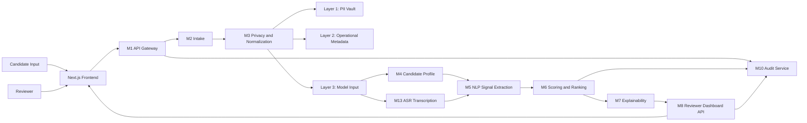
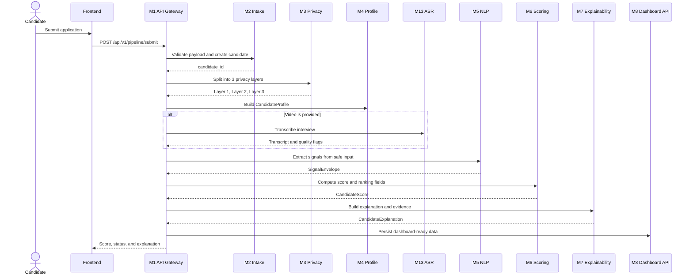
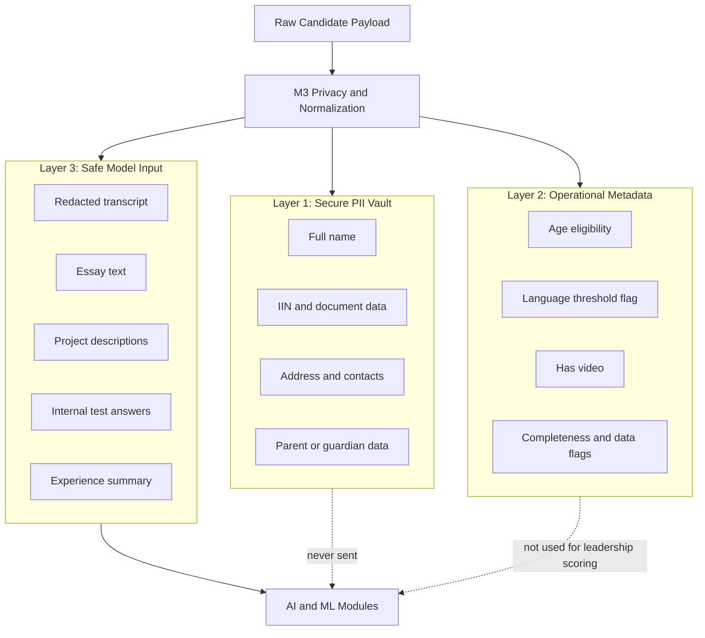
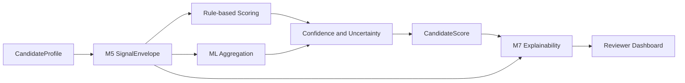
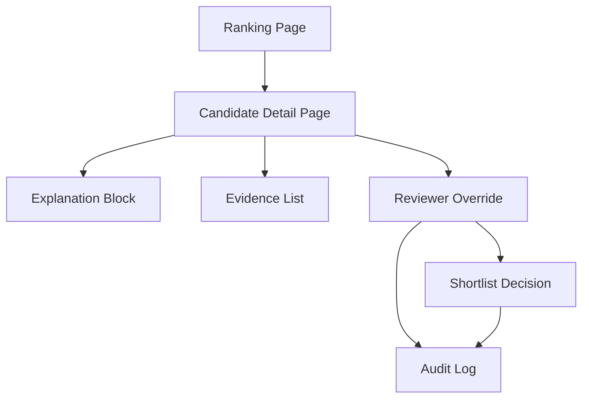
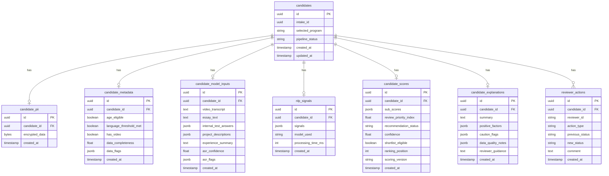

# inVision U Architecture Diagrams

These diagrams are derived from [ARCHITECTURE.md](./ARCHITECTURE.md).

They describe the intended system architecture and the expected product flow.
Use them as a visual companion to the detailed architecture document.

GitHub supports Mermaid diagrams directly in Markdown, so this file should render in the repository UI without extra tooling.

## 1. System Overview

## 2. Candidate Submission Pipeline

## 3. Privacy-by-Design Model

## 4. Scoring and Explainability Flow

## 5. Reviewer Workflow

## 6. Core Data Model

## Usage Notes

- Prefer linking this file from the repository root `README.md`.
- Keep `ARCHITECTURE.md` as the source of truth and update diagrams when module responsibilities change.
- If a diagram stops rendering on GitHub, it usually means Mermaid syntax needs a small cleanup rather than a platform issue.
