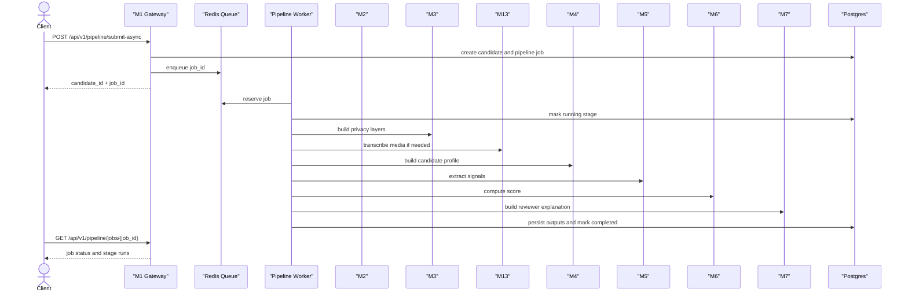
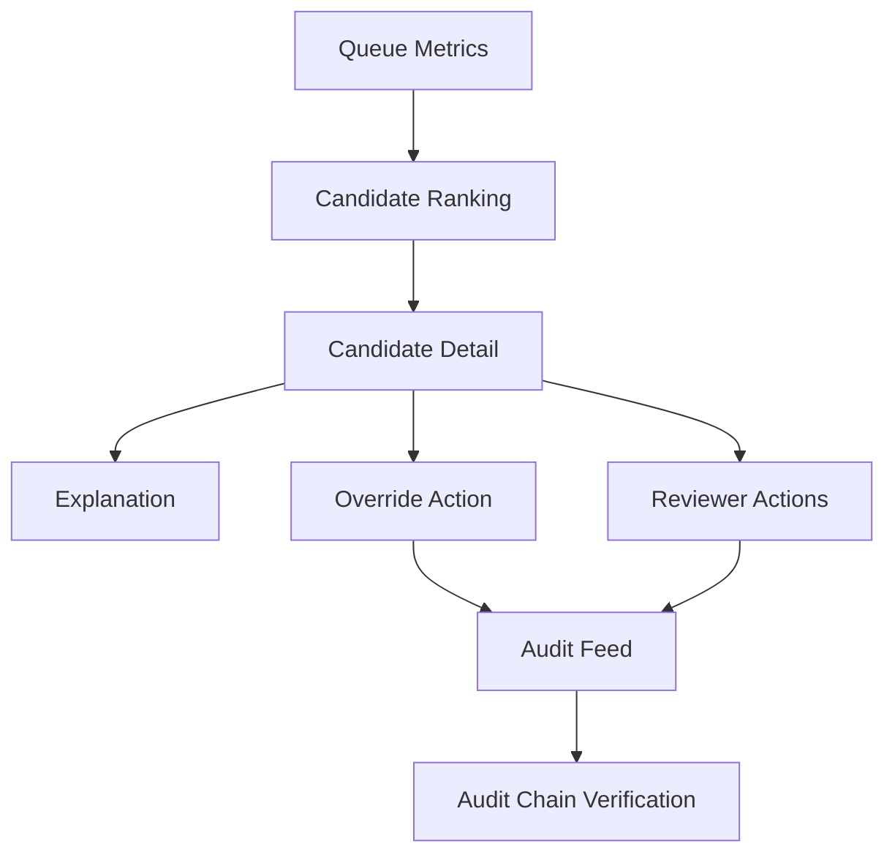

# API Reference

---

## Document Structure

- [Overview](#overview)
- [Response Envelope](#response-envelope)
- [System Endpoints](#system-endpoints)
- [Demo Endpoints](#demo-endpoints)
- [Candidate Intake Endpoints](#candidate-intake-endpoints)
- [Asynchronous Pipeline Endpoints](#asynchronous-pipeline-endpoints)
- [Diagram 1. Asynchronous Pipeline Flow](#diagram-1-asynchronous-pipeline-flow)
- [Direct Scoring Endpoints](#direct-scoring-endpoints)
- [Reviewer and Audit Endpoints](#reviewer-and-audit-endpoints)
- [Diagram 2. Reviewer Surface](#diagram-2-reviewer-surface)
- [Canonical Contracts](#canonical-contracts)

---

## Overview

This document describes the endpoints implemented in the current branch.
The public processing path is asynchronous: the API accepts a candidate payload, creates a persistent job, and returns `candidate_id` plus `job_id` immediately.

Base URL:

`http://localhost:8000`

---

## Response Envelope

Successful response:

```json
{
  "success": true,
  "data": {},
  "error": null,
  "meta": {
    "timestamp": "2026-03-30T10:00:00Z",
    "version": "1.0.0"
  }
}
```

Error response:

```json
{
  "success": false,
  "data": null,
  "error": {
    "code": "VALIDATION_ERROR",
    "message": "Invalid payload",
    "details": {}
  },
  "meta": {
    "timestamp": "2026-03-30T10:00:00Z",
    "version": "1.0.0"
  }
}
```

The same envelope is used for validation errors, authentication failures, not-found responses, and operational failures.

---

## System Endpoints

### `GET /`

Returns application metadata.

### `GET /health`

Returns a lightweight health response.

---

## Demo Endpoints

### `GET /api/v1/demo/candidates`

Lists all available demo fixtures with lightweight metadata.

### `GET /api/v1/demo/candidates/{slug}`

Returns one demo fixture with the full candidate payload.

### `POST /api/v1/demo/candidates/{slug}/run`

Queues the selected fixture through the same asynchronous pipeline used for real submissions.

Example response:

```json
{
  "candidate_id": "c0e5ce38-6b8b-4f51-a16d-3d5e35501d9b",
  "job_id": "57a558a0-23ba-4311-a4ce-91b812a31c9a",
  "pipeline_status": "queued",
  "job_status": "queued",
  "current_stage": "privacy",
  "message": "Pipeline job accepted and queued."
}
```

---

## Candidate Intake Endpoints

### `POST /api/v1/candidates/intake`

Validates a candidate submission, creates the candidate record, stores protected personal data, stores operational metadata, and returns `candidate_id`.

Example request:

```json
{
  "personal": {
    "first_name": "Aida",
    "last_name": "Example",
    "date_of_birth": "2007-06-15"
  },
  "academic": {
    "selected_program": "Digital Media and Marketing"
  },
  "content": {
    "essay_text": "I want to build media products that help communities.",
    "video_url": "https://example.com/interview.mp4"
  },
  "internal_test": {
    "answers": [
      {
        "question_id": "q1",
        "answer": "I would choose the fair option because responsibility matters."
      }
    ]
  }
}
```

---

## Asynchronous Pipeline Endpoints

### `POST /api/v1/pipeline/submit-async`

Accepts one candidate payload, creates a persistent job, and returns immediately.

The asynchronous stage order is:

`privacy -> asr -> profile -> nlp -> scoring -> explainability`

Example response:

```json
{
  "candidate_id": "c0e5ce38-6b8b-4f51-a16d-3d5e35501d9b",
  "job_id": "57a558a0-23ba-4311-a4ce-91b812a31c9a",
  "pipeline_status": "queued",
  "job_status": "queued",
  "current_stage": "privacy",
  "message": "Pipeline job accepted and queued."
}
```

### `POST /api/v1/pipeline/submit-async/batch`

Accepts up to `50` candidate payloads and creates one job per payload.

### `GET /api/v1/pipeline/jobs/{job_id}`

Returns the persisted job snapshot with stage runs.

Key fields:

- `status`
- `current_stage`
- `attempt_count`
- `error_code`
- `error_message`
- `stage_runs`

### `GET /api/v1/pipeline/jobs/{job_id}/events`

Returns the event timeline for the job.

Typical events:

- `job_queued`
- `stage_started`
- `stage_completed`
- `stage_failed`
- `job_completed`
- `job_failed`
- `job_requires_manual_review`

### `GET /api/v1/pipeline/candidates/{candidate_id}/status`

Returns candidate-level pipeline status plus the latest job snapshot.

### `GET /api/v1/pipeline/queue/metrics`

Reviewer-only operational endpoint.

Returns queue depth, stage counters, retry metrics, failure rate, manual review rate, and aggregated stage timing.

### `GET /api/v1/pipeline/ops/jobs/dead-letter`

Reviewer-only endpoint for dead-letter inspection.

### `GET /api/v1/pipeline/ops/jobs/delayed`

Reviewer-only endpoint for delayed retry inspection.

### `GET /api/v1/pipeline/ops/jobs/{job_id}/inspection`

Reviewer-only endpoint that shows where one job is currently stored, whether it is retryable, and what the current attempt state is.

### `POST /api/v1/pipeline/ops/jobs/{job_id}/retry`

Reviewer-only endpoint that manually requeues a failed or dead-lettered job.

---

## Diagram 1. Asynchronous Pipeline Flow



---

## Direct Scoring Endpoints

### `POST /api/v1/pipeline/score-signals`

Scores one candidate from a canonical `SignalEnvelope`.

### `POST /api/v1/pipeline/score-signals/batch`

Scores and ranks a batch of `SignalEnvelope` objects.

### `POST /api/v1/pipeline/score-signals/train-synthetic`

Trains the refinement layer on synthetic data.

Query parameters:

- `sample_count`
- `seed`

### `POST /api/v1/pipeline/score-signals/evaluate-synthetic`

Runs synthetic holdout evaluation for `M6`.

Query parameters:

- `train_sample_count`
- `test_sample_count`
- `seed`

---

## Reviewer and Audit Endpoints

### `GET /api/v1/dashboard/stats`

Returns dashboard summary counters.

### `GET /api/v1/dashboard/candidates`

Returns reviewer-facing ranking rows.

### `GET /api/v1/dashboard/candidates/{candidate_id}`

Returns the full reviewer detail page payload.

### `POST /api/v1/dashboard/candidates/{candidate_id}/override`

Creates a reviewer override.

The reviewer identity is derived server-side from the reviewer API key context.

### `GET /api/v1/dashboard/shortlist`

Returns shortlisted candidates.

### `POST /api/v1/dashboard/candidates/{candidate_id}/actions`

Creates a non-override reviewer action such as comment or shortlist change.

### `GET /api/v1/dashboard/candidates/{candidate_id}/actions`

Returns reviewer action history for one candidate.

### `GET /api/v1/audit/feed`

Returns the audit feed.

### `GET /api/v1/audit/verify`

Verifies the tamper-evident audit chain.

---

## Diagram 2. Reviewer Surface



---

## Canonical Contracts

### M5 Output

`M5` emits `SignalEnvelope` with:

- `candidate_id`
- `signal_schema_version`
- `m5_model_version`
- `selected_program`
- `program_id`
- `completeness`
- `data_flags`
- `signals`

Each signal contains:

- `value`
- `confidence`
- `source`
- `evidence`
- `reasoning`

### M6 Output

`M6` emits `CandidateScore` with the primary recommendation categories:

- `STRONG_RECOMMEND`
- `RECOMMEND`
- `WAITLIST`
- `DECLINED`

Separate review-routing fields:

- `manual_review_required`
- `human_in_loop_required`
- `uncertainty_flag`
- `review_recommendation`

### M7 Output

`M7` emits reviewer-facing explanation content:

- `summary`
- `positive_factors`
- `caution_blocks`
- `evidence_items`
- `reviewer_guidance`

---

Projet Documentation
