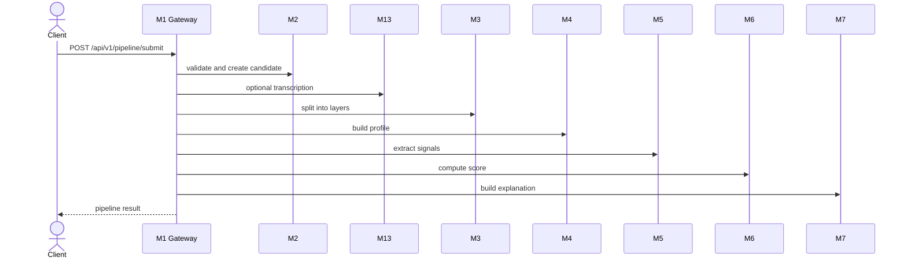
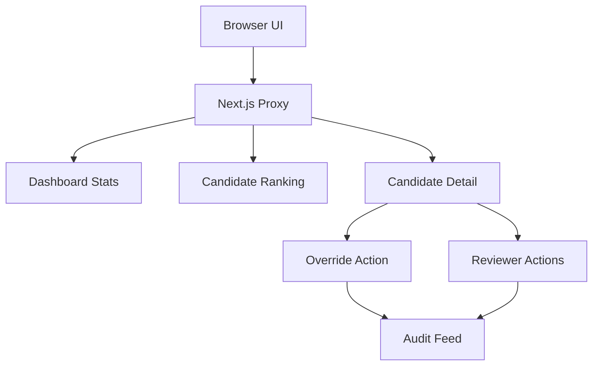

# API Reference

---

## Document Structure

- [Overview](#overview)
- [Response Envelope](#response-envelope)
- [System Endpoints](#system-endpoints)
- [Demo Endpoints](#demo-endpoints)
- [Candidate Intake Endpoints](#candidate-intake-endpoints)
- [Pipeline Endpoints](#pipeline-endpoints)
- [Diagram 1. Full Pipeline Endpoint Flow](#diagram-1-full-pipeline-endpoint-flow)
- [Direct Scoring Endpoints](#direct-scoring-endpoints)
- [Reviewer Endpoints](#reviewer-endpoints)
- [Diagram 2. Reviewer Workflow Surface](#diagram-2-reviewer-workflow-surface)
- [Canonical Contracts](#canonical-contracts)

---

## Overview

This document lists the endpoints implemented in the current branch. It excludes planned endpoints that do not yet exist in code.

Backend base URL:

`http://localhost:8000`

Frontend proxy base URL:

`http://localhost:3000/api/backend/*`

The Next.js proxy rewrites `/api/backend/*` to backend `/api/v1/*`. It automatically injects `X-API-Key` for `dashboard/*` and `audit/*` requests when `REVIEWER_API_KEY` is configured on the server side.

---

## Response Envelope

Successful response:

```json
{
  "success": true,
  "data": {},
  "error": null,
  "meta": {
    "timestamp": "2026-03-29T12:00:00Z",
    "version": "1.0.0"
  }
}
```

Error response:

```json
{
  "success": false,
  "data": null,
  "error": {
    "code": "VALIDATION_ERROR",
    "message": "Invalid payload",
    "details": {}
  },
  "meta": {
    "timestamp": "2026-03-29T12:00:00Z",
    "version": "1.0.0"
  }
}
```

The same envelope is returned for non-2xx API errors such as validation failures, auth failures, and not-found responses.

---

## System Endpoints

### `GET /`

Returns application metadata.

### `GET /health`

Returns a lightweight health response.

---

## Demo Endpoints

### `GET /api/v1/demo/candidates`

Lists all available demo candidate fixtures with metadata.

### `GET /api/v1/demo/candidates/{slug}`

Returns one fixture with its full payload.

### `POST /api/v1/demo/candidates/{slug}/run`

Loads the fixture payload and runs it through the full synchronous pipeline.

Response shape matches `POST /api/v1/pipeline/submit`.

---

## Candidate Intake Endpoints

### `POST /api/v1/candidates/intake`

Validates the candidate submission, creates the candidate record, stores encrypted PII and metadata, and returns a `candidate_id`.

Key response fields:

- `candidate_id`
- `pipeline_status`
- `message`

Example request:

```json
{
  "personal": {
    "first_name": "Aida",
    "last_name": "Example",
    "date_of_birth": "2007-06-15",
    "citizenship": "KZ"
  },
  "contacts": {
    "email": "aida@example.com",
    "telegram": "@aida"
  },
  "academic": {
    "selected_program": "Digital Media and Marketing"
  },
  "content": {
    "video_url": "https://www.youtube.com/watch?v=dQw4w9WgXcQ",
    "essay_text": "I want to build media products that help communities."
  },
  "internal_test": {
    "answers": [
      {
        "question_id": "q1",
        "answer": "I would choose the fair option because responsibility matters."
      }
    ]
  }
}
```

Current intake rules:

- `contacts.email` is required
- `content.video_url` is required and must pass public video URL validation
- `content.essay_text` is optional
- `content.transcript_text` is optional and can replace essay text in downstream narrative extraction
- extra unknown fields are ignored

---

## Pipeline Endpoints

### `POST /api/v1/pipeline/submit`

Runs the implemented backend flow:

`M2 -> optional M13 -> M3 -> M4 -> M5 -> M6 -> M7`

The response includes:

- `candidate_id`
- `pipeline_status`
- `score`
- `completeness`
- `data_flags`

### `POST /api/v1/pipeline/batch`

Runs the same flow for a list of candidate payloads. The current batch path is processed sequentially inside the API process.

---

## Diagram 1. Full Pipeline Endpoint Flow



---

## Direct Scoring Endpoints

### `POST /api/v1/pipeline/score-signals`

Scores one candidate from a canonical `SignalEnvelope`.

### `POST /api/v1/pipeline/score-signals/batch`

Scores and ranks a batch of `SignalEnvelope` objects.

### `POST /api/v1/pipeline/score-signals/train-synthetic`

Trains the scoring refinement layer on synthetic data.

Query parameters:

- `sample_count`
- `seed`

### `POST /api/v1/pipeline/score-signals/evaluate-synthetic`

Runs synthetic holdout evaluation for `M6`.

Query parameters:

- `train_sample_count`
- `test_sample_count`
- `seed`

---

## Reviewer Endpoints

All endpoints in this section require `X-API-Key`.

### `GET /api/v1/dashboard/stats`

Returns dashboard summary metrics:

- `total_candidates`
- `processed`
- `shortlisted`
- `pending_review`
- `avg_confidence`
- `by_status`

### `GET /api/v1/dashboard/candidates`

Returns ranked reviewer-facing candidate list items with safe projected names.

The frontend uses these records for the processed reviewer ranking.

### `GET /api/v1/dashboard/candidate-pool`

Returns the live candidate pool for the `/candidates` screen, split by stage:

- `raw`
- `processed`

Demo fixtures are intentionally not mixed into this endpoint.

### `GET /api/v1/dashboard/candidates/{candidate_id}`

Returns the full reviewer detail view:

- candidate identity
- `score`
- `explanation`
- `raw_content`
- `audit_logs`

### `POST /api/v1/dashboard/candidates/{candidate_id}/override`

Overrides the recommendation status and writes an audit entry.

Request body:

```json
{
  "reviewer_id": "committee-reviewer",
  "new_status": "RECOMMEND",
  "comment": "Manual adjustment after committee review"
}
```

### `GET /api/v1/dashboard/shortlist`

Returns the current shortlist derived from persisted score state.

### `POST /api/v1/dashboard/candidates/{candidate_id}/actions`

Creates non-override reviewer actions such as:

- `comment`
- `shortlist_add`
- `shortlist_remove`

### `GET /api/v1/dashboard/candidates/{candidate_id}/actions`

Returns reviewer action history for one candidate.

### `GET /api/v1/audit/feed?limit=100`

Returns the global audit feed ordered by newest first.

---

## Diagram 2. Reviewer Workflow Surface



---

## Canonical Contracts

### M5 Output

`M5` emits `SignalEnvelope` with:

- `candidate_id`
- `signal_schema_version`
- `m5_model_version`
- `selected_program`
- `program_id`
- `completeness`
- `data_flags`
- `signals`

Each signal contains:

- `value`
- `confidence`
- `source`
- `evidence`
- `reasoning`

### M6 Output

`M6` emits `CandidateScore` with four primary recommendation categories:

- `STRONG_RECOMMEND`
- `RECOMMEND`
- `WAITLIST`
- `DECLINED`

Separate review-routing fields:

- `manual_review_required`
- `human_in_loop_required`
- `uncertainty_flag`
- `review_recommendation`
- `ranking_position`
- `shortlist_eligible`

### M7 Output

`M7` emits reviewer-facing explanation content:

- `summary`
- `positive_factors`
- `caution_blocks`
- `reviewer_guidance`
- `data_quality_notes`

---

Projet Documentation
