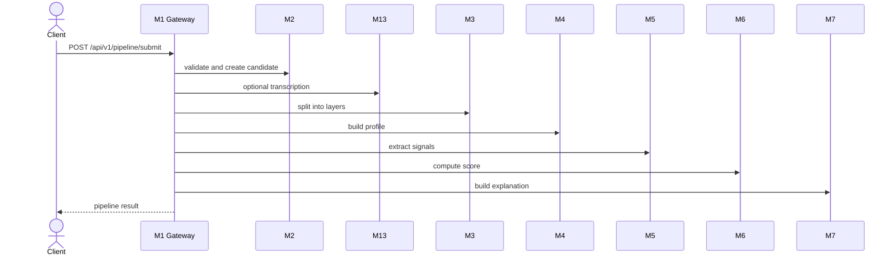
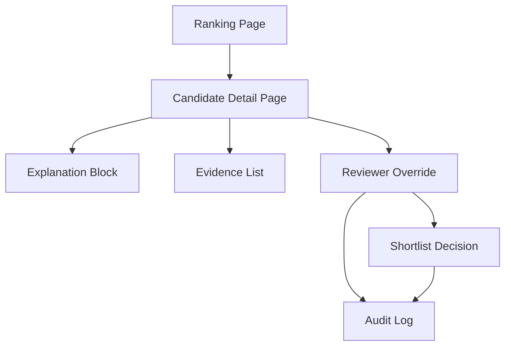

# API Reference

---

## Document Structure

- [Overview](#overview)
- [Response Envelope](#response-envelope)
- [System Endpoints](#system-endpoints)
- [Candidate Intake Endpoints](#candidate-intake-endpoints)
- [Pipeline Endpoints](#pipeline-endpoints)
- [Diagram 1. Full Pipeline Endpoint Flow](#diagram-1-full-pipeline-endpoint-flow)
- [Direct Scoring Endpoints](#direct-scoring-endpoints)
- [Diagram 2. Reviewer Workflow Surface](#diagram-2-reviewer-workflow-surface)
- [Canonical Contracts](#canonical-contracts)

---

## Overview

This document lists the endpoints implemented in the current branch. It excludes future endpoints that do not yet exist in code.

Base URL:

`http://localhost:8000`

---

## Response Envelope

Successful response:

```json
{
  "success": true,
  "data": {},
  "error": null,
  "meta": {
    "timestamp": "2026-03-29T12:00:00Z",
    "version": "1.0.0"
  }
}
```

Error response:

```json
{
  "success": false,
  "data": null,
  "error": {
    "code": "VALIDATION_ERROR",
    "message": "Invalid payload",
    "details": {}
  }
}
```

---

## System Endpoints

### `GET /`

Returns application metadata.

### `GET /health`

Returns a lightweight health response.

---

## Candidate Intake Endpoints

### `POST /api/v1/candidates/intake`

Validates the candidate submission, creates the candidate record, stores encrypted PII and metadata, and returns a `candidate_id`.

Example request:

```json
{
  "personal": {
    "first_name": "Aida",
    "last_name": "Example",
    "date_of_birth": "2007-06-15"
  },
  "academic": {
    "selected_program": "Digital Media and Marketing"
  },
  "content": {
    "essay_text": "I want to build media products that help communities.",
    "video_url": "https://example.com/interview.mp4"
  },
  "internal_test": {
    "answers": [
      {
        "question_id": "q1",
        "answer": "I would choose the fair option because responsibility matters."
      }
    ]
  }
}
```

---

## Pipeline Endpoints

### `POST /api/v1/pipeline/submit`

Runs the implemented backend flow:

`M2 -> M13 -> M3 -> M4 -> M5 -> M6 -> M7`

The response includes:

- `candidate_id`
- `pipeline_status`
- `score`
- `completeness`
- `data_flags`

### `POST /api/v1/pipeline/batch`

Runs the same flow for a list of candidate payloads. The current batch path is processed sequentially.

---

## Diagram 1. Full Pipeline Endpoint Flow



---

## Direct Scoring Endpoints

### `POST /api/v1/pipeline/score-signals`

Scores one candidate from a canonical `SignalEnvelope`.

Example request:

```json
{
  "candidate_id": "8a352307-4af4-4f0a-a8f7-b0dd22cb6fa5",
  "signal_schema_version": "v1",
  "m5_model_version": "gemini-2.5-flash:grouped-v1",
  "selected_program": "Digital Products and Services",
  "program_id": "digital_products_and_services",
  "completeness": 0.91,
  "data_flags": [],
  "signals": {
    "leadership_indicators": {
      "value": 0.82,
      "confidence": 0.88,
      "source": ["video_transcript", "essay"],
      "evidence": ["candidate led a school team project"],
      "reasoning": "leadership behavior is explicit and concrete"
    }
  }
}
```

Example response fields:

```json
{
  "candidate_id": "8a352307-4af4-4f0a-a8f7-b0dd22cb6fa5",
  "sub_scores": {
    "leadership_potential": 0.82,
    "growth_trajectory": 0.0,
    "motivation_clarity": 0.0,
    "initiative_agency": 0.0,
    "learning_agility": 0.0,
    "communication_clarity": 0.0,
    "ethical_reasoning": 0.0,
    "program_fit": 0.0
  },
  "review_priority_index": 0.63,
  "recommendation_status": "RECOMMEND",
  "manual_review_required": false,
  "human_in_loop_required": false,
  "uncertainty_flag": false,
  "review_recommendation": "STANDARD_REVIEW"
}
```

### `POST /api/v1/pipeline/score-signals/batch`

Scores and ranks a batch of `SignalEnvelope` objects.

### `POST /api/v1/pipeline/score-signals/train-synthetic`

Trains the scoring refinement layer on synthetic data.

Query parameters:

- `sample_count`
- `seed`

### `POST /api/v1/pipeline/score-signals/evaluate-synthetic`

Runs synthetic holdout evaluation for `M6`.

Query parameters:

- `train_sample_count`
- `test_sample_count`
- `seed`

---

## Diagram 2. Reviewer Workflow Surface



---

## Canonical Contracts

### M5 Output

`M5` emits `SignalEnvelope` with:

- `candidate_id`
- `signal_schema_version`
- `m5_model_version`
- `selected_program`
- `program_id`
- `completeness`
- `data_flags`
- `signals`

Each signal contains:

- `value`
- `confidence`
- `source`
- `evidence`
- `reasoning`

### M6 Output

`M6` emits `CandidateScore` with four primary recommendation categories:

- `STRONG_RECOMMEND`
- `RECOMMEND`
- `WAITLIST`
- `DECLINED`

Separate review-routing fields:

- `manual_review_required`
- `human_in_loop_required`
- `uncertainty_flag`
- `review_recommendation`

### M7 Output

`M7` emits reviewer-facing explanation content:

- `summary`
- `positive_factors`
- `caution_blocks`
- `evidence_items`
- `reviewer_guidance`

---

Projet Documentation
