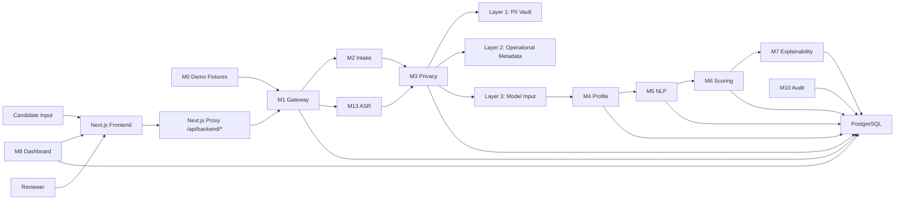
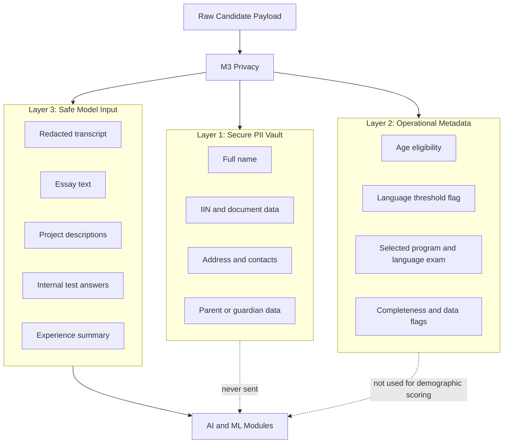
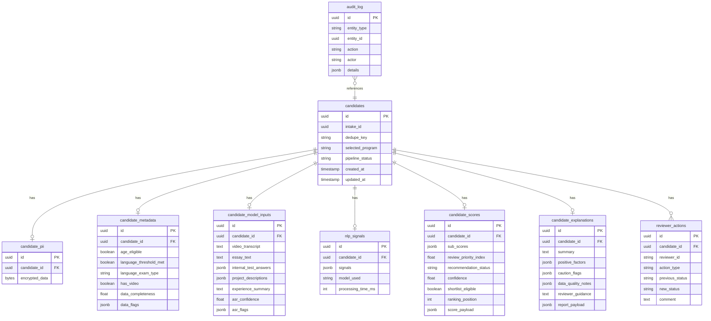

# System Architecture

---

## Document Structure

- [System Overview](#system-overview)
- [Diagram 1. System Overview](#diagram-1-system-overview)
- [Architecture Principles](#architecture-principles)
- [Implemented Backend Flow](#implemented-backend-flow)
- [Module Responsibilities](#module-responsibilities)
- [Detailed Module Catalog](#detailed-module-catalog)
- [Model Stack](#model-stack)
- [Data Governance Model](#data-governance-model)
- [Diagram 2. Privacy-by-Design Model](#diagram-2-privacy-by-design-model)
- [Diagram 3. Core Data Model](#diagram-3-core-data-model)
- [Repository Structure](#repository-structure)

---

## System Overview

The inVision U candidate selection system is a modular monolith for admissions decision support. The current repository contains both the FastAPI backend and the Next.js reviewer frontend.

The live branch currently operates as a synchronous request-response pipeline:

- candidate submissions are accepted through `M2` or routed through the full `M1` pipeline
- optional interview transcription is performed in `M13`
- privacy separation happens before model-facing processing in `M3`
- `M4`, `M5`, `M6`, and `M7` assemble profile, signals, score, and explanation
- reviewer-facing reads and writes are exposed through `M8` and `M10`
- all state is persisted in PostgreSQL

The platform is intentionally human-centered:

- it does not make a final autonomous admissions decision
- it exposes confidence, uncertainty, and review-routing fields
- it isolates sensitive data before model-facing processing
- it keeps overrides and reviewer actions auditable

---

## Diagram 1. System Overview



---

## Architecture Principles

### Privacy by Design

Personally identifiable information is isolated before any model-facing processing. AI and ML modules consume safe Layer 3 input only.

### Explainability First

Scores remain inspectable. Evidence, positive factors, caution blocks, and routing logic are surfaced to reviewers.

### Human in the Loop

Recommendation categories are advisory. Review-routing fields such as `manual_review_required`, `human_in_loop_required`, and `review_recommendation` keep the reviewer in control.

### Synchronous Orchestration

The current branch runs the main pipeline synchronously inside the API process. There is no Redis queue or detached worker layer in the live compose stack.

### Reviewer-Safe Access

Reviewer routes require `X-API-Key`. The Next.js proxy injects the header server-side for `dashboard/*` and `audit/*` routes so browser code does not carry the reviewer key directly.

---

## Implemented Backend Flow

The implemented backend flow in the current branch is:

0. `M0 Demo` provides pre-built candidate fixtures for demonstration purposes.
1. `M2 Intake` validates candidate submission payloads and creates the initial candidate record.
2. `M13 ASR` optionally transcribes interview media when `video_url` is present.
3. `M3 Privacy` separates input into secure PII, operational metadata, and safe model input.
4. `M4 Profile` assembles a unified `CandidateProfile`.
5. `M5 NLP` extracts a canonical `SignalEnvelope`.
6. `M6 Scoring` computes program-aware scores, ranking fields, and reviewer-routing output.
7. `M7 Explainability` formats summary, positive factors, caution blocks, and reviewer guidance.
8. `M8 Dashboard` exposes reviewer-facing reads over persisted scores, explanations, raw safe content, and shortlist state.
9. `M10 Audit` stores overrides, reviewer actions, and audit feed entries.

---

## Module Responsibilities

Detailed per-module documentation is maintained in:

- [`docs/eng/MODULES.md`](MODULES.md)

---

## Detailed Module Catalog

Use the dedicated module catalog for full module-level functionality, inputs, outputs, and file maps:

- [`docs/eng/MODULES.md`](MODULES.md)

---

### `M0 Demo`

Provides pre-built candidate fixtures for demonstration and smoke flows. Fixtures are stored as JSON and can be listed, inspected, or run through the live pipeline.

### `M1 Gateway`

Owns the public pipeline routes. It exposes full candidate submission, sequential batch submission, and direct scoring/evaluation endpoints.

### `M2 Intake`

Validates incoming candidate payloads, computes early completeness and eligibility fields, and persists the initial candidate anchor record.

### `M3 Privacy`

Separates candidate data into three layers and redacts sensitive information from model-facing content.

### `M4 Profile`

Builds the unified `CandidateProfile` consumed by NLP and scoring flows.

### `M5 NLP`

Extracts structured decision signals from safe candidate text and transcript content.

### `M6 Scoring`

Computes sub-scores, recommendation categories, ranking fields, confidence, uncertainty, and review-routing output.

### `M7 Explainability`

Builds deterministic reviewer-facing explanation output from `SignalEnvelope + CandidateScore`.

### `M8 Dashboard`

Reviewer-facing read API for stats, ranking lists, candidate detail, and shortlist views. Candidate names are derived from decrypted PII inside the backend projection layer rather than exposed as raw snapshots.

### `M9 Storage`

Repository and persistence layer used by active modules.

### `M10 Audit`

Reviewer write and traceability layer for overrides, comments, shortlist actions, and audit feed access.

### `M13 ASR`

Transcribes interview media and exposes transcript quality markers used by downstream stages.

---

## Model Stack

### NLP

| Module | Model | Role |
|---|---|---|
| `M5` | `meta-llama/llama-4-scout-17b-16e-instruct` | primary grouped structured signal extraction through Groq |
| `M5` | `gemini-2.5-flash` | optional grouped extraction fallback when `GEMINI_API_KEY` is configured and Groq is unavailable |
| `M5` | heuristic extractor | deterministic fallback extraction |
| `M7` | deterministic formatter | explainability report construction from persisted M6 output |

### ASR

| Module | Model | Role |
|---|---|---|
| `M13` | env-selected Groq Whisper model (`whisper-large-v3-turbo` by default) | interview transcription and segment analysis |

### Embeddings

| Runtime | Model | Role |
|---|---|---|
| Primary | `jinaai/jina-embeddings-v5-text-nano` | local similarity and consistency checks inside the backend process |
| Fallback | lexical cosine similarity | deterministic backup path when the local embedding backend is unavailable |

### Scoring

| Layer | Model / Method | Role |
|---|---|---|
| Baseline | rule-based scoring | transparent initial scoring |
| Refinement | `GradientBoostingRegressor` | ML score refinement |
| Calibration | `ScoreCalibrator` | optional score post-processing |

---

## Data Governance Model

### Layer 1: Secure PII Vault

Stores encrypted PII and administrative-sensitive data such as names, addresses, contact details, guardians, IDs, and supporting documents.

### Layer 2: Operational Metadata

Stores workflow metadata such as age eligibility, language-threshold status, selected program, language exam type, completeness, data flags, and whether a video was provided.

### Layer 3: Safe Model Input

Stores model-facing content such as a redacted transcript, essay text, internal test answers, project descriptions, experience summary, ASR confidence, and ASR quality flags.

---

## Diagram 2. Privacy-by-Design Model



---

## Diagram 3. Core Data Model



---

## Repository Structure

```text
.agent/
  memory/
backend/
  app/
    core/
    modules/
    schemas/
  tests/
docs/
  eng/
  rus/
frontend/
  src/
  e2e/
scripts/
```

---

Projet Documentation
