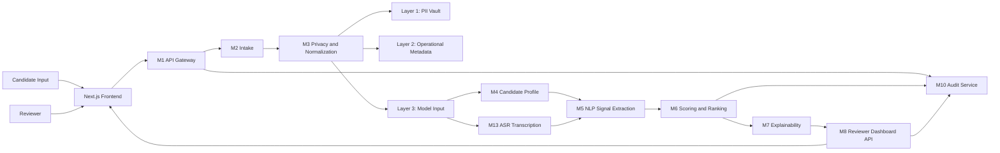
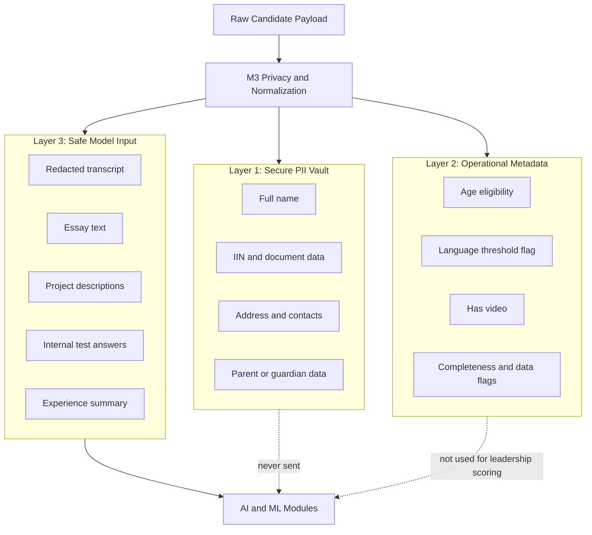
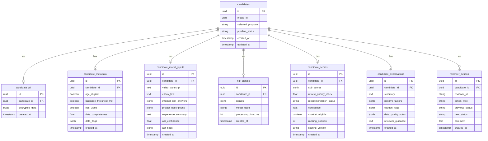

# System Architecture

---

## Document Structure

- [System Overview](#system-overview)
- [Diagram 1. System Overview](#diagram-1-system-overview)
- [Architecture Principles](#architecture-principles)
- [Implemented Backend Flow](#implemented-backend-flow)
- [Module Responsibilities](#module-responsibilities)
- [Detailed Module Catalog](#detailed-module-catalog)
- [Model Stack](#model-stack)
- [Data Governance Model](#data-governance-model)
- [Diagram 2. Privacy-by-Design Model](#diagram-2-privacy-by-design-model)
- [Diagram 3. Core Data Model](#diagram-3-core-data-model)
- [Repository Structure](#repository-structure)

---

## System Overview

The inVision U candidate selection system is a modular backend pipeline for admissions decision support. It validates submissions, separates sensitive data, prepares safe model input, extracts structured signals, computes explainable scores, and produces reviewer-facing explanations for the admissions committee.

The platform is intentionally human-centered:

- it does not make a final autonomous admissions decision;
- it exposes confidence, uncertainty, and review-routing fields;
- it isolates sensitive data before model-facing processing;
- it keeps scoring and explainability auditable.

---

## Diagram 1. System Overview



---

## Architecture Principles

### Privacy by Design

Personally identifiable information is isolated before any model-facing processing. AI and ML modules consume safe Layer 3 input only.

### Explainability First

Scores must remain inspectable. Evidence, factors, caution flags, and routing logic are surfaced to reviewers.

### Human in the Loop

Recommendation categories are advisory. Review-routing fields such as `manual_review_required`, `human_in_loop_required`, and `review_recommendation` keep the reviewer in control.

### Program-Aware, Not Demographic-Aware

The system adapts to the selected academic track using policy-defined weights while excluding sensitive and proxy demographic fields from scoring.

---

## Implemented Backend Flow

The implemented backend flow in the current branch is:

1. `M2 Intake` validates candidate submission payloads and creates the initial candidate record.
2. `M13 ASR` transcribes interview media and emits transcript-quality markers.
3. `M3 Privacy` separates input into secure PII, operational metadata, and safe model input.
4. `M4 Profile` assembles a unified `CandidateProfile`.
5. `M5 NLP` extracts a canonical `SignalEnvelope`.
6. `M6 Scoring` computes program-aware scores, ranking fields, and reviewer-routing output.
7. `M7 Explainability` formats summary, positive factors, caution blocks, and evidence.

---

## Module Responsibilities

Detailed per-module documentation is maintained in:

- [`docs/eng/MODULES.md`](MODULES.md)

---

## Detailed Module Catalog

Use the dedicated module catalog for full module-level functionality, inputs, outputs, and file maps:

- [`docs/eng/MODULES.md`](MODULES.md)

---

### `M1 Gateway`

Owns public API routing and orchestrates the full backend flow.

| File | Responsibility |
|---|---|
| `backend/app/modules/m1_gateway/router.py` | Public API endpoints for intake, pipeline submission, and direct scoring |
| `backend/app/modules/m1_gateway/orchestrator.py` | Step-by-step orchestration across M2, M13, M3, M4, M5, M6, and M7 |

### `M2 Intake`

Validates incoming candidate payloads, computes initial completeness, and persists the intake record.

| File | Responsibility |
|---|---|
| `backend/app/modules/m2_intake/schemas.py` | Intake request and response contracts |
| `backend/app/modules/m2_intake/service.py` | Validation, completeness checks, eligibility checks, and initial persistence |
| `backend/app/modules/m2_intake/router.py` | Candidate intake endpoint |

### `M3 Privacy`

Separates candidate data into three layers and redacts sensitive information from model-facing content.

| File | Responsibility |
|---|---|
| `backend/app/modules/m3_privacy/redactor.py` | Text-level PII redaction helpers |
| `backend/app/modules/m3_privacy/separator.py` | Three-layer separation logic |
| `backend/app/modules/m3_privacy/service.py` | Persistence of separated layers |

### `M4 Profile`

Builds the unified `CandidateProfile` consumed by ASR, NLP, and scoring flows.

| File | Responsibility |
|---|---|
| `backend/app/modules/m4_profile/schemas.py` | Candidate profile models |
| `backend/app/modules/m4_profile/assembler.py` | Assembly logic for profile fields and flags |
| `backend/app/modules/m4_profile/service.py` | Profile retrieval and persistence coordination |

### `M5 NLP`

Extracts structured decision signals from safe candidate text and transcript content.

| File | Responsibility |
|---|---|
| `backend/app/modules/m5_nlp/schemas.py` | `M5ExtractionRequest` and safe request validation |
| `backend/app/modules/m5_nlp/source_bundle.py` | Shared normalized source handling |
| `backend/app/modules/m5_nlp/gemini_client.py` | Gemini extraction client |
| `backend/app/modules/m5_nlp/extractor.py` | Deterministic heuristic extractor |
| `backend/app/modules/m5_nlp/signal_extraction_service.py` | Grouped extraction orchestration |
| `backend/app/modules/m5_nlp/embeddings.py` | Similarity and embeddings helpers |
| `backend/app/modules/m5_nlp/ai_detector.py` | Advisory authenticity and consistency heuristics |

### `M6 Scoring`

Computes sub-scores, recommendation categories, ranking fields, confidence, uncertainty, and human-in-the-loop routing.

| File | Responsibility |
|---|---|
| `backend/app/modules/m6_scoring/m6_scoring_config.yaml` | Central policy, thresholds, and program profiles |
| `backend/app/modules/m6_scoring/rules.py` | Deterministic baseline sub-score logic |
| `backend/app/modules/m6_scoring/confidence.py` | Confidence and uncertainty calculations |
| `backend/app/modules/m6_scoring/decision_policy.py` | Final category and review routing |
| `backend/app/modules/m6_scoring/ml_model.py` | `GradientBoostingRegressor` refinement layer |
| `backend/app/modules/m6_scoring/service.py` | Public scoring orchestration |
| `backend/app/modules/m6_scoring/evaluation.py` | Synthetic evaluation helpers |
| `backend/app/modules/m6_scoring/optimization.py` | Decision-policy search and tuning |

### `M7 Explainability`

Formats reviewer-facing explanation output from `SignalEnvelope + CandidateScore`.

| File | Responsibility |
|---|---|
| `backend/app/modules/m7_explainability/schemas.py` | Explainability input and output contracts |
| `backend/app/modules/m7_explainability/factors.py` | Factor titles and caution policy |
| `backend/app/modules/m7_explainability/evidence.py` | Evidence selection and factor mapping |
| `backend/app/modules/m7_explainability/service.py` | Explanation report construction |

### `M8 Dashboard`

Reserved placeholder for future reviewer dashboard API work.

### `M9 Storage`

Repository and persistence layer used by active modules.

| File | Responsibility |
|---|---|
| `backend/app/modules/m9_storage/models.py` | SQLAlchemy models |
| `backend/app/modules/m9_storage/repository.py` | Storage repository methods |

### `M10 Audit`

Reserved placeholder for future audit workflows.

### `M13 ASR`

Transcribes interview media and exposes transcript quality markers.

| File | Responsibility |
|---|---|
| `backend/app/modules/m13_asr/schemas.py` | ASR contracts |
| `backend/app/modules/m13_asr/downloader.py` | Safe media resolution |
| `backend/app/modules/m13_asr/transcriber.py` | Groq Whisper API integration |
| `backend/app/modules/m13_asr/quality_checker.py` | Confidence and quality-flag logic |
| `backend/app/modules/m13_asr/service.py` | End-to-end ASR orchestration |

---

## Model Stack

### NLP

| Module | Model | Role |
|---|---|---|
| `M5` | `gemini-2.5-flash` | Structured signal extraction |
| `M7` | `gemini-3.1-flash-lite-preview` | Fast explainability generation |

### ASR

| Module | Model | Role |
|---|---|---|
| `M13` | `whisper-large-v3-turbo` | Interview transcription and segment analysis |

### Embeddings

| Runtime | Model | Role |
|---|---|---|
| Primary | `jina-embeddings-v5` | Similarity and consistency checks |
| Fallback | `BAAI/bge-m3` | Backup embedding path |

### Scoring

| Layer | Model / Method | Role |
|---|---|---|
| Baseline | rule-based scoring | transparent initial scoring |
| Refinement | `GradientBoostingRegressor` | ML score refinement |

---

## Data Governance Model

### Layer 1: Secure PII Vault

Stores encrypted PII and administrative-sensitive data such as names, addresses, contact details, guardians, IDs, and supporting documents.

### Layer 2: Operational Metadata

Stores workflow metadata such as age eligibility, language threshold status, selected program, completeness, and data flags.

### Layer 3: Safe Model Input

Stores model-facing content such as a redacted transcript, essay text, internal test answers, project descriptions, experience summary, ASR confidence, and ASR quality flags.

---

## Diagram 2. Privacy-by-Design Model



---

## Diagram 3. Core Data Model



---

## Repository Structure

```text
backend/
  app/
    core/
    modules/
    schemas/
  tests/
docs/
  eng/
  rus/
frontend/
```

---

Projet Documentation
