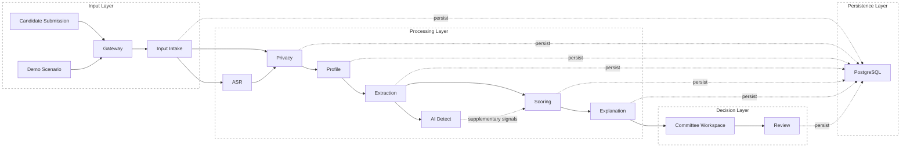
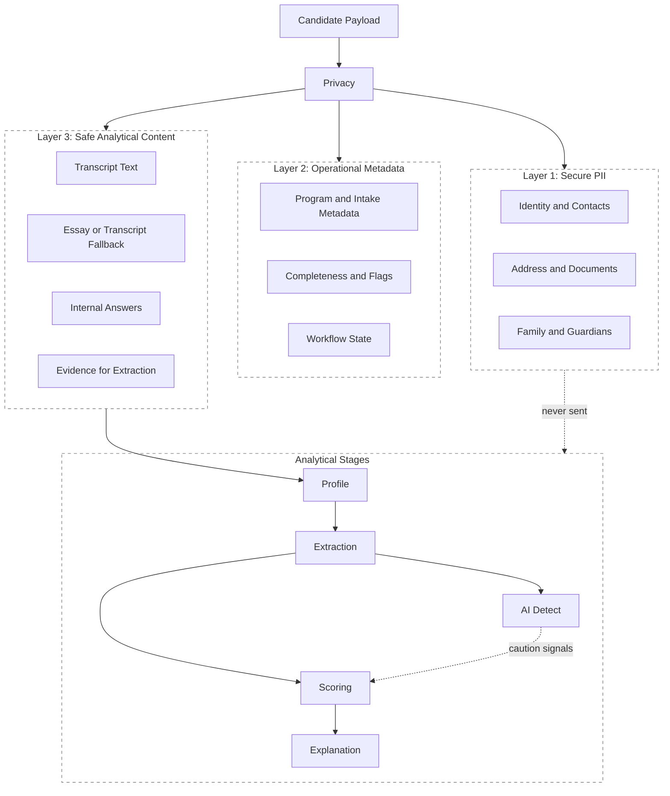
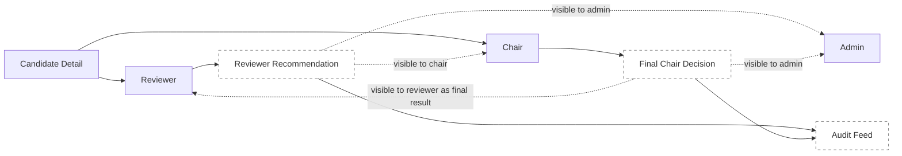
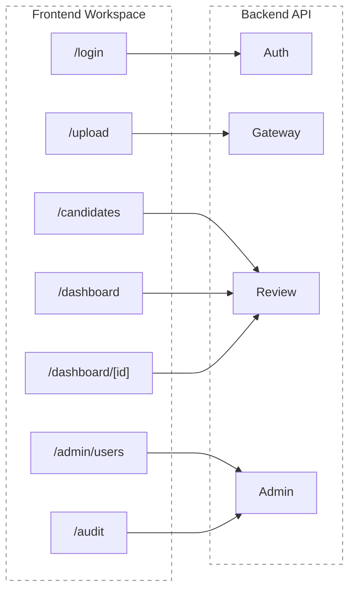

# System Architecture

---

## Document Structure

- [System Overview](#system-overview)
- [Diagram 1. End-to-End Stage Flow](#diagram-1-end-to-end-stage-flow)
- [Architectural Principles](#architectural-principles)
- [Runtime Stages](#runtime-stages)
- [Public Stage Map](#public-stage-map)
- [Data Management Model](#data-management-model)
- [Diagram 2. Data Separation Layers](#diagram-2-data-separation-layers)
- [Diagram 3. Committee Workflow](#diagram-3-committee-workflow)
- [Diagram 4. Frontend and API Surface](#diagram-4-frontend-and-api-surface)
- [Repository Structure](#repository-structure)

---

## System Overview

The inVision U admissions platform is a modular monolith for admissions decision support. The repository contains both the FastAPI backend and the Next.js committee workspace.

The current runtime operates as a synchronous request-response pipeline:

- candidate input enters through the input intake stage or through the full gateway pipeline
- `ASR` runs when public audio or video material is available
- `Privacy` separates PII before any model-facing processing
- `Profile`, `Extraction`, `AI Detect`, `Scoring`, and `Explanation` assemble the analytical view
- `Review` exposes committee actions, chair approval, and audit visibility
- all state is persisted in PostgreSQL

The platform is explicitly human-in-the-loop:

- it does not make an autonomous admissions decision
- it surfaces confidence, evidence, and caution signals
- it keeps sensitive data outside model-facing stages
- it records committee actions and final decisions

---

## Diagram 1. End-to-End Stage Flow



---

## Architectural Principles

### Privacy by Design

PII is isolated before any model-facing processing. AI and ML stages operate only on safe content and operationally permitted metadata.

### Explainability First

Scores must remain reviewable. Committee users see factor blocks, caution markers, evidence snippets, and final explanation summaries rather than a single opaque output.

### Human in the Loop

Recommendations are advisory. Final admissions handling stays inside the committee workflow, where reviewer recommendations and chair decisions are recorded explicitly.

### Session Auth and RBAC

Protected routes use HTTP-only session cookies and backend role checks for `admin`, `chair`, and `reviewer`. Role visibility determines who can manage users, see global audit data, or view committee decisions.

### Synchronous Core Pipeline

The default local stack uses synchronous orchestration inside the API process. The active Docker stack does not require a separate worker tier for the baseline review workflow.

---

## Runtime Stages

### Gateway

Public API entrypoint and orchestration layer for synchronous pipeline execution, batch submission, and committee-facing backend routes.

### Input Intake

The input stage validates candidate payloads, computes initial completeness, and creates the base candidate record. It is documented as an input stage rather than as a standalone analytical module.

### ASR

Consumes public audio or video links and produces transcript text plus transcript quality metadata when media is available.

### Privacy

Splits the candidate record into PII, operational metadata, and safe model content.

### Profile

Builds the canonical candidate profile from operational and safe layers.

### Extraction

Converts safe text, transcript material, and related evidence into structured decision signals.

### AI Detect

Adds supplementary authenticity and AI-assisted-writing indicators. These signals do not replace committee judgment; they act as caution inputs for scoring and explanation.

### Scoring

Computes candidate score, confidence, ranking, recommendation category, and review routing.

### Explanation

Transforms score and evidence into reviewer-facing narrative, factor blocks, and caution summaries.

### Review

Powers candidate workspaces, committee recommendations, chair decisions, and audit visibility.

### Storage

Persists candidate layers, projections, score outputs, explanation outputs, and committee events.

---

## Public Stage Map

The documentation uses public stage names. Current package mapping in code:

| Public stage | Current package |
|---|---|
| `Gateway` | `backend/app/modules/gateway` |
| `Input Intake` | `backend/app/modules/intake` |
| `ASR` | `backend/app/modules/asr` |
| `Privacy` | `backend/app/modules/privacy` |
| `Profile` | `backend/app/modules/profile` |
| `Extraction` | `backend/app/modules/extraction` |
| `AI Detect` | `backend/app/modules/extraction/ai_detector.py` |
| `Scoring` | `backend/app/modules/scoring` |
| `Explanation` | `backend/app/modules/explanation` |
| `Review` | `backend/app/modules/workspace` and `backend/app/modules/review` |
| `Storage` | `backend/app/modules/storage` |
| `Demo Layer` | `backend/app/modules/demo` |

---

## Data Management Model

### Layer 1: Secure PII

Stores encrypted or protected identity data: legal names, contacts, addresses, document references, and related administrative data.

### Layer 2: Operational Metadata

Stores workflow-visible metadata such as selected program, completeness, data flags, and intake-derived eligibility markers.

### Layer 3: Safe Analytical Content

Stores redacted transcript text, essay text when present, transcript-derived fallback content, internal answers, and safe evidence for downstream analytical stages.

---

## Diagram 2. Data Separation Layers



---

## Diagram 3. Committee Workflow



---

## Diagram 4. Frontend and API Surface



---

## Repository Structure

```text
backend/app/core/             config, db session, auth, RBAC dependencies
backend/app/modules/          runtime packages for gateway, stages, review, storage
backend/tests/                unit, integration, and evaluation coverage
frontend/src/app/             Next.js routes and API proxy
frontend/src/components/      shared UI and candidate-review components
docs/eng/                     English project documentation
docs/rus/                     Russian project documentation
```
