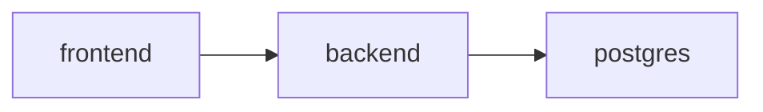

# Docker Guide

---

## Document Structure

- [Purpose](#purpose)
- [Repository Docker Assets](#repository-docker-assets)
- [Whole-Repository Template](#whole-repository-template)
- [Diagram 1. Repository Container Topology](#diagram-1-repository-container-topology)
- [M6 Evaluation Container](#m6-evaluation-container)

---

## Purpose

This document describes the Docker assets that currently exist in the repository and how they are used in the live branch.

---

## Repository Docker Assets

| File | Purpose |
|---|---|
| `backend/Dockerfile` | Backend application image |
| `frontend/Dockerfile` | Frontend production image for Next.js |
| `docker-compose.yml` | Live whole-repository stack: `postgres + backend + frontend` |
| `docker-compose.template.yml` | Older scaffold with placeholder services |
| `docker-compose.m6.yml` | M6-specific compose flow for evaluation and notebook work |
| `scripts/stack.sh` | Wrapper for common compose actions (`up`, `down`, `reset`, `logs`) |

---

## Whole-Repository Template

The live repository stack is:

- `docker-compose.yml`

It includes:

- `postgres`
- `backend`
- `frontend`

Current behavior:

- `backend` runs Alembic migrations on startup and then launches `uvicorn`
- `backend` receives model configuration through env, including `M5_LLM_MODEL`, `M5_LLM_FAST_MODEL`, `M13_ASR_MODEL`, `EMBEDDING_MODEL`, and `EMBEDDING_DEVICE`
- `frontend` receives `BACKEND_URL` and `REVIEWER_API_KEY` through environment variables
- reviewer pages use the Next.js proxy and forward `X-API-Key` only on the server side
- the default stack needs only `GROQ_API_KEY` for the primary LLM + ASR path; local embeddings do not require a Jina API key
- the local embedding model is downloaded from Hugging Face on first use and then reused from the local cache
- the stack is intended for local integration and demo use

Typical commands:

```bash
./scripts/stack.sh up
./scripts/stack.sh down
./scripts/stack.sh reset
./scripts/stack.sh logs
```

The older scaffold file `docker-compose.template.yml` is still present, but it is not the primary stack anymore.

---

## Diagram 1. Repository Container Topology



---

## M6 Evaluation Container

`M6` still has its own standalone container flow:

- `backend/app/modules/m6_scoring/Dockerfile.m6`
- `docker-compose.m6.yml`

This setup supports:

- synthetic evaluation runs
- local notebook access on port `8888`
- isolated scoring experiments without starting the full frontend stack

---

Projet Documentation
