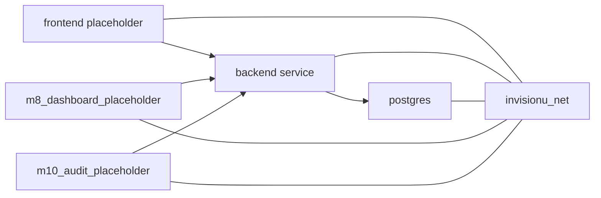

# Docker Guide

---

## Document Structure

- [Purpose](#purpose)
- [Repository Docker Assets](#repository-docker-assets)
- [Whole-Repository Template](#whole-repository-template)
- [Diagram 1. Repository Container Topology](#diagram-1-repository-container-topology)
- [M6 Evaluation Container](#m6-evaluation-container)

---

## Purpose

This document describes the Docker assets currently present in the repository and how they are intended to be used.

---

## Repository Docker Assets

| File | Purpose |
|---|---|
| `backend/Dockerfile` | Backend application image based on `python:3.11-slim` |
| `backend/app/modules/m6_scoring/Dockerfile.m6` | Standalone scoring and evaluation image for the M6 bundle |
| `docker-compose.template.yml` | Whole-repository Docker template with service placeholders |
| `docker-compose.m6.yml` | M6-specific compose flow for evaluation and notebook work |

---

## Whole-Repository Template

The repository-level template is:

- `docker-compose.template.yml`

It includes:

- `postgres`
- `backend`
- `frontend_placeholder`
- `m8_dashboard_placeholder`
- `m10_audit_placeholder`

This file is a starting scaffold rather than a production deployment manifest.

---

## Diagram 1. Repository Container Topology

---

## M6 Evaluation Container

`M6` has its own standalone container flow:

- `backend/app/modules/m6_scoring/Dockerfile.m6`
- `docker-compose.m6.yml`

This setup supports:

- synthetic evaluation
- local notebook access
- isolated scoring experiments

---

Projet Documentation
