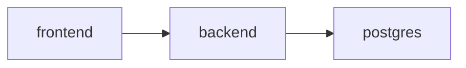

# Docker Guide

## Active stack

The live local stack is defined in:

- `docker-compose.yml`

Services:

- `postgres`
- `backend`
- `frontend`

## Runtime behavior

- `backend` runs Alembic migrations on startup and then starts `uvicorn`
- `frontend` receives `BACKEND_URL`
- frontend auth uses session cookies through the backend proxy
- the main external secret for the default model path is `GROQ_API_KEY`

## Commands

```bash
./scripts/stack.sh up
./scripts/stack.sh down
./scripts/stack.sh reset
./scripts/stack.sh logs
```

## Service topology


