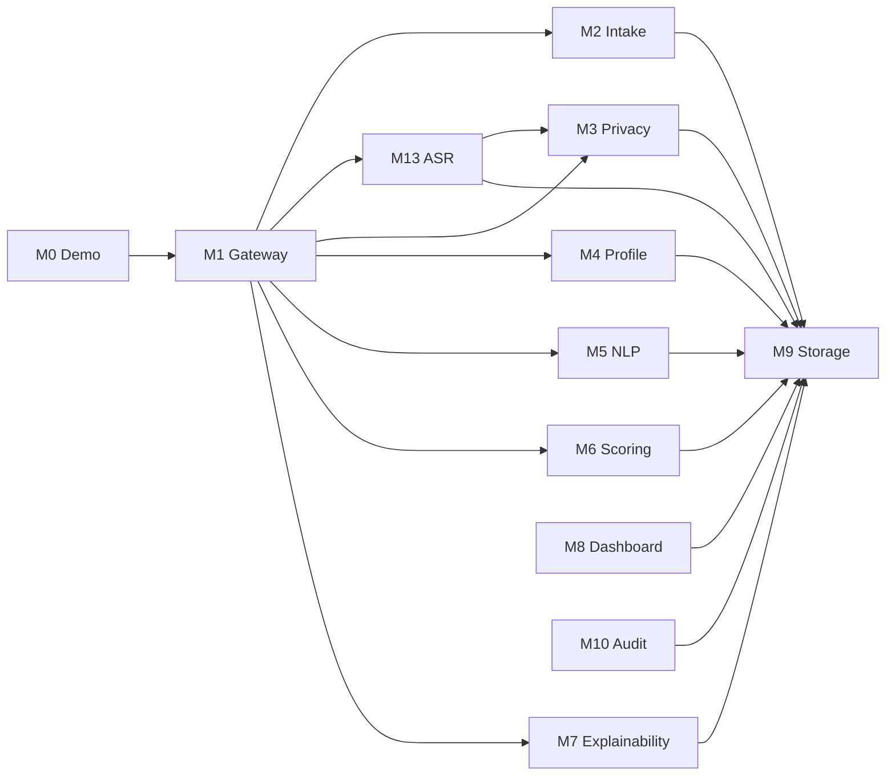

# Module Catalog

---

## Document Structure

- [Overview](#overview)
- [Diagram 1. Module Interaction Map](#diagram-1-module-interaction-map)
- [M0 Demo](#m0-demo)
- [M1 Gateway](#m1-gateway)
- [M2 Intake](#m2-intake)
- [M3 Privacy](#m3-privacy)
- [M4 Profile](#m4-profile)
- [M5 NLP](#m5-nlp)
- [M6 Scoring](#m6-scoring)
- [M7 Explainability](#m7-explainability)
- [M8 Dashboard](#m8-dashboard)
- [M9 Storage](#m9-storage)
- [M10 Audit](#m10-audit)
- [M13 ASR](#m13-asr)

---

## Overview

This document consolidates the functional documentation for all active backend modules. It separates module-level responsibilities from the higher-level architecture and API documents so each concern stays in one place.

---

## Diagram 1. Module Interaction Map

---

## M0 Demo

Provides pre-built candidate fixtures for demonstration. Loads realistic payloads from JSON files and runs them through the live synchronous pipeline.

| File | Responsibility |
|---|---|
| `backend/app/modules/m0_demo/fixtures/*.json` | pre-built candidate payloads covering multiple programs |
| `backend/app/modules/m0_demo/schemas.py` | `FixtureMeta`, `FixtureSummary`, `FixtureDetail` contracts |
| `backend/app/modules/m0_demo/service.py` | fixture loading, caching, and payload parsing |
| `backend/app/modules/m0_demo/router.py` | demo API endpoints: list, detail, pipeline run |

---

## M1 Gateway

### Purpose

`M1` is the public backend entry point for full-pipeline submission and direct scoring operations.

### Functional Scope

- exposes synchronous full-pipeline submission endpoints
- exposes sequential batch submission
- exposes direct M6 scoring and evaluation endpoints
- coordinates the implemented module order
- normalizes API success and error responses

### Inputs

- raw candidate submission payloads
- canonical `SignalEnvelope` for direct scoring routes
- batch lists for sequential processing

### Outputs

- pipeline responses with score and completeness payloads
- direct scoring results
- synthetic training and evaluation responses

### Files

| File | Responsibility |
|---|---|
| `backend/app/modules/m1_gateway/router.py` | public pipeline and scoring routes |
| `backend/app/modules/m1_gateway/orchestrator.py` | full synchronous pipeline orchestration |

---

## M2 Intake

### Purpose

`M2` validates the incoming submission and creates the initial candidate record that anchors the rest of the pipeline.

### Functional Scope

- validates candidate payload structure
- computes initial completeness
- extracts administrative eligibility signals
- persists the initial intake record
- returns `candidate_id` and intake state

### Files

| File | Responsibility |
|---|---|
| `backend/app/modules/m2_intake/schemas.py` | intake contracts |
| `backend/app/modules/m2_intake/service.py` | validation and persistence |
| `backend/app/modules/m2_intake/router.py` | intake endpoint |

---

## M3 Privacy

### Purpose

`M3` enforces privacy separation and produces the safe model-facing payload used by AI and ML modules.

### Functional Scope

- separates candidate input into three layers
- keeps PII in Layer 1 only
- stores operational metadata in Layer 2
- produces redacted model-safe content in Layer 3
- redacts explicit identifiers from text

### Files

| File | Responsibility |
|---|---|
| `backend/app/modules/m3_privacy/redactor.py` | text redaction |
| `backend/app/modules/m3_privacy/separator.py` | layer split logic |
| `backend/app/modules/m3_privacy/service.py` | persistence and orchestration |

---

## M4 Profile

### Purpose

`M4` assembles a unified `CandidateProfile` from privacy-safe material and operational metadata.

### Functional Scope

- combines Layer 2 and Layer 3 into one profile
- propagates completeness and data flags
- provides a normalized object for NLP and scoring stages

### Files

| File | Responsibility |
|---|---|
| `backend/app/modules/m4_profile/schemas.py` | candidate profile schema |
| `backend/app/modules/m4_profile/assembler.py` | profile assembly |
| `backend/app/modules/m4_profile/service.py` | profile coordination |

---

## M5 NLP

### Purpose

`M5` extracts structured decision signals from safe text, transcript, internal test answers, and project descriptions.

### Functional Scope

- normalizes safe inputs into reusable source bundles
- calls Groq for grouped Llama-based signal extraction
- applies heuristic fallback extraction when necessary
- uses local Hugging Face embeddings and authenticity checks as advisory support
- emits a canonical `SignalEnvelope` for `M6`

### Files

| File | Responsibility |
|---|---|
| `backend/app/modules/m5_nlp/schemas.py` | request schema and validation |
| `backend/app/modules/m5_nlp/client.py` | safe local-media transcription fallback client |
| `backend/app/modules/m5_nlp/groq_llm_client.py` | primary Groq-backed LLM integration |
| `backend/app/modules/m5_nlp/llm_shared.py` | shared LLM request/response helpers |
| `backend/app/modules/m5_nlp/source_bundle.py` | shared safe-source assembly |
| `backend/app/modules/m5_nlp/extractor.py` | heuristic fallback extraction |
| `backend/app/modules/m5_nlp/signal_extraction_service.py` | grouped extraction flow |
| `backend/app/modules/m5_nlp/embeddings.py` | local embedding and similarity utilities |
| `backend/app/modules/m5_nlp/ai_detector.py` | advisory authenticity checks |

---

## M6 Scoring

### Purpose

`M6` converts structured signals into a review-priority score, recommendation category, ranking fields, and review-routing output.

### Functional Scope

- computes deterministic sub-scores
- computes a rule-based baseline score
- refines the score with `GradientBoostingRegressor`
- applies program-aware weighting profiles
- derives confidence, uncertainty, and review-routing fields
- prepares explainability-ready outputs for `M7`
- ranks batch results and supports synthetic evaluation tooling

### Files

| File | Responsibility |
|---|---|
| `backend/app/modules/m6_scoring/m6_scoring_config.yaml` | core policy config |
| `backend/app/modules/m6_scoring/m6_scoring_config.py` | typed config loader |
| `backend/app/modules/m6_scoring/program_policy.py` | program-specific policy lookup |
| `backend/app/modules/m6_scoring/rules.py` | baseline sub-score logic |
| `backend/app/modules/m6_scoring/confidence.py` | confidence and uncertainty |
| `backend/app/modules/m6_scoring/decision_policy.py` | final category and review policy |
| `backend/app/modules/m6_scoring/calibration.py` | optional calibration utilities |
| `backend/app/modules/m6_scoring/ml_model.py` | GBR refinement model |
| `backend/app/modules/m6_scoring/ranker.py` | batch ranking |
| `backend/app/modules/m6_scoring/io_utils.py` | report and artifact IO helpers |
| `backend/app/modules/m6_scoring/service.py` | public scoring service |
| `backend/app/modules/m6_scoring/evaluation.py` | evaluation helpers |
| `backend/app/modules/m6_scoring/optimization.py` | threshold search |
| `backend/app/modules/m6_scoring/synthetic_data.py` | synthetic fixtures |

---

## M7 Explainability

### Purpose

`M7` converts `SignalEnvelope + CandidateScore` into reviewer-facing explanations that can be shown in a dashboard or report.

### Functional Scope

- builds concise candidate summary text
- selects top strengths and caution blocks
- maps evidence snippets to factors
- produces reviewer guidance text
- formats explanation output without re-scoring the candidate

### Files

| File | Responsibility |
|---|---|
| `backend/app/modules/m7_explainability/schemas.py` | explainability contracts |
| `backend/app/modules/m7_explainability/factors.py` | factor and caution titles |
| `backend/app/modules/m7_explainability/evidence.py` | evidence mapping |
| `backend/app/modules/m7_explainability/service.py` | explainability assembly |

---

## M8 Dashboard

### Purpose

`M8` exposes the reviewer-facing read API.

### Current State

- implemented in this branch
- exposes dashboard stats, ranking lists, candidate detail views, live candidate-pool reads, and safe reviewer identity projection
- builds candidate display names by decrypting stored PII inside the backend projection layer
- includes raw safe content and reviewer action history in detail responses
- requires session auth and RBAC before returning committee-facing data

### Files

| File | Responsibility |
|---|---|
| `backend/app/modules/m8_dashboard/router.py` | committee-facing read routes and decision/view entrypoints |
| `backend/app/modules/m8_dashboard/service.py` | safe reviewer projection logic and dashboard aggregation |
| `backend/app/modules/m8_dashboard/schemas.py` | committee DTOs for stats, lists, detail, and candidate-pool responses |

---

## M9 Storage

### Purpose

`M9` provides the repository and persistence layer shared by the active modules.

### Functional Scope

- stores candidate records and layer payloads
- stores NLP signals, scores, explanations, reviewer actions, and audit logs
- refreshes score rankings after scoring writes
- exposes repository methods used across the pipeline and reviewer surfaces

### Files

| File | Responsibility |
|---|---|
| `backend/app/modules/m9_storage/models.py` | SQLAlchemy models |
| `backend/app/modules/m9_storage/repository.py` | repository methods |

---

## M10 Audit

### Purpose

`M10` handles audit logging and reviewer action traceability.

### Current State

- implemented in this branch
- stores committee recommendations, chair decisions, view activity, and pipeline audit entries
- exposes audit feed access for admins and committee write flows for authenticated users
- updates persisted candidate status through the shared persistence layer

### Files

| File | Responsibility |
|---|---|
| `backend/app/modules/m10_audit/logger.py` | audit logging helpers and future extension point |
| `backend/app/modules/m10_audit/service.py` | committee decision workflows, reviewer action writes, audit feed shaping |
| `backend/app/modules/m10_audit/router.py` | committee action and audit feed routes |
| `backend/app/modules/m10_audit/schemas.py` | request and response contracts |

---

## M13 ASR

### Purpose

`M13` transcribes interview audio or video and produces transcript quality markers used by the rest of the pipeline.

### Functional Scope

- resolves safe media input
- calls Groq Whisper using the env-selected `M13_ASR_MODEL`
- normalizes transcript segments
- computes confidence and quality flags
- emits `requires_human_review` for low-quality transcription cases

### Files

| File | Responsibility |
|---|---|
| `backend/app/modules/m13_asr/schemas.py` | ASR contracts |
| `backend/app/modules/m13_asr/downloader.py` | safe media resolution |
| `backend/app/modules/m13_asr/transcriber.py` | Groq Whisper integration |
| `backend/app/modules/m13_asr/quality_checker.py` | quality analysis |
| `backend/app/modules/m13_asr/service.py` | ASR orchestration |

---

Projet Documentation
