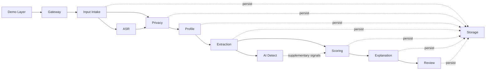

# Module Catalog

---

## Document Structure

- [Overview](#overview)
- [Diagram 1. Stage Interaction Map](#diagram-1-stage-interaction-map)
- [Gateway](#gateway)
- [ASR](#asr)
- [Privacy](#privacy)
- [Profile](#profile)
- [Extraction](#extraction)
- [AI Detect](#ai-detect)
- [Scoring](#scoring)
- [Explanation](#explanation)
- [Review](#review)
- [Storage](#storage)
- [Input Intake Stage](#input-intake-stage)
- [Demo Layer](#demo-layer)
- [Stage-to-Code Mapping](#stage-to-code-mapping)

---

## Overview

This document describes the active backend stages in business-facing terms. Internal package names still use the legacy `m*` convention, but the runtime is documented here through stage names that reflect the current product flow.

---

## Diagram 1. Stage Interaction Map

---

## Gateway

### Purpose

Public backend entrypoint for synchronous pipeline submission, batch execution, and committee-facing review APIs.

### Responsibilities

- orchestrates the end-to-end pipeline
- exposes synchronous submission endpoints
- normalizes success and error envelopes
- connects frontend routes to review-facing projections

### Main files

| File | Purpose |
|---|---|
| `backend/app/modules/gateway/router.py` | public pipeline and scoring routes |
| `backend/app/modules/gateway/orchestrator.py` | synchronous stage orchestration |

---

## ASR

### Purpose

Transcribes candidate video or audio material into transcript text and transcript quality metadata.

### Responsibilities

- resolves supported media sources
- downloads public media where allowed
- transcribes media into text
- returns transcript-level confidence and quality signals

### Main files

| File | Purpose |
|---|---|
| `backend/app/modules/asr/router.py` | ASR endpoints where exposed |
| `backend/app/modules/asr/service.py` | transcription orchestration |
| `backend/app/modules/asr/downloader.py` | media retrieval |

---

## Privacy

### Purpose

Acts as the privacy boundary of the system and prepares safe content for analytical stages.

### Responsibilities

- separates candidate input into PII, metadata, and safe analytical content
- redacts explicit identity signals from model-facing text
- persists the separated layers

### Main files

| File | Purpose |
|---|---|
| `backend/app/modules/privacy/redactor.py` | text redaction |
| `backend/app/modules/privacy/separator.py` | layer separation logic |
| `backend/app/modules/privacy/service.py` | orchestration and persistence |

---

## Profile

### Purpose

Builds the canonical candidate profile from operational metadata and safe analytical content.

### Responsibilities

- assembles profile fields for downstream analysis
- carries completeness and workflow flags
- provides a normalized profile object for extraction and scoring

### Main files

| File | Purpose |
|---|---|
| `backend/app/modules/profile/schemas.py` | profile contracts |
| `backend/app/modules/profile/assembler.py` | profile assembly |
| `backend/app/modules/profile/service.py` | stage service |

---

## Extraction

### Purpose

Extracts structured decision signals from safe text, transcript material, and related evidence.

### Responsibilities

- builds source bundles from transcript, essay, and safe answers
- performs grouped LLM-based extraction
- uses deterministic fallback extraction when needed
- returns the canonical signal envelope for scoring

### Main files

| File | Purpose |
|---|---|
| `backend/app/modules/extraction/source_bundle.py` | safe source assembly |
| `backend/app/modules/extraction/groq_llm_client.py` | primary LLM integration |
| `backend/app/modules/extraction/extractor.py` | deterministic fallback extraction |
| `backend/app/modules/extraction/signal_extraction_service.py` | extraction flow |

---

## AI Detect

### Purpose

Supplementary authenticity and AI-assisted-writing checks that enrich, but do not replace, the analytical judgment path.

### Responsibilities

- compares candidate materials for consistency
- adds advisory authenticity risk markers
- exposes caution signals to scoring and explanation

### Main files

| File | Purpose |
|---|---|
| `backend/app/modules/extraction/ai_detector.py` | authenticity and AI-risk checks |
| `backend/app/modules/extraction/embeddings.py` | similarity and consistency support |

---

## Scoring

### Purpose

Converts structured signals into candidate score, confidence, ranking, and recommendation categories.

### Responsibilities

- computes weighted sub-scores
- applies program-aware policies
- blends rule-based and ML refinement layers
- produces ranking and review-routing output

### Main files

| File | Purpose |
|---|---|
| `backend/app/modules/scoring/scoring_config.yaml` | scoring policy configuration |
| `backend/app/modules/scoring/rules.py` | baseline scoring rules |
| `backend/app/modules/scoring/ml_model.py` | refinement model |
| `backend/app/modules/scoring/decision_policy.py` | recommendation and routing policy |
| `backend/app/modules/scoring/service.py` | public scoring service |

---

## Explanation

### Purpose

Transforms score output and evidence into reviewer-facing narrative, factor blocks, and caution summaries.

### Responsibilities

- assembles concise candidate conclusions
- maps score drivers into readable factor cards
- surfaces caution markers and evidence references
- prepares content for localized frontend rendering

### Main files

| File | Purpose |
|---|---|
| `backend/app/modules/explanation/service.py` | explanation assembly |
| `backend/app/modules/explanation/schemas.py` | explanation contracts |

---

## Review

### Purpose

Provides candidate workspaces, committee recommendations, chair decisions, and audit visibility.

### Responsibilities

- exposes processed candidate ranking and candidate pool views
- serves candidate detail projections
- records reviewer recommendations and chair decisions
- exposes audit feed to administrative users

### Main files

| File | Purpose |
|---|---|
| `backend/app/modules/workspace/router.py` | candidate workspace routes |
| `backend/app/modules/workspace/service.py` | workspace projections |
| `backend/app/modules/review/service.py` | decision logging and audit feed |

---

## Storage

### Purpose

Persistence layer for candidate records, projections, and committee events.

### Responsibilities

- owns SQLAlchemy models
- persists analytical outputs and committee events
- provides repository methods for runtime services

### Main files

| File | Purpose |
|---|---|
| `backend/app/modules/storage/models.py` | ORM models |
| `backend/app/modules/storage/repository.py` | repository layer |

---

## Input Intake Stage

This is documented as an input stage rather than as a core analytical module.

### Purpose

Validates input payloads, computes initial completeness, and creates the base candidate record.

### Package

- `backend/app/modules/intake`

---

## Demo Layer

This is documented as a demonstration layer rather than as a core runtime stage.

### Purpose

Provides ready-made candidate fixtures and routes to replay them through the live pipeline.

### Package

- `backend/app/modules/demo`

---

## Stage-to-Code Mapping

| Public stage | Code package |
|---|---|
| `Gateway` | `gateway` |
| `Input Intake` | `intake` |
| `ASR` | `asr` |
| `Privacy` | `privacy` |
| `Profile` | `profile` |
| `Extraction` | `extraction` |
| `AI Detect` | `extraction/ai_detector.py` |
| `Scoring` | `scoring` |
| `Explanation` | `explanation` |
| `Review` | `workspace` + `review` |
| `Storage` | `storage` |
| `Demo Layer` | `demo` |
