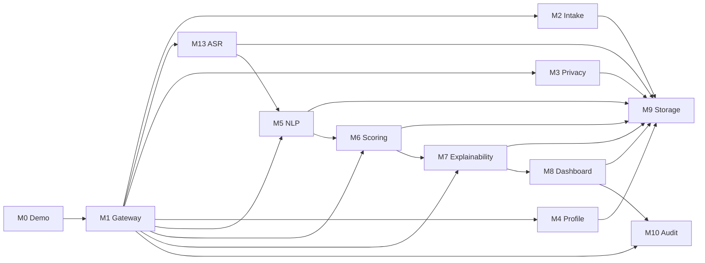

# Module Catalog

---

## Document Structure

- [Overview](#overview)
- [Diagram 1. Module Interaction Map](#diagram-1-module-interaction-map)
- [M0 Demo](#m0-demo)
- [M1 Gateway](#m1-gateway)
- [M2 Intake](#m2-intake)
- [M3 Privacy](#m3-privacy)
- [M4 Profile](#m4-profile)
- [M5 NLP](#m5-nlp)
- [M6 Scoring](#m6-scoring)
- [M7 Explainability](#m7-explainability)
- [M8 Dashboard](#m8-dashboard)
- [M9 Storage](#m9-storage)
- [M10 Audit](#m10-audit)
- [M13 ASR](#m13-asr)

---

## Overview

This document consolidates the functional documentation for all backend modules. It separates module-level responsibilities from the higher-level architecture and API documents so that each concern stays in one clear place.

---

## Diagram 1. Module Interaction Map

---

## M0 Demo

Provides pre-built candidate fixtures for hackathon demonstration. Loads realistic candidate payloads from JSON files and runs them through the existing pipeline without any modifications to M2-M7 modules.

| File | Responsibility |
|---|---|
| `backend/app/modules/m0_demo/fixtures/*.json` | 14 pre-built candidate payloads covering all programs |
| `backend/app/modules/m0_demo/schemas.py` | `FixtureMeta`, `FixtureSummary`, `FixtureDetail` contracts |
| `backend/app/modules/m0_demo/service.py` | Fixture loading, caching, and payload parsing |
| `backend/app/modules/m0_demo/router.py` | Demo API endpoints: list, detail, and pipeline run |

---

## M1 Gateway

### Purpose

`M1` is the public backend entry point. It exposes HTTP endpoints, coordinates the active pipeline, and returns normalized API envelopes.

### Functional Scope

- exposes intake endpoints;
- exposes full pipeline submission endpoints;
- exposes direct M6 scoring endpoints;
- coordinates the implemented module order;
- normalizes API success and error responses.

### Inputs

- raw candidate submission payloads;
- canonical `SignalEnvelope` for direct scoring routes;
- batch lists for sequential batch processing.

### Outputs

- intake responses with candidate identifiers;
- pipeline responses with score and explanation payloads;
- direct scoring and evaluation responses.

### Files

| File | Responsibility |
|---|---|
| `backend/app/modules/m1_gateway/router.py` | Public routes |
| `backend/app/modules/m1_gateway/orchestrator.py` | Full pipeline orchestration |

---

## M2 Intake

### Purpose

`M2` validates the incoming submission and creates the initial candidate record that anchors the rest of the pipeline.

### Functional Scope

- validates candidate payload structure;
- computes initial completeness;
- extracts administrative eligibility signals;
- persists the initial intake record;
- returns `candidate_id` and intake state.

### Inputs

- raw application form data;
- selected program;
- optional content references such as essay and video link.

### Outputs

- intake record identifier;
- intake completeness;
- initial eligibility and data flags.

### Files

| File | Responsibility |
|---|---|
| `backend/app/modules/m2_intake/schemas.py` | Intake contracts |
| `backend/app/modules/m2_intake/service.py` | Validation and persistence |
| `backend/app/modules/m2_intake/router.py` | Intake endpoint |

---

## M3 Privacy

### Purpose

`M3` enforces privacy separation and produces the safe model-facing payload used by the AI and ML modules.

### Functional Scope

- separates candidate input into three layers;
- keeps PII in Layer 1 only;
- stores operational metadata in Layer 2;
- produces redacted model-safe content in Layer 3;
- redacts explicit identifiers from text.

### Inputs

- raw candidate payload;
- ASR transcript and quality flags when available.

### Outputs

- Layer 1 secure PII vault payload;
- Layer 2 operational metadata payload;
- Layer 3 safe model input payload.

### Files

| File | Responsibility |
|---|---|
| `backend/app/modules/m3_privacy/redactor.py` | Text redaction |
| `backend/app/modules/m3_privacy/separator.py` | Layer split logic |
| `backend/app/modules/m3_privacy/service.py` | Persistence and orchestration |

---

## M4 Profile

### Purpose

`M4` assembles a unified `CandidateProfile` from privacy-safe material and operational metadata.

### Functional Scope

- combines Layer 2 and Layer 3 into one profile;
- propagates completeness and data flags;
- includes ASR metadata for downstream modules;
- provides a normalized object for NLP and scoring stages.

### Inputs

- Layer 2 operational metadata;
- Layer 3 safe model input.

### Outputs

- canonical `CandidateProfile`.

### Files

| File | Responsibility |
|---|---|
| `backend/app/modules/m4_profile/schemas.py` | Candidate profile schema |
| `backend/app/modules/m4_profile/assembler.py` | Profile assembly |
| `backend/app/modules/m4_profile/service.py` | Profile coordination |

---

## M5 NLP

### Purpose

`M5` extracts structured decision signals from safe text, transcript, internal test answers, and project descriptions.

### Functional Scope

- normalizes safe inputs into reusable source bundles;
- calls Gemini for grouped signal extraction;
- applies heuristic fallback extraction when necessary;
- uses embeddings and consistency checks as advisory support;
- emits a canonical `SignalEnvelope` for `M6`.

### Inputs

- candidate id;
- selected program;
- essay text;
- redacted transcript;
- internal test answers;
- project descriptions;
- experience summary;
- completeness and data flags.

### Outputs

- `SignalEnvelope`;
- signal-level `value`, `confidence`, `source`, `evidence`, and `reasoning`;
- `program_id` normalization for scoring.

### Files

| File | Responsibility |
|---|---|
| `backend/app/modules/m5_nlp/schemas.py` | Request schema and validation |
| `backend/app/modules/m5_nlp/source_bundle.py` | Shared safe-source assembly |
| `backend/app/modules/m5_nlp/gemini_client.py` | Gemini provider integration |
| `backend/app/modules/m5_nlp/extractor.py` | Heuristic fallback extraction |
| `backend/app/modules/m5_nlp/signal_extraction_service.py` | Grouped extraction flow |
| `backend/app/modules/m5_nlp/embeddings.py` | Similarity and embedding utilities |
| `backend/app/modules/m5_nlp/ai_detector.py` | Advisory authenticity checks |
| `backend/app/modules/m5_nlp/client.py` | Safe local-media transcription fallback |

---

## M6 Scoring

### Purpose

`M6` converts structured signals into a review-priority score, recommendation category, ranking fields, and review-routing output.

### Functional Scope

- computes deterministic sub-scores;
- computes a rule-based baseline score;
- refines the score with `GradientBoostingRegressor`;
- applies program-aware weighting profiles;
- derives confidence, uncertainty, and review-routing fields;
- prepares explainability-ready outputs for `M7`.

### Inputs

- canonical `SignalEnvelope`;
- selected program and canonical `program_id`;
- completeness and data flags.

### Outputs

- `CandidateScore`;
- `review_priority_index`;
- `recommendation_status`;
- `manual_review_required`;
- `human_in_loop_required`;
- `uncertainty_flag`;
- strengths, risks, and decision summary.

### Files

| File | Responsibility |
|---|---|
| `backend/app/modules/m6_scoring/m6_scoring_config.yaml` | Core policy config |
| `backend/app/modules/m6_scoring/m6_scoring_config.py` | Typed config loader |
| `backend/app/modules/m6_scoring/program_policy.py` | Program-specific policy lookup |
| `backend/app/modules/m6_scoring/rules.py` | Baseline sub-score logic |
| `backend/app/modules/m6_scoring/confidence.py` | Confidence and uncertainty |
| `backend/app/modules/m6_scoring/decision_policy.py` | Final category and review policy |
| `backend/app/modules/m6_scoring/ml_model.py` | GBR refinement model |
| `backend/app/modules/m6_scoring/service.py` | Public scoring service |
| `backend/app/modules/m6_scoring/evaluation.py` | Evaluation helpers |
| `backend/app/modules/m6_scoring/optimization.py` | Threshold search |
| `backend/app/modules/m6_scoring/synthetic_data.py` | Synthetic fixtures |
| `backend/app/modules/m6_scoring/ranker.py` | Batch ranking |

---

## M7 Explainability

### Purpose

`M7` converts `SignalEnvelope + CandidateScore` into reviewer-facing explanations that can be shown in a dashboard or report.

### Functional Scope

- builds concise candidate summary text;
- selects top strengths and caution blocks;
- maps evidence snippets to factors;
- produces reviewer guidance text;
- formats auditable explanation output without re-scoring the candidate.

### Inputs

- canonical `SignalEnvelope`;
- `CandidateScore` from `M6`.

### Outputs

- summary;
- positive factors;
- caution blocks;
- evidence items;
- reviewer guidance.

### Files

| File | Responsibility |
|---|---|
| `backend/app/modules/m7_explainability/schemas.py` | Explainability contracts |
| `backend/app/modules/m7_explainability/factors.py` | Factor and caution titles |
| `backend/app/modules/m7_explainability/evidence.py` | Evidence mapping |
| `backend/app/modules/m7_explainability/service.py` | Explainability assembly |

---

## M8 Dashboard

### Purpose

`M8` exposes the reviewer-facing dashboard API.

### Current State

- implemented in this branch;
- exposes dashboard stats, ranking lists, candidate detail views, shortlist reads, and safe reviewer identity projection;
- requires reviewer API key access before returning reviewer-facing data.

### Files

| File | Responsibility |
|---|---|
| `backend/app/modules/m8_dashboard/router.py` | Reviewer-facing read routes and override entrypoint |
| `backend/app/modules/m8_dashboard/service.py` | Safe reviewer projection logic and dashboard aggregation |
| `backend/app/modules/m8_dashboard/schemas.py` | Reviewer DTOs for stats, lists, detail, and shortlist |

---

## M9 Storage

### Purpose

`M9` provides the repository and persistence layer shared by the active modules.

### Functional Scope

- stores candidate records and layer payloads;
- stores NLP signals, scores, and explanations;
- provides repository methods for reads and writes;
- acts as the persistence backbone for the pipeline.

### Files

| File | Responsibility |
|---|---|
| `backend/app/modules/m9_storage/models.py` | SQLAlchemy models |
| `backend/app/modules/m9_storage/repository.py` | Repository methods |

---

## M10 Audit

### Purpose

`M10` handles audit logging and reviewer action traceability.

### Current State

- implemented in this branch;
- stores decision overrides, reviewer actions, and pipeline audit events;
- exposes candidate action endpoints and a reviewer-facing audit feed.

### Files

| File | Responsibility |
|---|---|
| `backend/app/modules/m10_audit/logger.py` | Future audit logging helpers |
| `backend/app/modules/m10_audit/service.py` | Override workflows, reviewer action writes, and audit feed shaping |
| `backend/app/modules/m10_audit/router.py` | Reviewer action and audit feed routes |

---

## M13 ASR

### Purpose

`M13` transcribes interview audio or video and produces transcript quality markers used by the rest of the pipeline.

### Functional Scope

- resolves safe media input;
- calls Groq `whisper-large-v3-turbo`;
- normalizes transcript segments;
- computes confidence and quality flags;
- emits `requires_human_review` for low-quality transcription cases.

### Inputs

- candidate id;
- media path or URL;
- optional language hints.

### Outputs

- transcript text;
- segment list;
- confidence values;
- quality flags;
- `requires_human_review`.

### Files

| File | Responsibility |
|---|---|
| `backend/app/modules/m13_asr/schemas.py` | ASR contracts |
| `backend/app/modules/m13_asr/downloader.py` | Safe media resolution |
| `backend/app/modules/m13_asr/transcriber.py` | Groq Whisper integration |
| `backend/app/modules/m13_asr/quality_checker.py` | Quality analysis |
| `backend/app/modules/m13_asr/service.py` | ASR orchestration |

---

Projet Documentation
