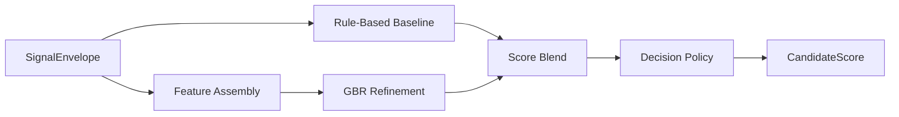
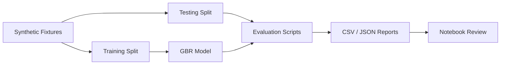

# Scoring and Decision Policy

---

## Document Structure

- [Purpose](#purpose)
- [Inputs](#inputs)
- [Sub-Scores](#sub-scores)
- [Scoring Formula](#scoring-formula)
- [Decision Categories](#decision-categories)
- [Human-in-the-Loop Routing](#human-in-the-loop-routing)
- [Evaluation Workflow](#evaluation-workflow)

---

## Purpose

`M6` converts structured NLP signals into auditable decision-support output for admissions reviewers. It combines deterministic scoring, ML refinement, confidence estimation, program-aware routing, and explicit manual-review escalation.

---

## Inputs

`M6` consumes a canonical `SignalEnvelope` that includes:

- candidate id
- selected program
- canonical program id
- completeness
- data flags
- structured signals

Each signal provides:

- normalized value
- confidence
- source list
- evidence snippets
- compact reasoning

---

## Sub-Scores

The scoring policy uses the following sub-score families:

| Sub-score | Meaning |
|---|---|
| `leadership_potential` | leadership behaviors, ownership, coordination |
| `growth_trajectory` | resilience, learning, progress after setbacks |
| `motivation_clarity` | clarity of goals and reason for applying |
| `initiative_agency` | self-started action and proactivity |
| `learning_agility` | ability to adapt and learn quickly |
| `communication_clarity` | clarity, structure, articulation |
| `ethical_reasoning` | fairness, decision quality, civic orientation |
| `program_fit` | alignment between candidate trajectory and selected program |

---

## Scoring Formula

### Rule-Based Baseline

`M6` first computes a deterministic baseline score from weighted sub-scores:

```text
baseline_rpi =
  w1 * leadership_potential +
  w2 * growth_trajectory +
  w3 * motivation_clarity +
  w4 * initiative_agency +
  w5 * learning_agility +
  w6 * communication_clarity +
  w7 * ethical_reasoning +
  w8 * program_fit
```

The exact weights are controlled by:

- `backend/app/modules/m6_scoring/m6_scoring_config.yaml`

### ML Refinement

The ML layer uses `GradientBoostingRegressor` to refine the baseline.

```text
final_raw_score = blend(baseline_rpi, ml_rpi)
```

### Decision Policy

The final decision layer applies:

- threshold bands
- completeness penalties where configured
- confidence and uncertainty logic
- manual-review routing
- program-aware policy profiles

### Diagram 1. M6 Scoring Flow



---

## Decision Categories

Primary recommendation categories:

- `STRONG_RECOMMEND`
- `RECOMMEND`
- `WAITLIST`
- `DECLINED`

These categories are separate from manual-review routing.

---

## Human-in-the-Loop Routing

Review-routing fields:

- `manual_review_required`
- `human_in_loop_required`
- `uncertainty_flag`
- `review_recommendation`

This allows `M6` to express:

- a stable recommendation category;
- a separate escalation decision;
- a separate confidence signal.

---

## Evaluation Workflow

The evaluation bundle lives under:

`backend/tests/m6_scoring/`

It supports:

- baseline vs GBR comparison
- balanced vs stress scenarios
- threshold and decision-policy optimization
- notebook review
- CSV and JSON report export

### Diagram 2. Evaluation Workflow



---

Projet Documentation
