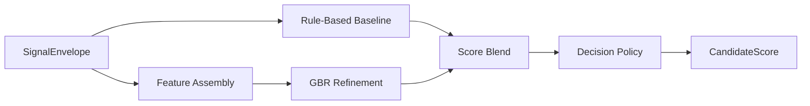

# Scoring and Decision Policy

---

## Document Structure

- [Purpose](#purpose)
- [Inputs](#inputs)
- [Sub-Scores](#sub-scores)
- [Why These Sub-Scores Exist](#why-these-sub-scores-exist)
- [What Program Fit Means](#what-program-fit-means)
- [Scoring Formula](#scoring-formula)
- [Why the Weights Matter](#why-the-weights-matter)
- [Program-Aware Weight Profiles](#program-aware-weight-profiles)
- [Decision Categories](#decision-categories)
- [Human-in-the-Loop Routing](#human-in-the-loop-routing)
- [Evaluation Workflow](#evaluation-workflow)

---

## Purpose

`M6` converts structured NLP signals into auditable decision-support output for admissions reviewers. It combines deterministic scoring, ML refinement, confidence estimation, program-aware routing, and explicit manual-review escalation.

---

## Inputs

`M6` consumes a canonical `SignalEnvelope` that includes:

- candidate id
- selected program
- canonical program id
- completeness
- data flags
- structured signals

Each signal provides:

- normalized value
- confidence
- source list
- evidence snippets
- compact reasoning

---

## Sub-Scores

The scoring policy uses the following sub-score families:

| Sub-score | Meaning |
|---|---|
| `leadership_potential` | leadership behaviors, ownership, coordination |
| `growth_trajectory` | resilience, learning, progress after setbacks |
| `motivation_clarity` | clarity of goals and reason for applying |
| `initiative_agency` | self-started action and proactivity |
| `learning_agility` | ability to adapt and learn quickly |
| `communication_clarity` | clarity, structure, articulation |
| `ethical_reasoning` | fairness, decision quality, civic orientation |
| `program_fit` | alignment between candidate trajectory and selected program |

---

## Why These Sub-Scores Exist

The scoring design deliberately avoids a single opaque impression score. Each sub-score isolates one reviewer-relevant dimension of candidate potential:

- `leadership_potential` captures whether the candidate already coordinates people, takes responsibility, or influences outcomes;
- `growth_trajectory` captures whether the candidate learns from setbacks and shows upward movement rather than static achievement only;
- `motivation_clarity` captures whether the candidate understands why they are applying and what they want to build or study;
- `initiative_agency` captures whether the candidate acts without waiting for perfect conditions;
- `learning_agility` captures whether the candidate can adapt, learn quickly, and absorb feedback;
- `communication_clarity` captures whether the candidate can explain ideas clearly enough for collaborative work;
- `ethical_reasoning` captures whether the candidate shows fairness, responsibility, and judgment;
- `program_fit` captures whether the selected academic track matches the candidate's stated direction.

These dimensions were chosen because the system is intended to identify early-stage potential, not only polished self-presentation or prior privilege.

---

## What Program Fit Means

`program_fit` does not mean social fit, personality fit, or demographic fit. In `M6`, it means one narrow and auditable thing:

- how strongly the candidate's goals, interests, projects, vocabulary, and examples align with the selected program.

At the configuration level, `program_fit` is currently computed from `program_alignment`, which comes from `M5`. That upstream signal is based on safe evidence such as:

- transcript content;
- essay intent;
- project descriptions;
- internal-test reasoning where relevant.

`program_fit` matters because a strong candidate can still be weakly aligned with the specific program they selected. The system should distinguish:

- high general potential;
- high potential for this exact track.

This keeps the pipeline from treating every strong applicant as equally relevant for every program.

---

## Scoring Formula

### Rule-Based Baseline

`M6` first computes a deterministic baseline score from weighted sub-scores:

```text
baseline_rpi =
  w1 * leadership_potential +
  w2 * growth_trajectory +
  w3 * motivation_clarity +
  w4 * initiative_agency +
  w5 * learning_agility +
  w6 * communication_clarity +
  w7 * ethical_reasoning +
  w8 * program_fit
```

The exact weights are controlled by:

- `backend/app/modules/m6_scoring/m6_scoring_config.yaml`

### ML Refinement

The ML layer uses `GradientBoostingRegressor` to refine the baseline.

```text
final_raw_score = blend(baseline_rpi, ml_rpi)
```

### Decision Policy

The final decision layer applies:

- threshold bands
- completeness penalties where configured
- confidence and uncertainty logic
- manual-review routing
- program-aware policy profiles

---

## Why the Weights Matter

The weights are the policy layer that converts multiple sub-scores into a single review-priority score. They matter because they answer a real admissions question:

- which dimensions should dominate the decision when evidence is mixed?

Without weights, every signal family would influence the final score equally, which would be a poor fit for this use case. The chosen weighting scheme makes the model prioritize:

- leadership and growth first;
- motivation and initiative next;
- learning and communication after that;
- ethics and program match as necessary balancing dimensions.

The default baseline profile is:

| Sub-score | Default weight | Why it matters |
|---|---:|---|
| `leadership_potential` | `0.20` | The system is meant to surface future changemakers, so demonstrated ownership and influence matter most. |
| `growth_trajectory` | `0.18` | Early-stage candidates may not have polished achievements yet, so growth and resilience carry strong signal value. |
| `motivation_clarity` | `0.15` | Strong intent and direction reduce the risk of accidental or weak-fit applications. |
| `initiative_agency` | `0.15` | Initiative is a core marker of early potential in educational and project-based contexts. |
| `learning_agility` | `0.12` | Ability to learn quickly matters strongly, but should not dominate over demonstrated agency and growth. |
| `communication_clarity` | `0.10` | Clear expression matters, but the system should not over-reward polished speaking alone. |
| `ethical_reasoning` | `0.05` | Ethical judgment is important, but should operate as a balancing dimension rather than the main driver. |
| `program_fit` | `0.05` | Fit matters, but the system should not over-penalize a promising candidate for imperfect wording alone. |

This design intentionally reduces the chance that a candidate is over-rewarded only for style, surface polish, or program-specific keyword stuffing.

---

## Program-Aware Weight Profiles

Different tracks require different emphasis, so `M6` overrides the default profile with program-aware weights.

### Why these profiles exist

The purpose is not to judge candidates by personality stereotypes. The purpose is to adjust scoring toward the type of evidence most relevant to each track.

### Current logic by program

| Program | Main emphasis | Why |
|---|---|---|
| `general_admissions` | leadership, growth, motivation | Neutral admissions baseline for mixed or undecided cases. |
| `creative_engineering` | initiative, learning agility, program fit | Engineering tracks reward building, experimentation, prototyping, and problem-solving action. |
| `digital_products_and_services` | initiative, communication, program fit | Product work needs proactive execution, user-oriented thinking, and the ability to explain product ideas. |
| `sociology_of_innovation_and_leadership` | leadership, ethical reasoning, program fit | This track values social systems thinking, values, inclusion, and people-centered leadership. |
| `public_governance_and_development` | ethical reasoning, communication, leadership | Governance-related tracks require judgment, public responsibility, and strong reasoning in institutional contexts. |
| `digital_media_and_marketing` | communication, initiative, motivation | Media and marketing rely more heavily on clarity, storytelling, audience awareness, and proactive content creation. |

### Important policy constraint

Program-specific weighting only changes the importance of safe, explainable sub-scores. It does not introduce demographic features, family background, region, gender, or other restricted fields into scoring.

### Diagram 1. M6 Scoring Flow



---

## Decision Categories

Primary recommendation categories:

- `STRONG_RECOMMEND`
- `RECOMMEND`
- `WAITLIST`
- `DECLINED`

These categories are separate from manual-review routing.

---

## Human-in-the-Loop Routing

Review-routing fields:

- `manual_review_required`
- `human_in_loop_required`
- `uncertainty_flag`
- `review_recommendation`

This allows `M6` to express:

- a stable recommendation category;
- a separate escalation decision;
- a separate confidence signal.

---

## Evaluation Workflow

The evaluation bundle lives under:

`backend/tests/m6_scoring/`

It supports:

- baseline vs GBR comparison
- balanced vs stress scenarios
- threshold and decision-policy optimization
- notebook review
- CSV and JSON report export

### Diagram 2. Evaluation Workflow


---

Projet Documentation
