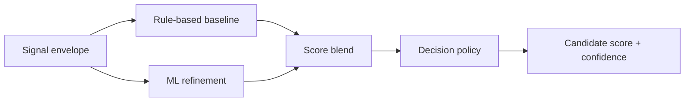
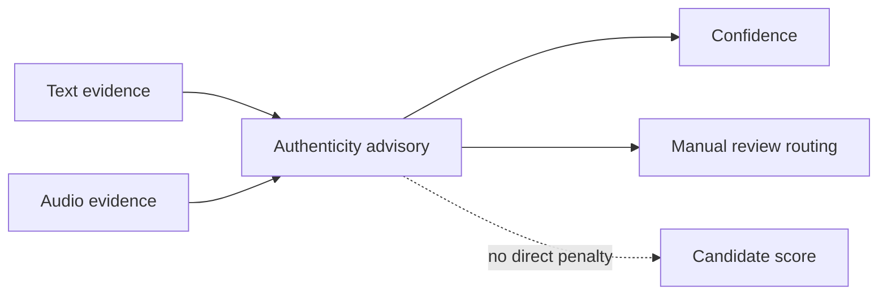

# Scoring and Authenticity Advisory

---

## Purpose

The `Scoring` stage converts structured extraction output into committee-facing decision support. It produces:

- candidate score
- confidence
- recommendation status
- manual review routing
- caution flags

The score is not a final admission decision. The final outcome belongs to the admissions committee.

---

## Inputs

The scoring stage consumes a canonical signal envelope that includes:

- candidate id
- selected program
- completeness
- data flags
- extracted signals
- transcript- and essay-derived evidence
- authenticity advisory flags when available

---

## Core dimensions

The current score is based on eight dimensions:

| Dimension | Meaning |
|---|---|
| `leadership_potential` | ownership, coordination, influence |
| `growth_trajectory` | progress after setbacks, resilience |
| `motivation_clarity` | clarity of goals and application intent |
| `initiative_agency` | self-started action and proactivity |
| `learning_agility` | speed of adaptation and learning |
| `communication_clarity` | clarity and structure of expression |
| `ethical_reasoning` | fairness, responsibility, judgment |
| `program_fit` | alignment with the selected academic track |

---

## Score structure

The scoring stage uses three layers:

1. Rule-based baseline
2. ML refinement
3. Decision policy and confidence routing

The main result shown in the UI is **Candidate score**.

### Diagram 1. Score composition

---

## Confidence and routing

Confidence is tracked separately from score.

This allows the platform to:

- keep a stable candidate score
- lower confidence when evidence quality is weak
- route degraded cases to manual review
- show caution flags without auto-rejecting the candidate

Review-routing fields include:

- `manual_review_required`
- `human_in_loop_required`
- `uncertainty_flag`
- `review_recommendation`

---

## Authenticity advisory

The platform no longer frames this layer as a hard `AI detect` verdict.

Instead, it uses an **Authenticity advisory** layer that contributes:

- writing authenticity risk
- cross-source inconsistency signals
- speech authenticity risk
- caution flags for committee review

These signals:

- do **not** directly lower the candidate score
- may lower confidence
- may trigger or reinforce manual review
- are surfaced as advisory evidence for reviewers

### Speech authenticity

The audio path can raise a `speech_authenticity_risk` flag when the media appears unnaturally uniform. This is treated as a caution signal, not as an automatic proof of synthetic speech.

### Diagram 2. Authenticity advisory behavior

---

## Program-aware weighting

The score uses program-aware weight profiles so different tracks can emphasize different evidence patterns. The intent is not to encode stereotypes, but to align weighting with the academic demands of the selected track.

Examples:

- digital media and marketing: communication, initiative, motivation
- creative engineering: initiative, learning agility, fit
- public governance: ethical reasoning, communication, leadership

---

## Decision categories

Primary recommendation categories:

- `STRONG_RECOMMEND`
- `RECOMMEND`
- `WAITLIST`
- `DECLINED`

These categories are separate from:

- confidence
- manual review routing
- the final chair decision

---

## Evaluation posture

The current system should be presented as a **decision-support and triage platform**, not as a fully validated autonomous admissions model.

At this stage:

- synthetic evaluation is used for development and stress testing
- committee review remains the final authority
- authenticity advisory is a caution layer, not a plagiarism verdict
- degraded pipelines must be surfaced explicitly

---

## Current implementation notes

Scoring behavior is configured in:

- `backend/app/modules/scoring/scoring_config.yaml`

Evaluation artifacts and tests live under:

- `backend/tests/scoring/`

Recommended reporting metrics include:

- average latency
- p95 latency
- degraded pipeline rate
- manual review rate
- authenticity advisory rate
- ASR low-confidence rate

