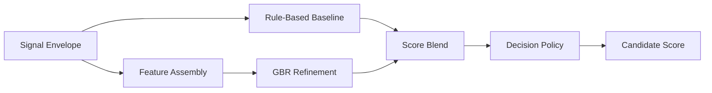

# Scoring and Decision Policy

---

## Document Structure

- [Purpose](#purpose)
- [Inputs](#inputs)
- [Evaluation Dimensions](#evaluation-dimensions)
- [Why These Dimensions Exist](#why-these-dimensions-exist)
- [What Program Fit Means](#what-program-fit-means)
- [Scoring Formula](#scoring-formula)
- [Why the Weights Matter](#why-the-weights-matter)
- [Program-Aware Weight Profiles](#program-aware-weight-profiles)
- [AI Detect as a Supplementary Signal](#ai-detect-as-a-supplementary-signal)
- [Decision Categories](#decision-categories)
- [Human-in-the-Loop Routing](#human-in-the-loop-routing)
- [Evaluation Workflow](#evaluation-workflow)

---

## Purpose

The `Scoring` stage converts structured extraction output into auditable decision-support output for the admissions committee. It combines deterministic scoring, ML refinement, confidence estimation, program-aware routing, and explicit manual-review escalation.

In the UI, the main numerical result is presented as **Candidate score**. In the API and backend code, this still maps to the persisted `rpi_score` field.

---

## Inputs

The `Scoring` stage consumes a canonical signal envelope that includes:

- candidate id
- selected program
- canonical program id
- completeness
- data flags
- structured signals
- supplementary caution markers from `AI Detect`, when available

Each structured signal provides:

- normalized value
- confidence
- source list
- evidence snippets
- compact reasoning

---

## Evaluation Dimensions

The scoring policy uses the following evaluation dimensions:

| Dimension | Meaning |
|---|---|
| `leadership_potential` | leadership behaviors, ownership, coordination |
| `growth_trajectory` | resilience, learning, progress after setbacks |
| `motivation_clarity` | clarity of goals and reason for applying |
| `initiative_agency` | self-started action and proactivity |
| `learning_agility` | ability to adapt and learn quickly |
| `communication_clarity` | clarity, structure, articulation |
| `ethical_reasoning` | fairness, decision quality, civic orientation |
| `program_fit` | alignment between candidate trajectory and selected program |

---

## Why These Dimensions Exist

The scoring design deliberately avoids a single opaque impression score. Each dimension isolates one reviewer-relevant aspect of candidate potential:

- `leadership_potential` checks whether the candidate already takes responsibility or influences outcomes
- `growth_trajectory` checks whether the candidate learns from setbacks and shows upward movement
- `motivation_clarity` checks whether the candidate understands why they are applying
- `initiative_agency` checks whether the candidate acts without waiting for perfect conditions
- `learning_agility` checks whether the candidate adapts and absorbs feedback
- `communication_clarity` checks whether the candidate can explain ideas clearly enough for collaborative study and work
- `ethical_reasoning` checks whether the candidate shows fairness, responsibility, and judgment
- `program_fit` checks whether the selected academic track matches the candidate's stated direction

These dimensions were chosen to identify early-stage potential rather than polished self-presentation alone.

---

## What Program Fit Means

`program_fit` does not mean demographic fit, social fit, or personality fit. It means one narrow and auditable thing:

- how strongly the candidate's goals, interests, examples, and vocabulary align with the selected academic program

At the configuration level, `program_fit` is currently computed from upstream alignment signals produced during extraction. Those signals are expected to rely only on safe evidence such as:

- transcript content
- essay intent
- candidate examples
- internal-answer reasoning where relevant

This matters because a promising candidate can still be weakly aligned with the specific track they selected.

---

## Scoring Formula

### Rule-Based Baseline

The baseline score is computed from weighted evaluation dimensions:

```text
baseline_rpi =
  w1 * leadership_potential +
  w2 * growth_trajectory +
  w3 * motivation_clarity +
  w4 * initiative_agency +
  w5 * learning_agility +
  w6 * communication_clarity +
  w7 * ethical_reasoning +
  w8 * program_fit
```

The exact weights are configured in:

- `backend/app/modules/scoring/scoring_config.yaml`

### ML Refinement

The ML refinement layer uses `GradientBoostingRegressor`:

```text
final_raw_score = blend(baseline_rpi, ml_rpi)
```

### Decision Policy

The final decision layer applies:

- threshold bands
- completeness penalties where configured
- confidence and uncertainty logic
- manual-review routing
- program-aware policy profiles

---

## Why the Weights Matter

Weights are the policy layer that decides which dimensions should dominate the final candidate score when evidence is mixed.

The default baseline profile is:

| Dimension | Default weight | Why it matters |
|---|---:|---|
| `leadership_potential` | `0.20` | The system aims to surface future changemakers, so ownership and influence matter most. |
| `growth_trajectory` | `0.18` | Growth and resilience are critical for early-stage applicants. |
| `motivation_clarity` | `0.15` | Strong intent reduces the risk of accidental or weak-fit applications. |
| `initiative_agency` | `0.15` | Initiative is a core marker of early potential. |
| `learning_agility` | `0.12` | Learning speed matters strongly, but should not dominate over initiative and growth. |
| `communication_clarity` | `0.10` | Clear expression matters, but should not over-reward polished speaking alone. |
| `ethical_reasoning` | `0.05` | Ethical judgment is important, but acts as a balancing dimension. |
| `program_fit` | `0.05` | Fit matters, but should not over-penalize promising candidates for imperfect wording alone. |

---

## Program-Aware Weight Profiles

Different tracks require different emphasis, so `Scoring` overrides the default profile with program-aware weights.

### Why these profiles exist

The purpose is not to judge candidates by personality stereotypes. The purpose is to adjust weighting toward the evidence most relevant to each track.

### Current logic by program

| Program | Main emphasis | Why |
|---|---|---|
| `general_admissions` | leadership, growth, motivation | Neutral baseline for mixed or undecided cases. |
| `creative_engineering` | initiative, learning agility, program fit | Engineering tracks reward experimentation and problem-solving action. |
| `digital_products_and_services` | initiative, communication, program fit | Product work needs proactive execution and clear communication. |
| `sociology_of_innovation_and_leadership` | leadership, ethical reasoning, program fit | This track values social systems thinking and people-centered leadership. |
| `public_governance_and_development` | ethical reasoning, communication, leadership | Governance tracks require public responsibility and institutional reasoning. |
| `digital_media_and_marketing` | communication, initiative, motivation | Media and marketing rely on clarity, audience awareness, and proactive creation. |

### Diagram 1. Scoring Flow



---

## AI Detect as a Supplementary Signal

`AI Detect` is a supplementary stage, not a replacement for committee judgment.

It can contribute:

- consistency checks between transcript, essay, and safe content
- caution markers such as authenticity risk
- additional evidence for explanation blocks and committee review

These signals are intended to:

- inform `Scoring`
- enrich `Explanation`
- support human review

They must not be treated as a fully autonomous plagiarism verdict.

---

## Decision Categories

Primary recommendation categories:

- `STRONG_RECOMMEND`
- `RECOMMEND`
- `WAITLIST`
- `DECLINED`

These categories are separate from manual-review routing and separate from the final committee decision.

---

## Human-in-the-Loop Routing

Review-routing fields:

- `manual_review_required`
- `human_in_loop_required`
- `uncertainty_flag`
- `review_recommendation`

This allows `Scoring` to express:

- a stable recommendation category
- a separate escalation decision
- a separate confidence signal

---

## Evaluation Workflow

The evaluation bundle lives under:

`backend/tests/scoring/`

It supports:

- baseline vs GBR comparison
- balanced vs stress scenarios
- threshold and decision-policy optimization
- notebook review
- CSV and JSON report export
