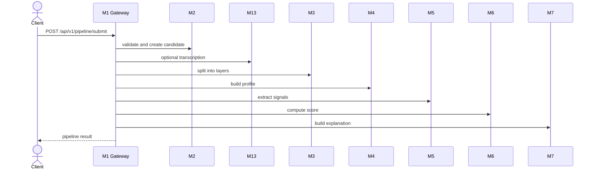
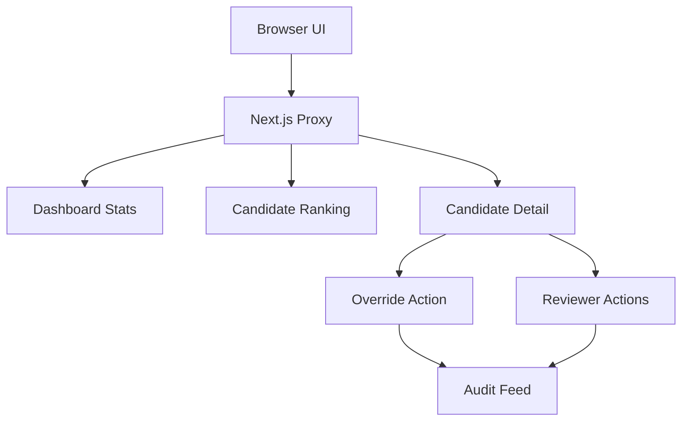

# API

---

## Структура документа

- [Обзор](#обзор)
- [Response Envelope](#response-envelope)
- [Системные endpoint'ы](#системные-endpointы)
- [Demo endpoint'ы](#demo-endpointы)
- [Candidate intake endpoint'ы](#candidate-intake-endpointы)
- [Pipeline endpoint'ы](#pipeline-endpointы)
- [Диаграмма 1. Flow полного pipeline](#диаграмма-1-flow-полного-pipeline)
- [Direct scoring endpoint'ы](#direct-scoring-endpointы)
- [Reviewer endpoint'ы](#reviewer-endpointы)
- [Диаграмма 2. Reviewer workflow surface](#диаграмма-2-reviewer-workflow-surface)
- [Канонические контракты](#канонические-контракты)

---

## Обзор

Этот документ перечисляет endpoint'ы, которые реально реализованы в текущей ветке.

Базовый backend URL:

`http://localhost:8000`

Базовый frontend proxy URL:

`http://localhost:3000/api/backend/*`

Next.js proxy переписывает `/api/backend/*` в backend `/api/v1/*`. Для `dashboard/*` и `audit/*` он автоматически добавляет `X-API-Key`, если на сервере frontend задан `REVIEWER_API_KEY`.

---

## Response Envelope

Успешный ответ:

```json
{
  "success": true,
  "data": {},
  "error": null,
  "meta": {
    "timestamp": "2026-03-29T12:00:00Z",
    "version": "1.0.0"
  }
}
```

Ошибка:

```json
{
  "success": false,
  "data": null,
  "error": {
    "code": "VALIDATION_ERROR",
    "message": "Invalid payload",
    "details": {}
  },
  "meta": {
    "timestamp": "2026-03-29T12:00:00Z",
    "version": "1.0.0"
  }
}
```

Одна и та же envelope-форма используется и для non-2xx ответов.

---

## Системные endpoint'ы

### `GET /`

Возвращает метаданные приложения.

### `GET /health`

Возвращает облегченный health response.

---

## Demo endpoint'ы

### `GET /api/v1/demo/candidates`

Возвращает список доступных demo-fixture кандидатов.

### `GET /api/v1/demo/candidates/{slug}`

Возвращает одну fixture вместе с полным payload.

### `POST /api/v1/demo/candidates/{slug}/run`

Берет fixture и прогоняет ее через живой синхронный pipeline.

Структура ответа совпадает с `POST /api/v1/pipeline/submit`.

---

## Candidate intake endpoint'ы

### `POST /api/v1/candidates/intake`

Валидирует анкету кандидата, создает запись, сохраняет encrypted PII и metadata и возвращает `candidate_id`.

Ключевые поля ответа:

- `candidate_id`
- `pipeline_status`
- `message`

Пример запроса:

```json
{
  "personal": {
    "first_name": "Aida",
    "last_name": "Example",
    "date_of_birth": "2007-06-15",
    "citizenship": "KZ"
  },
  "contacts": {
    "email": "aida@example.com",
    "telegram": "@aida"
  },
  "academic": {
    "selected_program": "Digital Media and Marketing"
  },
  "content": {
    "video_url": "https://www.youtube.com/watch?v=dQw4w9WgXcQ",
    "essay_text": "I want to build media products that help communities."
  },
  "internal_test": {
    "answers": [
      {
        "question_id": "q1",
        "answer": "I would choose the fair option because responsibility matters."
      }
    ]
  }
}
```

Актуальные правила intake:

- `contacts.email` обязателен
- `content.video_url` обязателен и проходит проверку public video URL
- `content.essay_text` опционален
- `content.transcript_text` опционален и может заменить эссе в downstream narrative extraction
- лишние неизвестные поля игнорируются

---

## Pipeline endpoint'ы

### `POST /api/v1/pipeline/submit`

Запускает реализованный backend flow:

`M2 -> optional M13 -> M3 -> M4 -> M5 -> M6 -> M7`

Ответ включает:

- `candidate_id`
- `pipeline_status`
- `score`
- `completeness`
- `data_flags`

### `POST /api/v1/pipeline/batch`

Запускает тот же flow для списка payload'ов. Сейчас batch-обработка идет последовательно внутри API-процесса.

---

## Диаграмма 1. Flow полного pipeline



---

## Direct scoring endpoint'ы

### `POST /api/v1/pipeline/score-signals`

Считает score одного кандидата из канонического `SignalEnvelope`.

### `POST /api/v1/pipeline/score-signals/batch`

Считает score и ranking для пачки `SignalEnvelope`.

### `POST /api/v1/pipeline/score-signals/train-synthetic`

Тренирует scoring refinement layer на synthetic data.

Query parameters:

- `sample_count`
- `seed`

### `POST /api/v1/pipeline/score-signals/evaluate-synthetic`

Гоняет synthetic holdout evaluation для `M6`.

Query parameters:

- `train_sample_count`
- `test_sample_count`
- `seed`

---

## Reviewer endpoint'ы

Все endpoint'ы в этом разделе требуют `X-API-Key`.

### `GET /api/v1/dashboard/stats`

Возвращает dashboard summary metrics:

- `total_candidates`
- `processed`
- `shortlisted`
- `pending_review`
- `avg_confidence`
- `by_status`

### `GET /api/v1/dashboard/candidates`

Возвращает ranking list reviewer-facing кандидатов с безопасно спроецированными именами.

Frontend использует этот endpoint для обработанного reviewer-ranking.

### `GET /api/v1/dashboard/candidate-pool`

Возвращает live candidate pool для экрана `/candidates` с разделением по стадиям:

- `raw`
- `processed`

Demo fixtures намеренно не смешиваются с этим endpoint'ом.

### `GET /api/v1/dashboard/candidates/{candidate_id}`

Возвращает полную reviewer detail view:

- candidate identity
- `score`
- `explanation`
- `raw_content`
- `audit_logs`

### `POST /api/v1/dashboard/candidates/{candidate_id}/override`

Переопределяет recommendation status и записывает audit entry.

Тело запроса:

```json
{
  "reviewer_id": "committee-reviewer",
  "new_status": "RECOMMEND",
  "comment": "Manual adjustment after committee review"
}
```

### `GET /api/v1/dashboard/shortlist`

Возвращает текущий shortlist на основе сохраненного score state.

### `POST /api/v1/dashboard/candidates/{candidate_id}/actions`

Создает reviewer action без override, например:

- `comment`
- `shortlist_add`
- `shortlist_remove`

### `GET /api/v1/dashboard/candidates/{candidate_id}/actions`

Возвращает историю reviewer actions для одного кандидата.

### `GET /api/v1/audit/feed?limit=100`

Возвращает глобальный audit feed в порядке от новых к старым.

---

## Диаграмма 2. Reviewer workflow surface



---

## Канонические контракты

### Выход M5

`M5` отдает `SignalEnvelope` с полями:

- `candidate_id`
- `signal_schema_version`
- `m5_model_version`
- `selected_program`
- `program_id`
- `completeness`
- `data_flags`
- `signals`

Каждый signal содержит:

- `value`
- `confidence`
- `source`
- `evidence`
- `reasoning`

### Выход M6

`M6` отдает `CandidateScore` с четырьмя основными recommendation category:

- `STRONG_RECOMMEND`
- `RECOMMEND`
- `WAITLIST`
- `DECLINED`

Отдельные review-routing поля:

- `manual_review_required`
- `human_in_loop_required`
- `uncertainty_flag`
- `review_recommendation`
- `ranking_position`
- `shortlist_eligible`

### Выход M7

`M7` отдает reviewer-facing explainability-контент:

- `summary`
- `positive_factors`
- `caution_blocks`
- `reviewer_guidance`
- `data_quality_notes`

---

Projet Documentation
