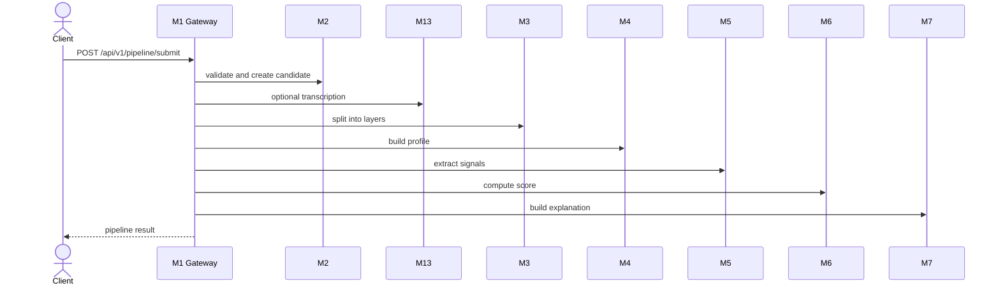
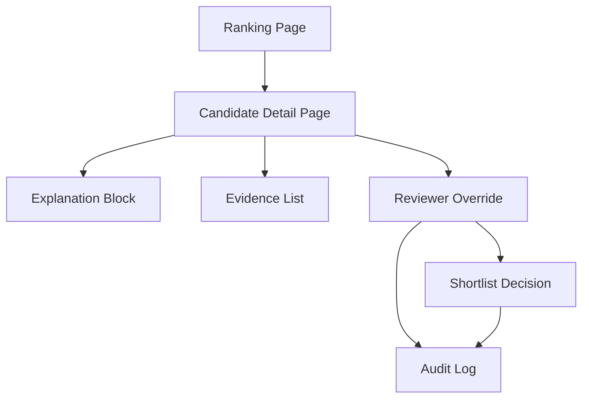

# Справочник API

---

## Структура документа

- [Обзор](#обзор)
- [Формат ответа](#формат-ответа)
- [Системные методы](#системные-методы)
- [Методы приема заявок](#методы-приема-заявок)
- [Методы запуска конвейера](#методы-запуска-конвейера)
- [Диаграмма 1. Полный путь обработки заявки](#диаграмма-1-полный-путь-обработки-заявки)
- [Методы прямого скоринга](#методы-прямого-скоринга)
- [Диаграмма 2. Поверхность работы проверяющего](#диаграмма-2-поверхность-работы-проверяющего)
- [Канонические контракты](#канонические-контракты)

---

## Обзор

Этот документ описывает только те методы API, которые реально реализованы в текущей ветке. Запланированные, но не существующие методы сюда не включаются.

Базовый адрес:

`http://localhost:8000`

---

## Формат ответа

Успешный ответ:

```json
{
  "success": true,
  "data": {},
  "error": null,
  "meta": {
    "timestamp": "2026-03-29T12:00:00Z",
    "version": "1.0.0"
  }
}
```

Ответ с ошибкой:

```json
{
  "success": false,
  "data": null,
  "error": {
    "code": "VALIDATION_ERROR",
    "message": "Invalid payload",
    "details": {}
  },
  "meta": {
    "timestamp": "2026-03-29T12:00:00Z",
    "version": "1.0.0"
  }
}
```

Тот же envelope используется и для non-2xx API ошибок: validation failures, auth failures и not-found ответов.

---

## Системные методы

### `GET /`

Возвращает общую информацию о приложении.

### `GET /health`

Возвращает короткий ответ о состоянии сервиса.

---

## Методы приема заявок

### `POST /api/v1/candidates/intake`

Проверяет структуру заявки кандидата, создает запись кандидата, сохраняет зашифрованные персональные данные и служебные сведения, после чего возвращает `candidate_id`.

Пример запроса:

```json
{
  "personal": {
    "first_name": "Aida",
    "last_name": "Example",
    "date_of_birth": "2007-06-15"
  },
  "academic": {
    "selected_program": "Digital Media and Marketing"
  },
  "content": {
    "essay_text": "I want to build media products that help communities.",
    "video_url": "https://example.com/interview.mp4"
  },
  "internal_test": {
    "answers": [
      {
        "question_id": "q1",
        "answer": "I would choose the fair option because responsibility matters."
      }
    ]
  }
}
```

---

## Методы запуска конвейера

### `POST /api/v1/pipeline/submit`

Запускает реализованный серверный конвейер:

`M2 -> M13 -> M3 -> M4 -> M5 -> M6 -> M7`

Ответ включает:

- `candidate_id`
- `pipeline_status`
- `score`
- `completeness`
- `data_flags`

### `POST /api/v1/pipeline/batch`

Запускает тот же конвейер для массива заявок. В текущей реализации пакетная обработка выполняется последовательно.

---

## Диаграмма 1. Полный путь обработки заявки



---

## Методы прямого скоринга

### `POST /api/v1/pipeline/score-signals`

Рассчитывает оценку для одного кандидата по каноническому `SignalEnvelope`.

Пример запроса:

```json
{
  "candidate_id": "8a352307-4af4-4f0a-a8f7-b0dd22cb6fa5",
  "signal_schema_version": "v1",
  "m5_model_version": "gemini-2.5-flash:grouped-v1",
  "selected_program": "Digital Products and Services",
  "program_id": "digital_products_and_services",
  "completeness": 0.91,
  "data_flags": [],
  "signals": {
    "leadership_indicators": {
      "value": 0.82,
      "confidence": 0.88,
      "source": ["video_transcript", "essay"],
      "evidence": ["candidate led a school team project"],
      "reasoning": "leadership behavior is explicit and concrete"
    }
  }
}
```

Пример ключевых полей ответа:

```json
{
  "candidate_id": "8a352307-4af4-4f0a-a8f7-b0dd22cb6fa5",
  "sub_scores": {
    "leadership_potential": 0.82,
    "growth_trajectory": 0.0,
    "motivation_clarity": 0.0,
    "initiative_agency": 0.0,
    "learning_agility": 0.0,
    "communication_clarity": 0.0,
    "ethical_reasoning": 0.0,
    "program_fit": 0.0
  },
  "review_priority_index": 0.63,
  "recommendation_status": "RECOMMEND",
  "manual_review_required": false,
  "human_in_loop_required": false,
  "uncertainty_flag": false,
  "review_recommendation": "STANDARD_REVIEW"
}
```

### `POST /api/v1/pipeline/score-signals/batch`

Рассчитывает оценки и ранжирование для массива объектов `SignalEnvelope`.

### `POST /api/v1/pipeline/score-signals/train-synthetic`

Обучает уточняющий слой скоринга на синтетических данных.

Параметры:

- `sample_count`
- `seed`

### `POST /api/v1/pipeline/score-signals/evaluate-synthetic`

Запускает контрольную оценку `M6` на синтетической выборке.

Параметры:

- `train_sample_count`
- `test_sample_count`
- `seed`

---

## Диаграмма 2. Поверхность работы проверяющего



---

## Канонические контракты

### Выход `M5`

`M5` возвращает `SignalEnvelope` со следующими полями:

- `candidate_id`
- `signal_schema_version`
- `m5_model_version`
- `selected_program`
- `program_id`
- `completeness`
- `data_flags`
- `signals`

Каждый сигнал включает:

- `value`
- `confidence`
- `source`
- `evidence`
- `reasoning`

### Выход `M6`

`M6` возвращает `CandidateScore` с четырьмя основными категориями рекомендации:

- `STRONG_RECOMMEND`
- `RECOMMEND`
- `WAITLIST`
- `DECLINED`

Поля маршрутизации на проверку отделены:

- `manual_review_required`
- `human_in_loop_required`
- `uncertainty_flag`
- `review_recommendation`

### Выход `M7`

`M7` возвращает материалы для проверяющего:

- summary
- positive_factors
- caution_blocks
- evidence_items
- reviewer_guidance

---

Projet Documentation
