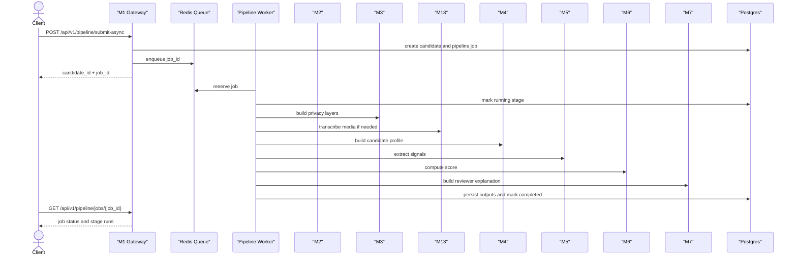
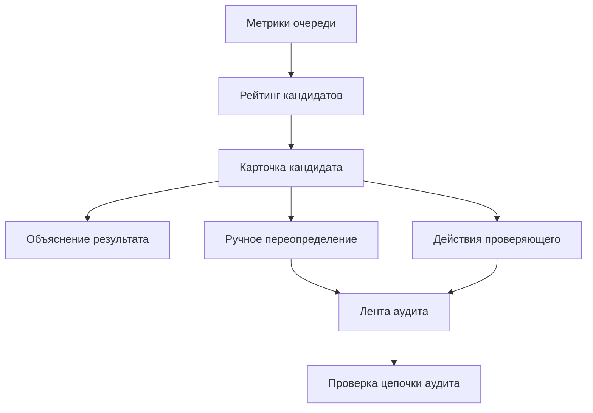

# Справочник API

---

## Структура документа

- [Обзор](#обзор)
- [Формат ответа](#формат-ответа)
- [Системные методы](#системные-методы)
- [Демо-методы](#демо-методы)
- [Методы приема заявок](#методы-приема-заявок)
- [Асинхронные методы конвейера](#асинхронные-методы-конвейера)
- [Диаграмма 1. Асинхронный путь обработки заявки](#диаграмма-1-асинхронный-путь-обработки-заявки)
- [Методы прямого скоринга](#методы-прямого-скоринга)
- [Методы проверяющего и аудита](#методы-проверяющего-и-аудита)
- [Диаграмма 2. Поверхность работы проверяющего](#диаграмма-2-поверхность-работы-проверяющего)
- [Канонические контракты](#канонические-контракты)

---

## Обзор

Документ описывает только те методы API, которые реально реализованы в текущей ветке.
Публичный путь обработки теперь асинхронный: сервер принимает заявку, создает фоновую задачу, сразу возвращает `candidate_id` и `job_id`, а тяжелые этапы выполняются воркерами.

Базовый адрес:

`http://localhost:8000`

---

## Формат ответа

Успешный ответ:

```json
{
  "success": true,
  "data": {},
  "error": null,
  "meta": {
    "timestamp": "2026-03-30T10:00:00Z",
    "version": "1.0.0"
  }
}
```

Ответ с ошибкой:

```json
{
  "success": false,
  "data": null,
  "error": {
    "code": "VALIDATION_ERROR",
    "message": "Неверный payload",
    "details": {}
  },
  "meta": {
    "timestamp": "2026-03-30T10:00:00Z",
    "version": "1.0.0"
  }
}
```

Тот же формат используется для ошибок валидации, ошибок доступа, ответов `404` и операционных сбоев.

---

## Системные методы

### `GET /`

Возвращает общую информацию о приложении.

### `GET /health`

Возвращает короткий ответ о состоянии сервиса.

---

## Демо-методы

### `GET /api/v1/demo/candidates`

Возвращает список доступных демо-кандидатов с краткими метаданными.

### `GET /api/v1/demo/candidates/{slug}`

Возвращает одного демо-кандидата и полный payload его заявки.

### `POST /api/v1/demo/candidates/{slug}/run`

Ставит выбранный демо-кейс в ту же асинхронную очередь, которая используется для реальных заявок.

Пример ответа:

```json
{
  "candidate_id": "c0e5ce38-6b8b-4f51-a16d-3d5e35501d9b",
  "job_id": "57a558a0-23ba-4311-a4ce-91b812a31c9a",
  "pipeline_status": "queued",
  "job_status": "queued",
  "current_stage": "privacy",
  "message": "Pipeline job accepted and queued."
}
```

---

## Методы приема заявок

### `POST /api/v1/candidates/intake`

Проверяет структуру заявки, создает запись кандидата, сохраняет защищенные персональные данные и служебные метаданные, после чего возвращает `candidate_id`.

Пример запроса:

```json
{
  "personal": {
    "first_name": "Aida",
    "last_name": "Example",
    "date_of_birth": "2007-06-15"
  },
  "academic": {
    "selected_program": "Digital Media and Marketing"
  },
  "content": {
    "essay_text": "I want to build media products that help communities.",
    "video_url": "https://example.com/interview.mp4"
  },
  "internal_test": {
    "answers": [
      {
        "question_id": "q1",
        "answer": "I would choose the fair option because responsibility matters."
      }
    ]
  }
}
```

---

## Асинхронные методы конвейера

### `POST /api/v1/pipeline/submit-async`

Принимает одну заявку, создает устойчивую задачу конвейера и сразу возвращает ответ.

Порядок этапов:

`privacy -> asr -> profile -> nlp -> scoring -> explainability`

Пример ответа:

```json
{
  "candidate_id": "c0e5ce38-6b8b-4f51-a16d-3d5e35501d9b",
  "job_id": "57a558a0-23ba-4311-a4ce-91b812a31c9a",
  "pipeline_status": "queued",
  "job_status": "queued",
  "current_stage": "privacy",
  "message": "Pipeline job accepted and queued."
}
```

### `POST /api/v1/pipeline/submit-async/batch`

Принимает до `50` заявок и создает отдельную задачу для каждой из них.

### `GET /api/v1/pipeline/jobs/{job_id}`

Возвращает текущее состояние задачи вместе с историей запусков этапов.

Основные поля:

- `status`
- `current_stage`
- `attempt_count`
- `error_code`
- `error_message`
- `stage_runs`

### `GET /api/v1/pipeline/jobs/{job_id}/events`

Возвращает ленту событий по задаче.

Типичные события:

- `job_queued`
- `stage_started`
- `stage_completed`
- `stage_failed`
- `job_completed`
- `job_failed`
- `job_requires_manual_review`

### `GET /api/v1/pipeline/candidates/{candidate_id}/status`

Возвращает статус обработки кандидата и снимок последней фоновой задачи.

### `GET /api/v1/pipeline/queue/metrics`

Служебный метод для проверяющего.

Возвращает глубину очереди, счетчики по этапам, сведения о повторах, долю ошибок, долю ручной проверки и агрегаты по времени выполнения.

### `GET /api/v1/pipeline/ops/jobs/dead-letter`

Служебный метод для просмотра задач, ушедших в dead-letter.

### `GET /api/v1/pipeline/ops/jobs/delayed`

Служебный метод для просмотра задач, ожидающих повторного запуска.

### `GET /api/v1/pipeline/ops/jobs/{job_id}/inspection`

Служебный метод для диагностики одной задачи: где она находится, можно ли ее повторить и в каком состоянии находятся попытки.

### `POST /api/v1/pipeline/ops/jobs/{job_id}/retry`

Служебный метод для ручного возврата неудачной задачи в очередь.

---

## Диаграмма 1. Асинхронный путь обработки заявки



---

## Методы прямого скоринга

### `POST /api/v1/pipeline/score-signals`

Считает оценку для одного кандидата по каноническому `SignalEnvelope`.

### `POST /api/v1/pipeline/score-signals/batch`

Считает оценки и ранжирование для массива объектов `SignalEnvelope`.

### `POST /api/v1/pipeline/score-signals/train-synthetic`

Обучает уточняющий слой на синтетических данных.

Параметры:

- `sample_count`
- `seed`

### `POST /api/v1/pipeline/score-signals/evaluate-synthetic`

Запускает контрольную оценку `M6` на синтетической выборке.

Параметры:

- `train_sample_count`
- `test_sample_count`
- `seed`

---

## Методы проверяющего и аудита

### `GET /api/v1/dashboard/stats`

Возвращает сводные показатели панели проверяющего.

### `GET /api/v1/dashboard/candidates`

Возвращает строки рейтинга для проверки.

### `GET /api/v1/dashboard/candidates/{candidate_id}`

Возвращает полную карточку кандидата для проверяющего.

### `POST /api/v1/dashboard/candidates/{candidate_id}/override`

Создает ручное переопределение статуса кандидата.

Идентификатор проверяющего определяется на сервере из контекста авторизации.

### `GET /api/v1/dashboard/shortlist`

Возвращает кандидатов, попавших в shortlist.

### `POST /api/v1/dashboard/candidates/{candidate_id}/actions`

Создает действие проверяющего без смены статуса, например комментарий или изменение shortlist.

### `GET /api/v1/dashboard/candidates/{candidate_id}/actions`

Возвращает историю действий проверяющего по кандидату.

### `GET /api/v1/audit/feed`

Возвращает ленту аудита.

### `GET /api/v1/audit/verify`

Проверяет целостность tamper-evident audit chain.

---

## Диаграмма 2. Поверхность работы проверяющего



---

## Канонические контракты

### Выход `M5`

`M5` возвращает `SignalEnvelope` со следующими полями:

- `candidate_id`
- `signal_schema_version`
- `m5_model_version`
- `selected_program`
- `program_id`
- `completeness`
- `data_flags`
- `signals`

Каждый сигнал содержит:

- `value`
- `confidence`
- `source`
- `evidence`
- `reasoning`

### Выход `M6`

`M6` возвращает `CandidateScore` с основными категориями рекомендации:

- `STRONG_RECOMMEND`
- `RECOMMEND`
- `WAITLIST`
- `DECLINED`

Поля маршрутизации проверки отделены:

- `manual_review_required`
- `human_in_loop_required`
- `uncertainty_flag`
- `review_recommendation`

### Выход `M7`

`M7` возвращает материалы для проверяющего:

- `summary`
- `positive_factors`
- `caution_blocks`
- `evidence_items`
- `reviewer_guidance`

---

Projet Documentation
