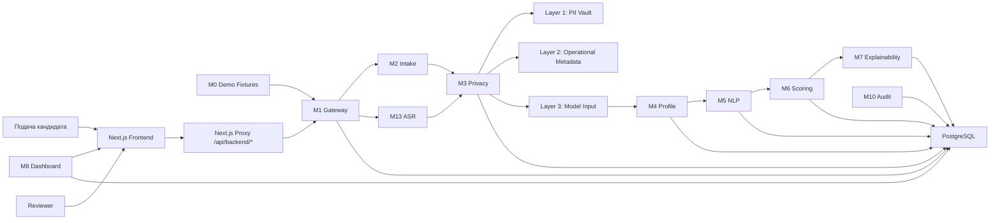
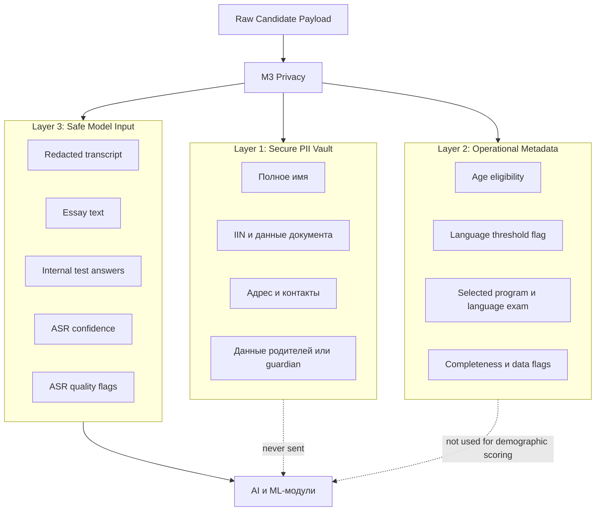
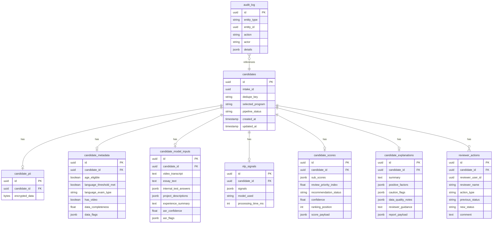

# Архитектура системы

---

## Структура документа

- [Обзор системы](#обзор-системы)
- [Диаграмма 1. Общая схема](#диаграмма-1-общая-схема)
- [Архитектурные принципы](#архитектурные-принципы)
- [Реализованный backend flow](#реализованный-backend-flow)
- [Ответственность модулей](#ответственность-модулей)
- [Подробный каталог модулей](#подробный-каталог-модулей)
- [Стек моделей](#стек-моделей)
- [Модель управления данными](#модель-управления-данными)
- [Диаграмма 2. Privacy-by-Design](#диаграмма-2-privacy-by-design)
- [Диаграмма 3. Базовая модель данных](#диаграмма-3-базовая-модель-данных)
- [Структура репозитория](#структура-репозитория)

---

## Обзор системы

Система отбора кандидатов inVision U — это модульный монолит для admissions decision support. В текущем репозитории лежат и FastAPI backend, и Next.js reviewer frontend.

Живая ветка сейчас работает как синхронный request-response pipeline:

- анкета кандидата попадает в `M2` или в полный pipeline через `M1`
- при наличии `video_url` вызывается `M13` для транскрибации интервью
- до model-facing обработки данные проходят privacy-разделение в `M3`
- `M4`, `M5`, `M6` и `M7` собирают профиль, сигналы, score и explainability
- reviewer-чтение и reviewer-действия идут через `M8` и `M10`
- все состояния сохраняются в PostgreSQL

Платформа остается human-in-the-loop:

- не принимает финальное автономное решение о зачислении
- явно показывает confidence, uncertainty и review-routing поля
- изолирует чувствительные данные до model-facing обработки
- логирует overrides и reviewer actions

---

## Диаграмма 1. Общая схема



---

## Архитектурные принципы

### Privacy by Design

PII изолируется до любой model-facing обработки. AI/ML-модули работают только с безопасным Layer 3.

### Explainability First

Score должен оставаться разбираемым. Для reviewer выводятся evidence, positive factors, caution blocks и routing logic.

### Human in the Loop

Recommendation categories носят advisory-характер. Поля `manual_review_required`, `human_in_loop_required` и `review_recommendation` сохраняют контроль за reviewer.

### Синхронная оркестрация

Текущая ветка исполняет основной pipeline синхронно внутри API-процесса. В основном compose-стеке нет Redis-очереди и отдельного worker-слоя.

### Reviewer-safe доступ

Защищенные маршруты используют session auth с HTTP-only cookie. Доступ ограничивается через backend RBAC для ролей `admin`, `chair` и `reviewer`, поэтому общий reviewer key больше не нужен.

---

## Реализованный backend flow

Реализованный backend flow в текущей ветке:

0. `M0 Demo` дает готовые demo fixtures.
1. `M2 Intake` валидирует payload и создает базовую запись кандидата.
2. `M13 ASR` опционально транскрибирует интервью, если указан `video_url`.
3. `M3 Privacy` разделяет входные данные на PII, operational metadata и safe model input.
4. `M4 Profile` собирает единый `CandidateProfile`.
5. `M5 NLP` извлекает канонический `SignalEnvelope`.
6. `M6 Scoring` считает program-aware score, ranking fields и reviewer-routing output.
7. `M7 Explainability` формирует summary, positive factors, caution blocks и reviewer guidance.
8. `M8 Dashboard` отдает reviewer-facing read API поверх сохраненных score/explanation/raw content.
9. `M10 Audit` хранит overrides, reviewer actions и audit feed.

---

## Ответственность модулей

Подробная документация по каждому модулю вынесена в:

- [`docs/rus/MODULES.md`](MODULES.md)

---

## Подробный каталог модулей

Для полного описания модулей, их входов, выходов и файлов смотри:

- [`docs/rus/MODULES.md`](MODULES.md)

---

## Стек моделей

### NLP

| Модуль | Модель | Роль |
|---|---|---|
| `M5` | `meta-llama/llama-4-scout-17b-16e-instruct` | основной grouped structured signal extraction через Groq |
| `M5` | heuristic extractor | детерминированный fallback |
| `M7` | deterministic formatter | сборка explainability-report из сохраненного M6 output |

### ASR

| Модуль | Модель | Роль |
|---|---|---|
| `M13` | env-выбранная Groq Whisper model (`whisper-large-v3-turbo` по умолчанию) | транскрибация интервью и анализ сегментов |

### Embeddings

| Runtime | Модель | Роль |
|---|---|---|
| Primary | `jinaai/jina-embeddings-v5-text-nano` | локальные similarity и consistency checks внутри backend-процесса |
| Fallback | lexical cosine similarity | детерминированный запасной path при недоступности локального embedding backend |

### Scoring

| Слой | Модель / метод | Роль |
|---|---|---|
| Baseline | rule-based scoring | прозрачный базовый score |
| Refinement | `GradientBoostingRegressor` | ML-уточнение score |
| Calibration | `ScoreCalibrator` | опциональный post-processing score |

---

## Модель управления данными

### Layer 1: Secure PII Vault

Хранит зашифрованные PII и административно-чувствительные данные: имена, адреса, контакты, guardians, IDs и supporting documents.

### Layer 2: Operational Metadata

Хранит workflow-метаданные: age eligibility, language-threshold status, selected program, language exam type, completeness, data flags и наличие видео.

### Layer 3: Safe Model Input

Хранит model-facing контент: redacted transcript, essay text, internal test answers, ASR confidence и ASR quality flags.

---

## Диаграмма 2. Privacy-by-Design



---

## Диаграмма 3. Базовая модель данных



---

## Структура репозитория

```text
.agent/
  memory/
backend/
  app/
    core/
    modules/
    schemas/
  tests/
docs/
  eng/
  rus/
frontend/
  src/
  e2e/
scripts/
```

---

Projet Documentation
