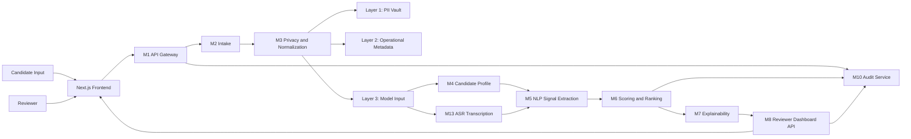
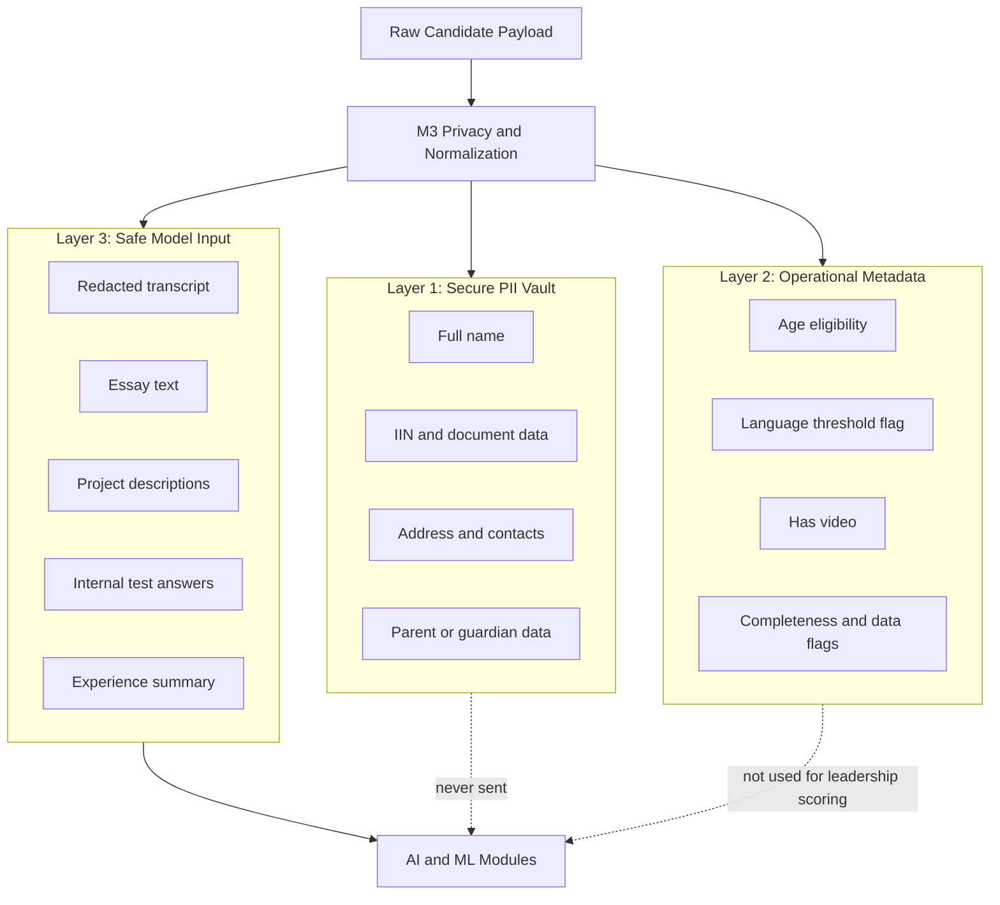
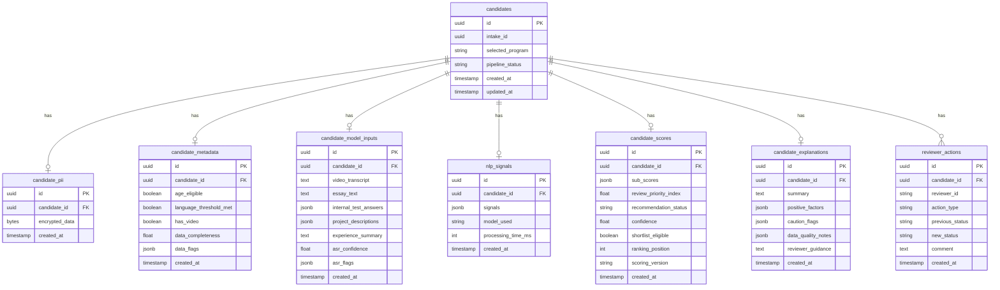

# Архитектура системы

---

## Структура документа

- [Общий обзор](#общий-обзор)
- [Диаграмма 1. Общая схема системы](#диаграмма-1-общая-схема-системы)
- [Архитектурные принципы](#архитектурные-принципы)
- [Реализованный серверный конвейер](#реализованный-серверный-конвейер)
- [Ответственность модулей](#ответственность-модулей)
- [Подробный каталог модулей](#подробный-каталог-модулей)
- [Стек моделей](#стек-моделей)
- [Модель управления данными](#модель-управления-данными)
- [Диаграмма 2. Разделение данных по принципу privacy-by-design](#диаграмма-2-разделение-данных-по-принципу-privacy-by-design)
- [Диаграмма 3. Основные сущности данных](#диаграмма-3-основные-сущности-данных)
- [Структура репозитория](#структура-репозитория)

---

## Общий обзор

Система отбора inVision U представляет собой модульный серверный конвейер для поддержки приемной комиссии. Она валидирует заявки, отделяет чувствительные данные, готовит безопасный вход для моделей, извлекает структурированные сигналы, рассчитывает объяснимые оценки и формирует понятные материалы для проверяющего.

Платформа изначально строится как система с обязательным участием человека:

- окончательное решение принимает комиссия;
- модельные модули работают только с безопасным третьим слоем данных;
- скоринг и объяснения должны оставаться проверяемыми;
- логика направления на ручную проверку отделена от основной рекомендации.

---

## Диаграмма 1. Общая схема системы



---

## Архитектурные принципы

### Privacy by Design

Персональные данные отделяются до любой обработки моделями. AI- и ML-модули получают только безопасный третий слой.

### Explainability First

Каждая рекомендация должна раскладываться на сигналы, промежуточные оценки, предупреждающие флаги и пояснения для проверяющего.

### Human in the Loop

Поля `manual_review_required`, `human_in_loop_required` и `review_recommendation` явно показывают, где требуется дополнительная проверка человеком.

### Program-Aware, Not Demographic-Aware

Система учитывает выбранную образовательную программу через веса политики, но не использует чувствительные и демографические признаки как основание для оценки потенциала.

---

## Реализованный серверный конвейер

В текущей ветке реализован следующий порядок обработки:

1. `M2 Intake` валидирует данные кандидата и создает начальную запись.
2. `M13 ASR` расшифровывает интервью и добавляет показатели качества.
3. `M3 Privacy` разделяет данные на персональные, служебные и безопасные для модели.
4. `M4 Profile` собирает единый профиль кандидата.
5. `M5 NLP` извлекает канонический `SignalEnvelope`.
6. `M6 Scoring` рассчитывает итоговый балл, рекомендацию и правила маршрутизации на проверку.
7. `M7 Explainability` формирует краткое объяснение, факторы, доказательства и предупреждения.

---

## Ответственность модулей

Подробная модульная документация вынесена отдельно:

- [`docs/rus/MODULES.md`](MODULES.md)

---

## Подробный каталог модулей

Полное описание функциональности, входов, выходов и назначения файлов по модулям находится здесь:

- [`docs/rus/MODULES.md`](MODULES.md)

---

### `M1 Gateway`

Отвечает за публичные серверные конечные точки и координацию всего конвейера.

| Файл | Ответственность |
|---|---|
| `backend/app/modules/m1_gateway/router.py` | API-методы для приема заявок, запуска конвейера и прямого скоринга |
| `backend/app/modules/m1_gateway/orchestrator.py` | Пошаговая координация между M2, M13, M3, M4, M5, M6 и M7 |

### `M2 Intake`

Отвечает за проверку входящих заявок, расчет полноты данных и начальное сохранение кандидата.

| Файл | Ответственность |
|---|---|
| `backend/app/modules/m2_intake/schemas.py` | Контракты запросов и ответов при приеме заявки |
| `backend/app/modules/m2_intake/service.py` | Проверки, полнота данных, базовая допустимость и первая запись |
| `backend/app/modules/m2_intake/router.py` | Конечная точка приема заявки |

### `M3 Privacy`

Отвечает за трехслойное разделение данных и скрытие чувствительной информации.

| Файл | Ответственность |
|---|---|
| `backend/app/modules/m3_privacy/redactor.py` | Удаление и замена персональных данных в тексте |
| `backend/app/modules/m3_privacy/separator.py` | Логика разделения на три слоя |
| `backend/app/modules/m3_privacy/service.py` | Сохранение разделенных слоев |

### `M4 Profile`

Отвечает за сборку единого `CandidateProfile`, который используют следующие модули.

| Файл | Ответственность |
|---|---|
| `backend/app/modules/m4_profile/schemas.py` | Модели профиля кандидата |
| `backend/app/modules/m4_profile/assembler.py` | Сборка полей профиля и технических флагов |
| `backend/app/modules/m4_profile/service.py` | Координация получения и сборки профиля |

### `M5 NLP`

Отвечает за извлечение структурированных сигналов из безопасного содержимого кандидата.

| Файл | Ответственность |
|---|---|
| `backend/app/modules/m5_nlp/schemas.py` | Входной контракт `M5ExtractionRequest` |
| `backend/app/modules/m5_nlp/source_bundle.py` | Нормализация и объединение безопасных текстовых источников |
| `backend/app/modules/m5_nlp/gemini_client.py` | Клиент Gemini для извлечения сигналов |
| `backend/app/modules/m5_nlp/extractor.py` | Резервное эвристическое извлечение |
| `backend/app/modules/m5_nlp/signal_extraction_service.py` | Координация группового извлечения |
| `backend/app/modules/m5_nlp/embeddings.py` | Семантическое сравнение и работа с эмбеддингами |
| `backend/app/modules/m5_nlp/ai_detector.py` | Вспомогательные проверки на неаутентичность и несогласованность |

### `M6 Scoring`

Отвечает за промежуточные оценки, рекомендации, ранжирование, уверенность и маршрутизацию на ручную проверку.

| Файл | Ответственность |
|---|---|
| `backend/app/modules/m6_scoring/m6_scoring_config.yaml` | Центральная конфигурация правил, весов и порогов |
| `backend/app/modules/m6_scoring/rules.py` | Детерминированная базовая логика скоринга |
| `backend/app/modules/m6_scoring/confidence.py` | Расчет уверенности и неопределенности |
| `backend/app/modules/m6_scoring/decision_policy.py` | Финальная логика рекомендаций и маршрутизации |
| `backend/app/modules/m6_scoring/ml_model.py` | Уточняющая модель `GradientBoostingRegressor` |
| `backend/app/modules/m6_scoring/service.py` | Основная координация скоринга |

### `M7 Explainability`

Отвечает за формирование понятных объяснений на основе `SignalEnvelope + CandidateScore`.

| Файл | Ответственность |
|---|---|
| `backend/app/modules/m7_explainability/schemas.py` | Контракты объяснений |
| `backend/app/modules/m7_explainability/factors.py` | Названия факторов и предупреждений |
| `backend/app/modules/m7_explainability/evidence.py` | Связь факторов с доказательствами |
| `backend/app/modules/m7_explainability/service.py` | Сборка объяснения для проверяющего |

### `M8 Dashboard`

Оставлен как заготовка для будущего API проверяющего интерфейса.

### `M9 Storage`

Отвечает за модели хранения и слой доступа к данным.

| Файл | Ответственность |
|---|---|
| `backend/app/modules/m9_storage/models.py` | SQLAlchemy-модели |
| `backend/app/modules/m9_storage/repository.py` | Методы чтения и записи |

### `M10 Audit`

Оставлен как заготовка для будущих журналов аудита.

### `M13 ASR`

Отвечает за расшифровку интервью и показатели качества расшифровки.

| Файл | Ответственность |
|---|---|
| `backend/app/modules/m13_asr/schemas.py` | Контракты ASR |
| `backend/app/modules/m13_asr/downloader.py` | Безопасная работа с медиавходом |
| `backend/app/modules/m13_asr/transcriber.py` | Интеграция с Groq Whisper API |
| `backend/app/modules/m13_asr/quality_checker.py` | Оценка качества и уверенности |
| `backend/app/modules/m13_asr/service.py` | Полная координация расшифровки |

---

## Стек моделей

### NLP

| Модуль | Модель | Роль |
|---|---|---|
| `M5` | `gemini-2.5-flash` | Извлечение структурированных сигналов |
| `M7` | `gemini-3.1-flash-lite-preview` | Быстрый слой генерации объяснений |

### ASR

| Модуль | Модель | Роль |
|---|---|---|
| `M13` | `whisper-large-v3-turbo` | Расшифровка интервью |

### Embeddings

| Режим | Модель | Роль |
|---|---|---|
| Основная | `jina-embeddings-v5` | Семантическое сравнение и проверка согласованности |
| Резервная | `BAAI/bge-m3` | Запасной путь эмбеддингов |

### Scoring

| Слой | Модель / метод | Роль |
|---|---|---|
| Базовый | rule-based scoring | Прозрачная исходная логика оценивания |
| Уточняющий | `GradientBoostingRegressor` | Уточнение итогового балла |

---

## Модель управления данными

### Layer 1: Secure PII Vault

Содержит зашифрованные персональные и административно чувствительные данные: имена, адреса, контакты, документы, идентификаторы и сведения о родителях или опекунах.

### Layer 2: Operational Metadata

Содержит служебные данные конвейера: возрастную допустимость, статус языкового порога, выбранную программу, полноту данных и технические флаги.

### Layer 3: Safe Model Input

Содержит безопасный для моделей материал: очищенную расшифровку, эссе, ответы внутреннего теста, описания проектов, краткое описание опыта, уверенность ASR и флаги качества.

---

## Диаграмма 2. Разделение данных по принципу privacy-by-design



---

## Диаграмма 3. Основные сущности данных



---

## Структура репозитория

```text
backend/
  app/
    core/
    modules/
    schemas/
  tests/
docs/
  eng/
  rus/
frontend/
```

---

Projet Documentation
