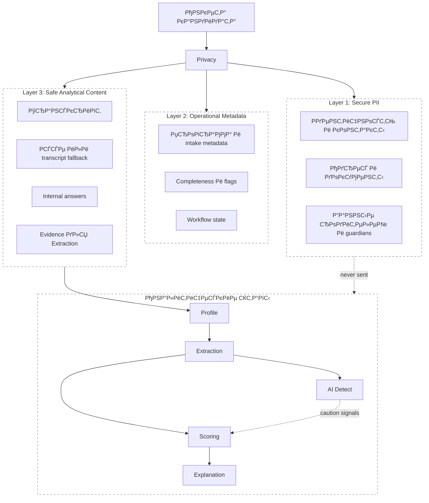
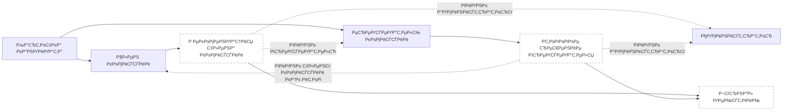
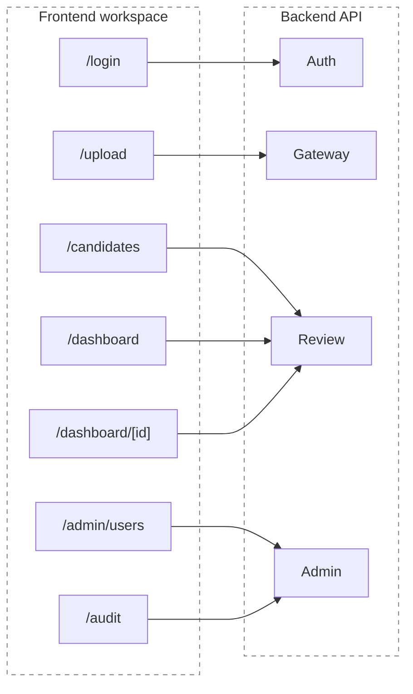

# Архитектура системы

---

## Структура документа

- [Обзор системы](#обзор-системы)
- [Диаграмма 1. Сквозной flow по этапам](#диаграмма-1-сквозной-flow-по-этапам)
- [Архитектурные принципы](#архитектурные-принципы)
- [Этапы runtime](#этапы-runtime)
- [Карта публичных названий](#карта-публичных-названий)
- [Модель управления данными](#модель-управления-данными)
- [Диаграмма 2. Слои разделения данных](#диаграмма-2-слои-разделения-данных)
- [Диаграмма 3. Workflow комиссии](#диаграмма-3-workflow-комиссии)
- [Диаграмма 4. Frontend и API surface](#диаграмма-4-frontend-и-api-surface)
- [Структура репозитория](#структура-репозитория)

---

## Обзор системы

Платформа inVision U для приемной комиссии представляет собой модульный монолит для поддержки решений по кандидатам. В репозитории находятся и FastAPI backend, и Next.js workspace комиссии.

Текущий runtime работает как синхронный request-response pipeline:

- входные данные кандидата поступают через этап intake или через полный pipeline gateway
- `ASR` запускается, если у кандидата есть публичное аудио или видео
- `Privacy` отделяет PII до любой model-facing обработки
- `Profile`, `Extraction`, `AI Detect`, `Scoring` и `Explanation` формируют аналитическое представление
- `Review` обслуживает действия комиссии, итоговое решение председателя и журнал
- все состояния сохраняются в PostgreSQL

Платформа остается human-in-the-loop:

- не принимает автономное финальное решение о зачислении
- показывает confidence, evidence и caution-сигналы
- не отправляет чувствительные данные в аналитические этапы
- логирует действия комиссии и итоговые решения

---

## Диаграмма 1. Сквозной flow по этапам

```mermaid
flowchart LR
    subgraph InputLayer["Слой входа"]
        Candidate["Подача кандидата"]
        Demo["Демо-сценарий"]
        Gateway["Gateway"]
        Intake["Input Intake"]
    end

    subgraph ProcessingLayer["Слой обработки"]
        ASR["ASR"]
        Privacy["Privacy"]
        Profile["Profile"]
        Extraction["Extraction"]
        AIDetect["AI Detect"]
        Scoring["Scoring"]
        Explanation["Explanation"]
    end

    subgraph DecisionLayer["Слой решений"]
        Workspace["Workspace РєРѕРјРёСЃСЃРёРё"]
        Review["Review"]
    end

    subgraph StorageLayer["Слой хранения"]
        DB["PostgreSQL"]
    end

    Candidate --> Gateway
    Demo --> Gateway
    Gateway --> Intake
    Intake --> ASR
    Intake --> Privacy
    ASR --> Privacy
    Privacy --> Profile
    Profile --> Extraction
    Extraction --> AIDetect
    Extraction --> Scoring
    AIDetect -. дополнительные сигналы .-> Scoring
    Scoring --> Explanation
    Explanation --> Workspace
    Workspace --> Review

    Intake -. сохранение .-> DB
    Privacy -. сохранение .-> DB
    Profile -. сохранение .-> DB
    Extraction -. сохранение .-> DB
    Scoring -. сохранение .-> DB
    Explanation -. сохранение .-> DB
    Review -. сохранение .-> DB

    style InputLayer fill:transparent,stroke:#7d7d7d,stroke-dasharray: 5 5
    style ProcessingLayer fill:transparent,stroke:#7d7d7d,stroke-dasharray: 5 5
    style DecisionLayer fill:transparent,stroke:#7d7d7d,stroke-dasharray: 5 5
    style StorageLayer fill:transparent,stroke:#7d7d7d,stroke-dasharray: 5 5
```



---

## Архитектурные принципы

### Privacy by Design

PII изолируется до любой model-facing обработки. AI и ML этапы работают только с безопасным контентом и разрешенными operational metadata.

### Explainability First

Скоринг должен оставаться разборным для комиссии. Интерфейс показывает факторные блоки, caution-маркеры, evidence и итоговые объяснения, а не один непрозрачный балл.

### Human in the Loop

Рекомендации носят advisory-характер. Финальное движение по кандидату остается внутри workflow комиссии, где отдельно фиксируются рекомендации членов комиссии и решение председателя.

### Session Auth Рё RBAC

Защищенные маршруты используют HTTP-only session cookie и backend RBAC для ролей `admin`, `chair` и `reviewer`.

### Синхронный базовый pipeline

Основной локальный стек работает как синхронная оркестрация внутри API-процесса. Для базового review workflow отдельный worker-слой не обязателен.

---

## Этапы runtime

### Gateway

Публичная входная точка API и слой orchestration для синхронного pipeline, batch-запусков и committee-facing backend routes.

### Input Intake

Этап входных данных валидирует payload кандидата, считает начальную заполненность и создает базовую запись кандидата. В публичной документации это описывается как этап intake, а не как отдельный аналитический модуль.

### ASR

Преобразует публичные аудио- и видеоматериалы кандидата в транскрипт и метаданные качества транскрипции.

### Privacy

Разделяет запись кандидата на PII, operational metadata и безопасный аналитический контент.

### Profile

Собирает канонический профиль кандидата из operational и safe слоев.

### Extraction

Извлекает структурированные decision signals из безопасного текста, транскрипта и связанных evidence.

### AI Detect

Добавляет дополнительные сигналы подлинности и AI-assisted-writing риска. Эти сигналы не заменяют решение комиссии и работают как caution-input для scoring и explanation.

### Scoring

Считает оценку кандидата, confidence, ranking, recommendation category и review routing.

### Explanation

Преобразует score и evidence в reviewer-facing narrative, factor blocks и caution summaries.

### Review

Обслуживает рабочие пространства кандидатов, рекомендации комиссии, итоговое решение председателя и журнал действий.

### Storage

Сохраняет слои кандидата, проекции, score-результаты, explanation-результаты и события комиссии.

---

## Карта публичных названий

Документация использует публичные названия этапов. Текущее соответствие пакетам кода:

| Публичное название | Текущий пакет |
|---|---|
| `Gateway` | `backend/app/modules/gateway` |
| `Input Intake` | `backend/app/modules/intake` |
| `ASR` | `backend/app/modules/asr` |
| `Privacy` | `backend/app/modules/privacy` |
| `Profile` | `backend/app/modules/profile` |
| `Extraction` | `backend/app/modules/extraction` |
| `AI Detect` | `backend/app/modules/extraction/ai_detector.py` |
| `Scoring` | `backend/app/modules/scoring` |
| `Explanation` | `backend/app/modules/explanation` |
| `Review` | `backend/app/modules/workspace` Рё `backend/app/modules/review` |
| `Storage` | `backend/app/modules/storage` |
| `Demo Layer` | `backend/app/modules/demo` |

---

## Модель управления данными

### Layer 1: Secure PII

Содержит зашифрованные или защищенные identity-данные: юридическое имя, контакты, адреса, сведения о документах и связанную административную информацию.

### Layer 2: Operational Metadata

Содержит workflow-метаданные: выбранную программу, completeness, data flags и intake-derived eligibility markers.

### Layer 3: Safe Analytical Content

Содержит redacted transcript, essay при наличии, transcript-based fallback narrative, internal answers и evidence для downstream аналитики.

---

## Диаграмма 2. Слои разделения данных



---

## Диаграмма 3. Workflow комиссии



---

## Диаграмма 4. Frontend и API surface



---

## Структура репозитория

```text
backend/app/core/             config, db session, auth, RBAC dependencies
backend/app/modules/          runtime packages для gateway, этапов, review и storage
backend/tests/                unit, integration Рё evaluation coverage
frontend/src/app/             Next.js routes Рё API proxy
frontend/src/components/      shared UI Рё candidate-review components
docs/eng/                     документация на английском
docs/rus/                     документация на русском
```
