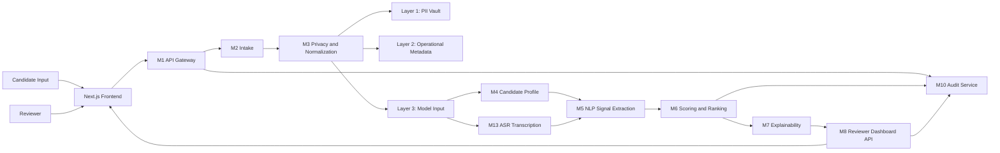
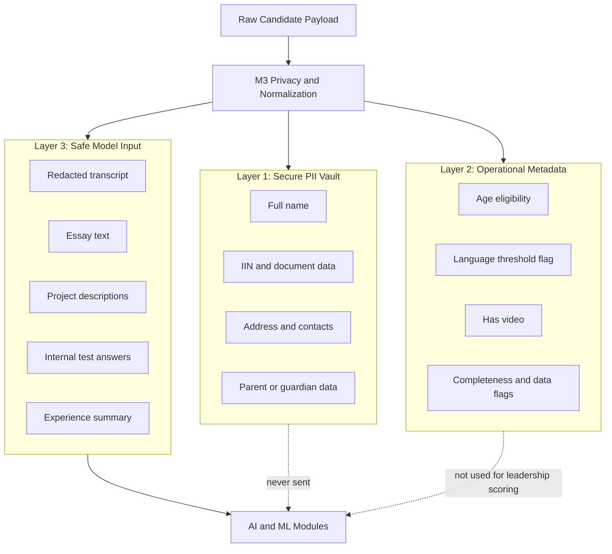

# Архитектура системы

---

## Структура документа

- [Общий обзор](#общий-обзор)
- [Диаграмма 1. Общая схема системы](#диаграмма-1-общая-схема-системы)
- [Архитектурные принципы](#архитектурные-принципы)
- [Реализованный backend flow](#реализованный-backend-flow)
- [Ответственность модулей](#ответственность-модулей)
- [Подробный каталог модулей](#подробный-каталог-модулей)
- [Стек моделей](#стек-моделей)
- [Модель data governance](#модель-data-governance)
- [Диаграмма 2. Privacy-by-Design](#диаграмма-2-privacy-by-design)
- [Диаграмма 3. Ядро данных](#диаграмма-3-ядро-данных)
- [Структура репозитория](#структура-репозитория)

---

## Общий обзор

Система отбора inVision U представляет собой модульный backend-конвейер для поддержки приемной комиссии. Она валидирует заявки, отделяет чувствительные данные, готовит безопасный модельный вход, извлекает структурированные сигналы, считает объяснимые оценки и формирует reviewer-facing explainability output.

Платформа принципиально остается human-in-the-loop:

- финальное решение принимает человек;
- модельные модули работают только по безопасному Layer 3;
- скоринг и объяснения должны оставаться проверяемыми;
- review routing отделен от recommendation category.

---

## Диаграмма 1. Общая схема системы



---

## Архитектурные принципы

### Privacy by Design

PII отделяется до любой model-facing обработки. AI и ML модули получают только безопасный Layer 3.

### Explainability First

Каждая рекомендация должна быть разложима на сигналы, sub-scores, caution flags и reviewer guidance.

### Human in the Loop

Поля `manual_review_required`, `human_in_loop_required` и `review_recommendation` явно показывают, где нужен дополнительный человек.

### Program-Aware, Not Demographic-Aware

Система учитывает выбранную программу через policy weights, но не использует чувствительные и демографические признаки как факторы потенциала.

---

## Реализованный backend flow

В текущей ветке реализован следующий backend flow:

1. `M2 Intake` валидирует payload кандидата и создает запись.
2. `M13 ASR` транскрибирует интервью и добавляет quality flags.
3. `M3 Privacy` разделяет данные на PII, metadata и safe model input.
4. `M4 Profile` собирает unified `CandidateProfile`.
5. `M5 NLP` извлекает canonical `SignalEnvelope`.
6. `M6 Scoring` считает score, recommendation category и review routing.
7. `M7 Explainability` формирует summary, factors, evidence и cautions.

---

## Ответственность модулей

Подробная модульная документация вынесена отдельно:

- [`docs/rus/MODULES.md`](MODULES.md)

---

## Подробный каталог модулей

Полное описание функционала, входов, выходов и file map по модулям находится здесь:

- [`docs/rus/MODULES.md`](MODULES.md)

---

### `M1 Gateway`

Отвечает за публичные backend endpoints и orchestration всего pipeline.

| Файл | Ответственность |
|---|---|
| `backend/app/modules/m1_gateway/router.py` | API endpoints для intake, pipeline submit и direct scoring |
| `backend/app/modules/m1_gateway/orchestrator.py` | Пошаговая orchestration логика между M2, M13, M3, M4, M5, M6 и M7 |

### `M2 Intake`

Отвечает за валидацию входящих заявок, вычисление completeness и первичное сохранение кандидата.

| Файл | Ответственность |
|---|---|
| `backend/app/modules/m2_intake/schemas.py` | Контракты intake request и response |
| `backend/app/modules/m2_intake/service.py` | Проверки, completeness, eligibility и начальная запись |
| `backend/app/modules/m2_intake/router.py` | Intake endpoint |

### `M3 Privacy`

Отвечает за трехслойное разделение данных и редактирование чувствительной информации.

| Файл | Ответственность |
|---|---|
| `backend/app/modules/m3_privacy/redactor.py` | Текстовый redaction PII |
| `backend/app/modules/m3_privacy/separator.py` | Логика разделения на 3 слоя |
| `backend/app/modules/m3_privacy/service.py` | Сохранение separated layers |

### `M4 Profile`

Отвечает за сборку unified `CandidateProfile`, который используют downstream-модули.

| Файл | Ответственность |
|---|---|
| `backend/app/modules/m4_profile/schemas.py` | Модели CandidateProfile |
| `backend/app/modules/m4_profile/assembler.py` | Сборка profile fields и flags |
| `backend/app/modules/m4_profile/service.py` | Build flow и coordination со storage |

### `M5 NLP`

Отвечает за извлечение structured decision signals из безопасного контента кандидата.

| Файл | Ответственность |
|---|---|
| `backend/app/modules/m5_nlp/schemas.py` | Входной контракт `M5ExtractionRequest` |
| `backend/app/modules/m5_nlp/source_bundle.py` | Нормализация и сбор safe text sources |
| `backend/app/modules/m5_nlp/gemini_client.py` | Gemini extraction client |
| `backend/app/modules/m5_nlp/extractor.py` | Heuristic fallback extractor |
| `backend/app/modules/m5_nlp/signal_extraction_service.py` | Grouped extraction orchestration |
| `backend/app/modules/m5_nlp/embeddings.py` | Similarity и embeddings helpers |
| `backend/app/modules/m5_nlp/ai_detector.py` | Advisory authenticity и consistency heuristics |

### `M6 Scoring`

Отвечает за sub-scores, recommendation categories, ranking, confidence, uncertainty и human-in-the-loop routing.

| Файл | Ответственность |
|---|---|
| `backend/app/modules/m6_scoring/m6_scoring_config.yaml` | Центральная policy-конфигурация |
| `backend/app/modules/m6_scoring/rules.py` | Deterministic baseline scoring |
| `backend/app/modules/m6_scoring/confidence.py` | Confidence и uncertainty logic |
| `backend/app/modules/m6_scoring/decision_policy.py` | Финальный routing policy |
| `backend/app/modules/m6_scoring/ml_model.py` | `GradientBoostingRegressor` refinement |
| `backend/app/modules/m6_scoring/service.py` | Основная orchestration логика |
| `backend/app/modules/m6_scoring/evaluation.py` | Synthetic evaluation |
| `backend/app/modules/m6_scoring/optimization.py` | Threshold и policy search |

### `M7 Explainability`

Отвечает за reviewer-facing explanation output на основе `SignalEnvelope + CandidateScore`.

| Файл | Ответственность |
|---|---|
| `backend/app/modules/m7_explainability/schemas.py` | Explainability contracts |
| `backend/app/modules/m7_explainability/factors.py` | Factor titles и caution policy |
| `backend/app/modules/m7_explainability/evidence.py` | Mapping factor -> evidence |
| `backend/app/modules/m7_explainability/service.py` | Сборка explainability report |

### `M8 Dashboard`

Оставлен как placeholder для будущего reviewer dashboard API.

### `M9 Storage`

Отвечает за models и repository layer.

| Файл | Ответственность |
|---|---|
| `backend/app/modules/m9_storage/models.py` | SQLAlchemy модели |
| `backend/app/modules/m9_storage/repository.py` | Repository methods |

### `M10 Audit`

Оставлен как placeholder для будущих audit workflows.

### `M13 ASR`

Отвечает за транскрибацию interview media и transcript quality markers.

| Файл | Ответственность |
|---|---|
| `backend/app/modules/m13_asr/schemas.py` | ASR contracts |
| `backend/app/modules/m13_asr/downloader.py` | Безопасный media resolution |
| `backend/app/modules/m13_asr/transcriber.py` | Интеграция с Groq Whisper API |
| `backend/app/modules/m13_asr/quality_checker.py` | Confidence и quality flags |
| `backend/app/modules/m13_asr/service.py` | End-to-end ASR orchestration |

---

## Стек моделей

### NLP

| Модуль | Модель | Роль |
|---|---|---|
| `M5` | `gemini-2.5-flash` | Structured signal extraction |
| `M7` | `gemini-3.1-flash-lite-preview` | Быстрый explainability layer |

### ASR

| Модуль | Модель | Роль |
|---|---|---|
| `M13` | `whisper-large-v3-turbo` | Транскрибация интервью |

### Embeddings

| Режим | Модель | Роль |
|---|---|---|
| Основная | `jina-embeddings-v5` | Similarity и consistency checks |
| Fallback | `BAAI/bge-m3` | Резервный embeddings path |

### Scoring

| Слой | Модель / метод | Роль |
|---|---|---|
| Baseline | rule-based scoring | прозрачный deterministic baseline |
| Refinement | `GradientBoostingRegressor` | ML refinement |

---

## Модель data governance

### Layer 1: Secure PII Vault

Содержит ФИО, контакты, адрес, документы, идентификаторы и данные родителей/опекунов.

### Layer 2: Operational Metadata

Содержит age eligibility, language threshold status, selected program, completeness и data flags.

### Layer 3: Safe Model Input

Содержит редактированный transcript, essay, internal test answers, project descriptions, experience summary, ASR confidence и ASR flags.

---

## Диаграмма 2. Privacy-by-Design



---

## Диаграмма 3. Ядро данных


---

## Структура репозитория

```text
backend/
  app/
    core/
    modules/
    schemas/
  tests/
docs/
  eng/
  rus/
frontend/
```

---

Projet Documentation
