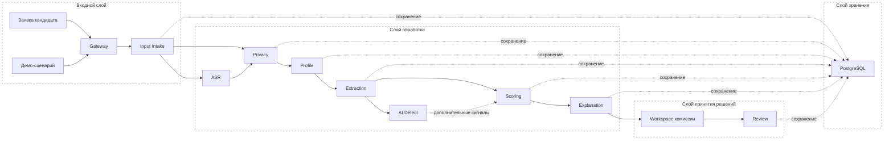
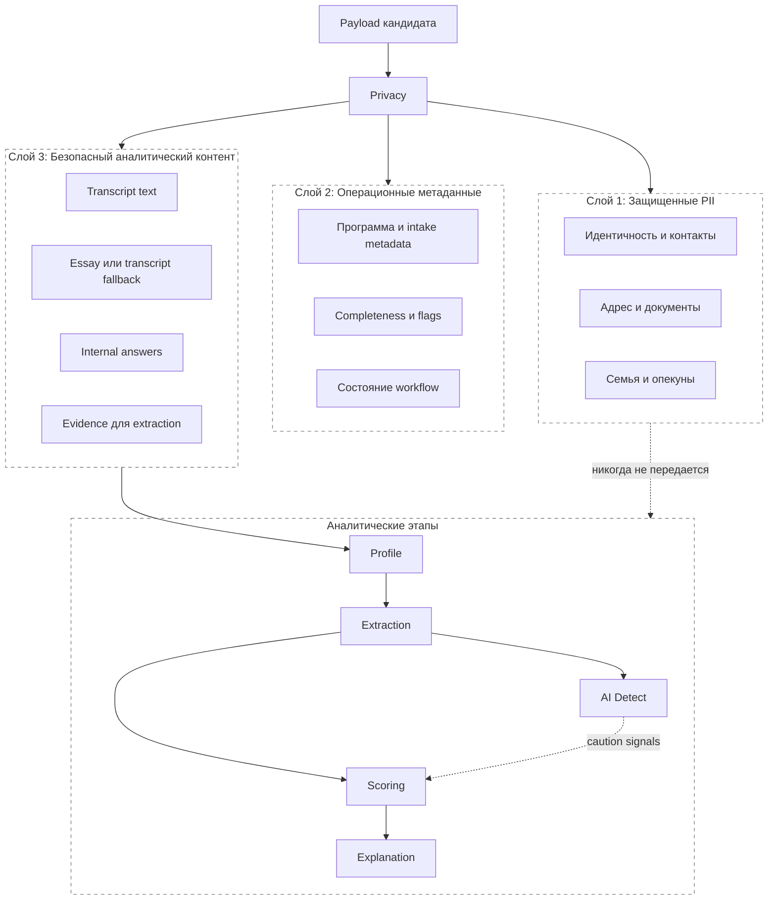
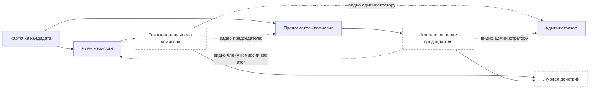
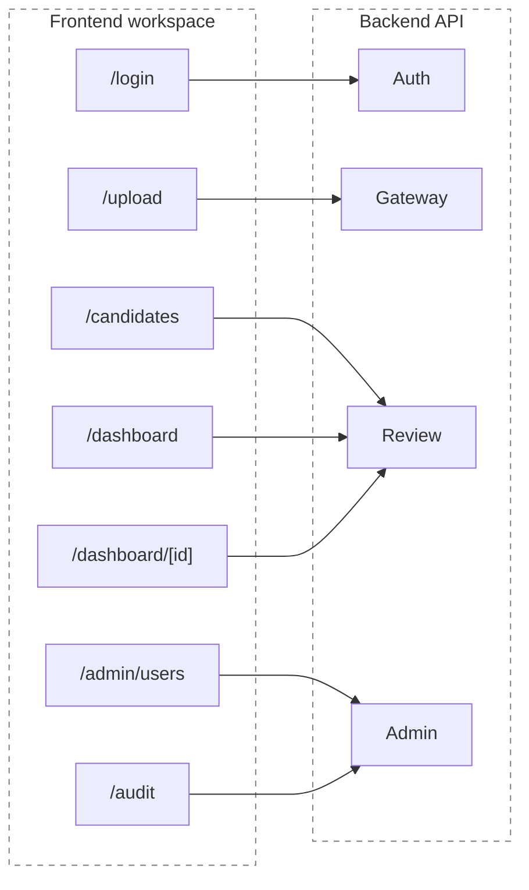

# Архитектура системы

---

## Структура документа

- [Обзор системы](#обзор-системы)
- [Диаграмма 1. Сквозной поток этапов](#диаграмма-1-сквозной-поток-этапов)
- [Архитектурные принципы](#архитектурные-принципы)
- [Этапы рантайма](#этапы-рантайма)
- [Публичная карта этапов](#публичная-карта-этапов)
- [Модель управления данными](#модель-управления-данными)
- [Диаграмма 2. Слои разделения данных](#диаграмма-2-слои-разделения-данных)
- [Диаграмма 3. Workflow комиссии](#диаграмма-3-workflow-комиссии)
- [Диаграмма 4. Frontend и API](#диаграмма-4-frontend-и-api)
- [Структура репозитория](#структура-репозитория)

---

## Обзор системы

Платформа приемной комиссии inVision U представляет собой модульный монолит для поддержки решений комиссии. В репозитории находятся и FastAPI backend, и Next.js workspace для членов комиссии.

Текущий рантайм работает как синхронный request-response pipeline:

- данные кандидата поступают через входной этап `Input Intake` или через полный pipeline `Gateway`
- `ASR` запускается, если доступен публичный аудио- или видеоматериал
- `Privacy` отделяет PII до любой model-facing обработки
- `Profile`, `Extraction`, `AI Detect`, `Scoring` и `Explanation` формируют аналитическое представление кандидата
- `Review` обслуживает действия комиссии, итоговое решение председателя и видимость журнала
- все состояние сохраняется в PostgreSQL

Платформа изначально строится как human-in-the-loop система:

- она не принимает автономное решение о зачислении
- она показывает confidence, evidence и caution signals
- она держит чувствительные данные вне model-facing этапов
- она фиксирует действия комиссии и финальные решения

---

## Диаграмма 1. Сквозной поток этапов



---

## Архитектурные принципы

### Privacy by Design

PII изолируется до любой model-facing обработки. AI и ML этапы работают только с безопасным контентом и операционно разрешенными метаданными.

### Explainability First

Оценки должны оставаться проверяемыми. Пользователь комиссии видит factor blocks, caution markers, evidence snippets и итоговые explanation summaries, а не один непрозрачный output.

### Human in the Loop

Рекомендации носят advisory-характер. Финальная обработка заявки остается внутри workflow комиссии, где рекомендации членов комиссии и решения председателя фиксируются явно.

### Session Auth и RBAC

Защищенные маршруты используют HTTP-only session cookies и backend role checks для `admin`, `chair` и `reviewer`. Role visibility определяет, кто может управлять пользователями, видеть глобальный audit и просматривать решения комиссии.

### Синхронный базовый pipeline

Локальный стек по умолчанию использует синхронную orchestration внутри API-процесса. Активный Docker-стек не требует отдельного worker-tier для базового review workflow.

---

## Этапы рантайма

### Gateway

Публичная API-точка входа и orchestration layer для синхронного выполнения pipeline, batch submission и backend-маршрутов рабочего пространства комиссии.

### Input Intake

Входной этап валидирует candidate payload, вычисляет первичную completeness и создает базовую запись кандидата. В документации он описывается как входной этап, а не как самостоятельный аналитический модуль.

### ASR

Потребляет публичные аудио- и видеоссылки и, если media доступно, создает transcript text вместе с transcript quality metadata.

### Privacy

Разделяет запись кандидата на PII, operational metadata и safe model content.

### Profile

Строит канонический профиль кандидата из operational и safe слоев.

### Extraction

Преобразует safe text, transcript material и связанное evidence в структурированные decision signals.

### AI Detect

Добавляет дополнительные индикаторы подлинности текста и AI-assisted writing. Эти сигналы не заменяют решение комиссии; они работают как caution inputs для scoring и explanation.

### Scoring

Вычисляет итоговую оценку кандидата, confidence, ranking, recommendation category и review routing.

### Explanation

Преобразует score и evidence в reviewer-facing narrative, factor blocks и caution summaries.

### Review

Обслуживает workspace кандидатов, рекомендации комиссии, решения председателя и видимость audit.

### Storage

Сохраняет candidate layers, projections, outputs scoring, outputs explanation и committee events.

---

## Публичная карта этапов

Документация использует публичные названия этапов. Текущее соответствие package names в коде:

| Публичный этап | Текущий package |
|---|---|
| `Gateway` | `backend/app/modules/gateway` |
| `Input Intake` | `backend/app/modules/intake` |
| `ASR` | `backend/app/modules/asr` |
| `Privacy` | `backend/app/modules/privacy` |
| `Profile` | `backend/app/modules/profile` |
| `Extraction` | `backend/app/modules/extraction` |
| `AI Detect` | `backend/app/modules/extraction/ai_detector.py` |
| `Scoring` | `backend/app/modules/scoring` |
| `Explanation` | `backend/app/modules/explanation` |
| `Review` | `backend/app/modules/workspace` и `backend/app/modules/review` |
| `Storage` | `backend/app/modules/storage` |
| `Demo Layer` | `backend/app/modules/demo` |

---

## Модель управления данными

### Слой 1: защищенные PII

Хранит зашифрованные или защищенные identity data: официальные имена, контакты, адреса, реквизиты документов и связанную административную информацию.

### Слой 2: операционные метаданные

Хранит metadata, видимые workflow: выбранная программа, completeness, data flags и eligibility markers, полученные на intake.

### Слой 3: безопасный аналитический контент

Хранит redacted transcript text, essay text при наличии, transcript-derived fallback content, internal answers и безопасное evidence для downstream analytical stages.

---

## Диаграмма 2. Слои разделения данных



---

## Диаграмма 3. Workflow комиссии



---

## Диаграмма 4. Frontend и API



---

## Структура репозитория

```text
backend/app/core/             config, db session, auth, RBAC dependencies
backend/app/modules/          runtime packages for gateway, stages, review, storage
backend/tests/                unit, integration, and evaluation coverage
frontend/src/app/             Next.js routes and API proxy
frontend/src/components/      shared UI and candidate-review components
docs/eng/                     English project documentation
docs/rus/                     Russian project documentation
```
