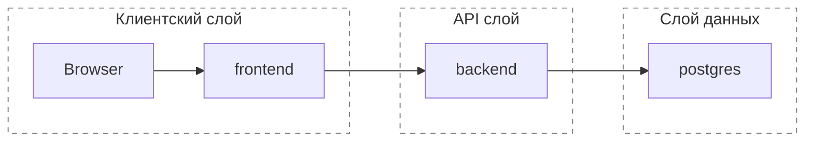

# Docker Guide

## Актуальный стек

Основной локальный стек описан в:

- `docker-compose.yml`

Сервисы:

- `postgres`
- `backend`
- `frontend`

## Текущее поведение

- `backend` на старте прогоняет Alembic migrations и затем запускает `uvicorn`
- `frontend` получает `BACKEND_URL`
- frontend-аутентификация использует session cookie через backend proxy
- доступ по ролям ограничивается на backend через RBAC
- основной внешний секрет для стандартного аналитического пути: `GROQ_API_KEY`

## Команды

```bash
./scripts/stack.sh up
./scripts/stack.sh down
./scripts/stack.sh reset
./scripts/stack.sh logs
```

## Топология сервисов


