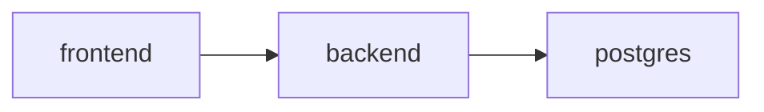

# Docker Guide

---

## Структура документа

- [Назначение](#назначение)
- [Docker-артефакты репозитория](#docker-артефакты-репозитория)
- [Основной стек репозитория](#основной-стек-репозитория)
- [Диаграмма 1. Топология контейнеров](#диаграмма-1-топология-контейнеров)
- [Контейнер для M6](#контейнер-для-m6)

---

## Назначение

Этот документ описывает Docker-артефакты, которые реально присутствуют в текущей ветке репозитория, и то, как они используются.

---

## Docker-артефакты репозитория

| Файл | Назначение |
|---|---|
| `backend/Dockerfile` | образ backend-приложения |
| `frontend/Dockerfile` | production-образ Next.js frontend |
| `docker-compose.yml` | основной локальный стек `postgres + backend + frontend` |
| `docker-compose.template.yml` | более старый scaffold с placeholder-сервисами |
| `docker-compose.m6.yml` | отдельный compose для evaluation и notebook workflow модуля `M6` |
| `scripts/stack.sh` | обертка над compose-командами (`up`, `down`, `reset`, `logs`) |

---

## Основной стек репозитория

Основной рабочий стек в текущем репозитории:

- `docker-compose.yml`

Он поднимает:

- `postgres`
- `backend`
- `frontend`

Текущее поведение:

- `backend` на старте прогоняет Alembic migration и затем запускает `uvicorn`
- `backend` получает model-конфигурацию через env: `M5_LLM_MODEL`, `M5_LLM_FAST_MODEL`, `M13_ASR_MODEL`, `EMBEDDING_MODEL`, `EMBEDDING_DEVICE`
- `frontend` получает `BACKEND_URL` и `REVIEWER_API_KEY` через env-переменные
- reviewer-экраны работают через Next.js proxy, который серверно добавляет `X-API-Key`
- для основного LLM + ASR path достаточно `GROQ_API_KEY`; локальные embeddings не требуют Jina API key
- локальная embedding-модель скачивается с Hugging Face при первом использовании и затем переиспользуется из локального cache
- стек предназначен для локальной интеграции, демо и smoke-проверок

Типовые команды:

```bash
./scripts/stack.sh up
./scripts/stack.sh down
./scripts/stack.sh reset
./scripts/stack.sh logs
```

`docker-compose.template.yml` остается в репозитории как старый шаблон, но основным стеком сейчас не является.

---

## Диаграмма 1. Топология контейнеров



---

## Контейнер для M6

Для `M6` по-прежнему есть отдельный контейнерный workflow:

- `backend/app/modules/m6_scoring/Dockerfile.m6`
- `docker-compose.m6.yml`

Он используется для:

- synthetic evaluation
- локального notebook-доступа на порту `8888`
- изолированных scoring-экспериментов без запуска полного frontend-стека

---

Projet Documentation
