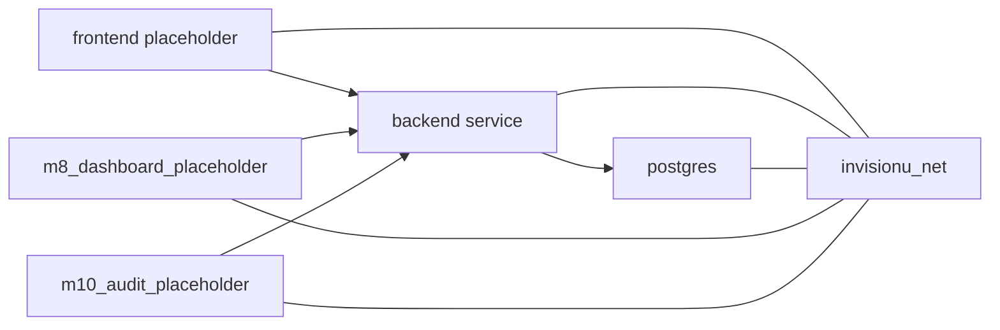

# Руководство по Docker

---

## Структура документа

- [Назначение](#назначение)
- [Docker-артефакты репозитория](#docker-артефакты-репозитория)
- [Шаблон всего репозитория](#шаблон-всего-репозитория)
- [Диаграмма 1. Контейнерная топология](#диаграмма-1-контейнерная-топология)
- [Контейнер M6 evaluation](#контейнер-m6-evaluation)

---

## Назначение

Этот документ описывает Docker-артефакты, которые сейчас есть в репозитории, и их назначение.

---

## Docker-артефакты репозитория

| Файл | Назначение |
|---|---|
| `backend/Dockerfile` | backend application image на базе `python:3.11-slim` |
| `backend/app/modules/m6_scoring/Dockerfile.m6` | standalone scoring и evaluation image для M6 bundle |
| `docker-compose.template.yml` | whole-repository Docker template with placeholders |
| `docker-compose.m6.yml` | M6-specific compose flow для evaluation и notebook |

---

## Шаблон всего репозитория

Основной шаблон всего репозитория:

- `docker-compose.template.yml`

Он включает:

- `postgres`
- `backend`
- `frontend_placeholder`
- `m8_dashboard_placeholder`
- `m10_audit_placeholder`

Этот файл является стартовым scaffold, а не production-ready deployment manifest.

---

## Диаграмма 1. Контейнерная топология

---

## Контейнер M6 evaluation

Для `M6` существует отдельный container flow:

- `backend/app/modules/m6_scoring/Dockerfile.m6`
- `docker-compose.m6.yml`

Он нужен для:

- synthetic evaluation
- notebook access
- isolated scoring experiments

---

Projet Documentation
