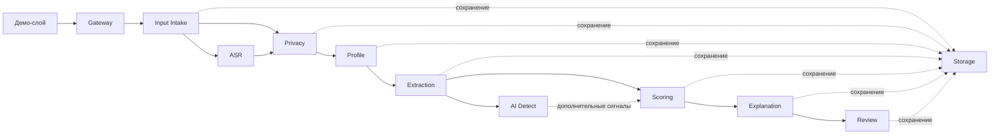

# Каталог модулей

---

## Структура документа

- [Обзор](#обзор)
- [Диаграмма 1. Карта взаимодействия этапов](#диаграмма-1-карта-взаимодействия-этапов)
- [Gateway](#gateway)
- [ASR](#asr)
- [Privacy](#privacy)
- [Profile](#profile)
- [Extraction](#extraction)
- [AI Detect](#ai-detect)
- [Scoring](#scoring)
- [Explanation](#explanation)
- [Review](#review)
- [Storage](#storage)
- [Этап Input Intake](#этап-input-intake)
- [Демо-слой](#демо-слой)
- [Соответствие этапов и кода](#соответствие-этапов-и-кода)

---

## Обзор

Этот документ описывает активные backend stages в business-facing терминологии. Внутренние package names в коде уже приведены к stage-based именам, а рантайм ниже описан через этапы продукта.

---

## Диаграмма 1. Карта взаимодействия этапов

---

## Gateway

### Назначение

Публичная backend-точка входа для синхронной отправки pipeline, batch execution и committee-facing review APIs.

### Задачи

- orchestrates сквозной pipeline
- exposes synchronous submission endpoints
- normalizes success и error envelopes
- connects frontend routes с review-facing projections

### Основные файлы

| Файл | Назначение |
|---|---|
| `backend/app/modules/gateway/router.py` | публичные pipeline и scoring routes |
| `backend/app/modules/gateway/orchestrator.py` | синхронная stage orchestration |

---

## ASR

### Назначение

Транскрибирует видеоматериалы и аудиоматериалы кандидата в transcript text и transcript quality metadata.

### Задачи

- resolves supported media sources
- downloads public media where allowed
- transcribes media into text
- returns transcript-level confidence and quality signals

### Основные файлы

| Файл | Назначение |
|---|---|
| `backend/app/modules/asr/router.py` | ASR endpoints, если они опубликованы |
| `backend/app/modules/asr/service.py` | orchestration транскрибации |
| `backend/app/modules/asr/downloader.py` | загрузка media |

---

## Privacy

### Назначение

Работает как privacy boundary системы и подготавливает safe content для аналитических этапов.

### Задачи

- separates candidate input на PII, metadata и safe analytical content
- redacts explicit identity signals from model-facing text
- persists separated layers

### Основные файлы

| Файл | Назначение |
|---|---|
| `backend/app/modules/privacy/redactor.py` | редактирование текста |
| `backend/app/modules/privacy/separator.py` | логика разделения слоев |
| `backend/app/modules/privacy/service.py` | orchestration и persistence |

---

## Profile

### Назначение

Строит канонический профиль кандидата из operational metadata и safe analytical content.

### Задачи

- assembles profile fields for downstream analysis
- carries completeness and workflow flags
- provides a normalized profile object for extraction and scoring

### Основные файлы

| Файл | Назначение |
|---|---|
| `backend/app/modules/profile/schemas.py` | profile contracts |
| `backend/app/modules/profile/assembler.py` | сборка профиля |
| `backend/app/modules/profile/service.py` | stage service |

---

## Extraction

### Назначение

Извлекает структурированные decision signals из safe text, transcript material и связанного evidence.

### Задачи

- builds source bundles from transcript, essay, and safe answers
- performs grouped LLM-based extraction
- uses deterministic fallback extraction when needed
- returns the canonical signal envelope for scoring

### Основные файлы

| Файл | Назначение |
|---|---|
| `backend/app/modules/extraction/source_bundle.py` | сборка safe sources |
| `backend/app/modules/extraction/groq_llm_client.py` | основная LLM integration |
| `backend/app/modules/extraction/extractor.py` | deterministic fallback extraction |
| `backend/app/modules/extraction/signal_extraction_service.py` | extraction flow |

---

## AI Detect

### Назначение

Дополнительные проверки подлинности и AI-assisted writing, которые обогащают, но не заменяют аналитический контур.

### Задачи

- compares candidate materials for consistency
- adds advisory authenticity risk markers
- exposes caution signals to scoring and explanation

### Основные файлы

| Файл | Назначение |
|---|---|
| `backend/app/modules/extraction/ai_detector.py` | проверки подлинности и AI-risk |
| `backend/app/modules/extraction/embeddings.py` | similarity и consistency support |

---

## Scoring

### Назначение

Преобразует структурированные сигналы в итоговую оценку кандидата, confidence, ranking и recommendation categories.

### Задачи

- computes weighted sub-scores
- applies program-aware policies
- blends rule-based and ML refinement layers
- produces ranking and review-routing output

### Основные файлы

| Файл | Назначение |
|---|---|
| `backend/app/modules/scoring/scoring_config.yaml` | scoring policy configuration |
| `backend/app/modules/scoring/rules.py` | baseline scoring rules |
| `backend/app/modules/scoring/ml_model.py` | refinement model |
| `backend/app/modules/scoring/decision_policy.py` | recommendation и routing policy |
| `backend/app/modules/scoring/service.py` | public scoring service |

---

## Explanation

### Назначение

Преобразует score output и evidence в reviewer-facing narrative, factor blocks и caution summaries.

### Задачи

- assembles concise candidate conclusions
- maps score drivers into readable factor cards
- surfaces caution markers and evidence references
- prepares content for localized frontend rendering

### Основные файлы

| Файл | Назначение |
|---|---|
| `backend/app/modules/explanation/service.py` | сборка explanation |
| `backend/app/modules/explanation/schemas.py` | explanation contracts |

---

## Review

### Назначение

Предоставляет workspace кандидатов, рекомендации комиссии, решения председателя и видимость журнала действий.

### Задачи

- exposes processed candidate ranking and candidate pool views
- serves candidate detail projections
- records reviewer recommendations and chair decisions
- exposes audit feed to administrative users

### Основные файлы

| Файл | Назначение |
|---|---|
| `backend/app/modules/workspace/router.py` | candidate workspace routes |
| `backend/app/modules/workspace/service.py` | workspace projections |
| `backend/app/modules/review/service.py` | decision logging и audit feed |

---

## Storage

### Назначение

Слой хранения для candidate records, projections и committee events.

### Задачи

- owns SQLAlchemy models
- persists analytical outputs and committee events
- provides repository methods for runtime services

### Основные файлы

| Файл | Назначение |
|---|---|
| `backend/app/modules/storage/models.py` | ORM models |
| `backend/app/modules/storage/repository.py` | repository layer |

---

## Этап Input Intake

Этот слой документируется как входной этап, а не как core analytical module.

### Назначение

Валидирует входные payloads, вычисляет начальную completeness и создает базовую запись кандидата.

### Package

- `backend/app/modules/intake`

---

## Демо-слой

Этот слой документируется как демонстрационный, а не как core runtime stage.

### Назначение

Предоставляет готовые candidate fixtures и routes для их повторного прогона через живой pipeline.

### Package

- `backend/app/modules/demo`

---

## Соответствие этапов и кода

| Публичный этап | Code package |
|---|---|
| `Gateway` | `gateway` |
| `Input Intake` | `intake` |
| `ASR` | `asr` |
| `Privacy` | `privacy` |
| `Profile` | `profile` |
| `Extraction` | `extraction` |
| `AI Detect` | `extraction/ai_detector.py` |
| `Scoring` | `scoring` |
| `Explanation` | `explanation` |
| `Review` | `workspace` + `review` |
| `Storage` | `storage` |
| `Демо-слой` | `demo` |
