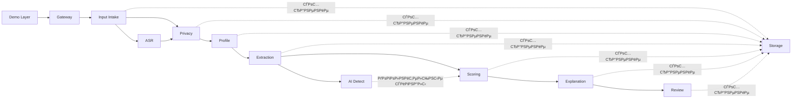

# Каталог модулей

---

## Структура документа

- [РћР±Р·РѕСЂ](#РѕР±Р·РѕСЂ)
- [Диаграмма 1. Карта взаимодействия этапов](#диаграмма-1-карта-взаимодействия-этапов)
- [Gateway](#gateway)
- [ASR](#asr)
- [Privacy](#privacy)
- [Profile](#profile)
- [Extraction](#extraction)
- [AI Detect](#ai-detect)
- [Scoring](#scoring)
- [Explanation](#explanation)
- [Review](#review)
- [Storage](#storage)
- [Этап Input Intake](#этап-input-intake)
- [Demo Layer](#demo-layer)
- [Карта соответствия названий и пакетов](#карта-соответствия-названий-и-пакетов)

---

## РћР±Р·РѕСЂ

Этот документ описывает активные backend-этапы в публичных терминах. Внутри кода пока сохраняются legacy `m*` package names, но в документации используется stage vocabulary, соответствующий текущему product flow.

---

## Диаграмма 1. Карта взаимодействия этапов

---

## Gateway

### Назначение

Публичная backend-входная точка для синхронного запуска pipeline, batch execution и committee-facing review APIs.

### Функциональная область

- оркестрирует end-to-end pipeline
- отдает synchronous submission endpoint'ы
- нормализует success/error envelopes
- связывает frontend routes с review-facing projections

### Основные файлы

| Файл | Назначение |
|---|---|
| `backend/app/modules/gateway/router.py` | публичные pipeline и scoring routes |
| `backend/app/modules/gateway/orchestrator.py` | синхронная orchestration по этапам |

---

## ASR

### Назначение

Преобразует видео- или аудиоматериал кандидата в транскрипт и метаданные качества транскрипции.

### Функциональная область

- резолвит поддерживаемые media sources
- загружает публичные media links, если это разрешено
- транскрибирует материал в текст
- возвращает transcript confidence и quality signals

### Основные файлы

| Файл | Назначение |
|---|---|
| `backend/app/modules/asr/router.py` | ASR endpoint'ы, где они доступны |
| `backend/app/modules/asr/service.py` | orchestration транскрибации |
| `backend/app/modules/asr/downloader.py` | media retrieval |

---

## Privacy

### Назначение

Является privacy boundary системы и подготавливает безопасный контент для аналитических этапов.

### Функциональная область

- разделяет запись кандидата на PII, metadata и safe analytical content
- вырезает явные identity signals из model-facing текста
- сохраняет разделенные слои

### Основные файлы

| Файл | Назначение |
|---|---|
| `backend/app/modules/privacy/redactor.py` | text redaction |
| `backend/app/modules/privacy/separator.py` | layer separation logic |
| `backend/app/modules/privacy/service.py` | orchestration Рё persistence |

---

## Profile

### Назначение

Собирает канонический профиль кандидата из operational metadata и safe analytical content.

### Функциональная область

- собирает профиль для downstream анализа
- переносит completeness и workflow flags
- отдает нормализованный объект для extraction и scoring

### Основные файлы

| Файл | Назначение |
|---|---|
| `backend/app/modules/profile/schemas.py` | profile contracts |
| `backend/app/modules/profile/assembler.py` | сборка профиля |
| `backend/app/modules/profile/service.py` | stage service |

---

## Extraction

### Назначение

Извлекает структурированные decision signals из безопасного текста, транскрипта и связанных evidence.

### Функциональная область

- собирает source bundles из transcript, essay и safe answers
- выполняет grouped LLM-based extraction
- использует deterministic fallback extraction при необходимости
- возвращает канонический signal envelope для scoring

### Основные файлы

| Файл | Назначение |
|---|---|
| `backend/app/modules/extraction/source_bundle.py` | СЃР±РѕСЂРєР° safe sources |
| `backend/app/modules/extraction/groq_llm_client.py` | primary LLM integration |
| `backend/app/modules/extraction/extractor.py` | deterministic fallback extraction |
| `backend/app/modules/extraction/signal_extraction_service.py` | extraction flow |

---

## AI Detect

### Назначение

Дополнительный контур проверки на подлинность и AI-assisted-writing риск, который дополняет, но не заменяет основную аналитическую логику.

### Функциональная область

- сравнивает материалы кандидата на согласованность
- добавляет advisory authenticity markers
- передает caution signals в scoring и explanation

### Основные файлы

| Файл | Назначение |
|---|---|
| `backend/app/modules/extraction/ai_detector.py` | проверки подлинности и AI-risk |
| `backend/app/modules/extraction/embeddings.py` | similarity Рё consistency support |

---

## Scoring

### Назначение

Преобразует структурированные сигналы в оценку кандидата, confidence, ranking и recommendation categories.

### Функциональная область

- считает weighted sub-scores
- применяет program-aware policy
- смешивает rule-based и ML refinement слои
- формирует ranking и review-routing output

### Основные файлы

| Файл | Назначение |
|---|---|
| `backend/app/modules/scoring/scoring_config.yaml` | scoring policy configuration |
| `backend/app/modules/scoring/rules.py` | baseline scoring rules |
| `backend/app/modules/scoring/ml_model.py` | refinement model |
| `backend/app/modules/scoring/decision_policy.py` | recommendation Рё routing policy |
| `backend/app/modules/scoring/service.py` | публичный scoring service |

---

## Explanation

### Назначение

Преобразует score output и evidence в reviewer-facing narrative, factor blocks и caution summaries.

### Функциональная область

- собирает итоговые concise conclusions
- переводит драйверы score в читаемые factor cards
- показывает caution markers и evidence references
- подготавливает контент для localized frontend rendering

### Основные файлы

| Файл | Назначение |
|---|---|
| `backend/app/modules/explanation/service.py` | СЃР±РѕСЂРєР° explanation |
| `backend/app/modules/explanation/schemas.py` | explanation contracts |

---

## Review

### Назначение

Обслуживает candidate workspaces, рекомендации комиссии, итоговые решения председателя и audit visibility.

### Функциональная область

- отдает processed ranking и candidate pool views
- отдает candidate detail projections
- сохраняет reviewer recommendations и chair decisions
- отдает audit feed административным пользователям

### Основные файлы

| Файл | Назначение |
|---|---|
| `backend/app/modules/workspace/router.py` | routes рабочего пространства кандидатов |
| `backend/app/modules/workspace/service.py` | workspace projections |
| `backend/app/modules/review/service.py` | decision logging Рё audit feed |

---

## Storage

### Назначение

Persistence layer для candidate records, projections и событий комиссии.

### Функциональная область

- содержит SQLAlchemy models
- сохраняет аналитические результаты и committee events
- дает repository methods для runtime services

### Основные файлы

| Файл | Назначение |
|---|---|
| `backend/app/modules/storage/models.py` | ORM models |
| `backend/app/modules/storage/repository.py` | repository layer |

---

## Этап Input Intake

Этот этап документируется как input stage, а не как core analytical module.

### Назначение

Валидирует входной payload, считает initial completeness и создает базовую запись кандидата.

### Пакет

- `backend/app/modules/intake`

---

## Demo Layer

Этот слой документируется как demonstration layer, а не как core runtime stage.

### Назначение

Дает готовые candidate fixtures и routes для прогона их через живой pipeline.

### Пакет

- `backend/app/modules/demo`

---

## Карта соответствия названий и пакетов

| Публичное название | Пакет кода |
|---|---|
| `Gateway` | `gateway` |
| `Input Intake` | `intake` |
| `ASR` | `asr` |
| `Privacy` | `privacy` |
| `Profile` | `profile` |
| `Extraction` | `extraction` |
| `AI Detect` | `extraction/ai_detector.py` |
| `Scoring` | `scoring` |
| `Explanation` | `explanation` |
| `Review` | `workspace` + `review` |
| `Storage` | `storage` |
| `Demo Layer` | `demo` |
