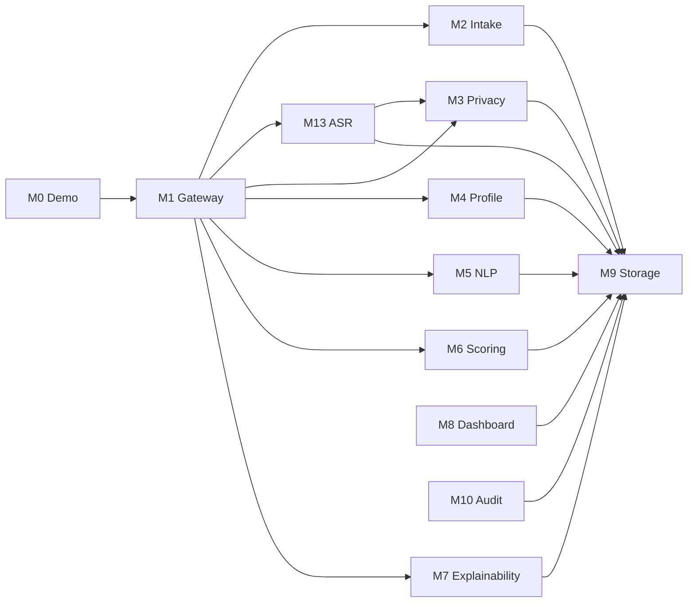

# Каталог модулей

---

## Структура документа

- [Обзор](#обзор)
- [Диаграмма 1. Карта взаимодействия модулей](#диаграмма-1-карта-взаимодействия-модулей)
- [M0 Demo](#m0-demo)
- [M1 Gateway](#m1-gateway)
- [M2 Intake](#m2-intake)
- [M3 Privacy](#m3-privacy)
- [M4 Profile](#m4-profile)
- [M5 NLP](#m5-nlp)
- [M6 Scoring](#m6-scoring)
- [M7 Explainability](#m7-explainability)
- [M8 Dashboard](#m8-dashboard)
- [M9 Storage](#m9-storage)
- [M10 Audit](#m10-audit)
- [M13 ASR](#m13-asr)

---

## Обзор

Этот документ собирает функциональную документацию по всем активным backend-модулям. Архитектурные и API-детали вынесены в отдельные документы, а здесь остается модульный уровень.

---

## Диаграмма 1. Карта взаимодействия модулей

---

## M0 Demo

Дает заранее подготовленные фикстуры кандидатов для demo. Загружает реалистичные JSON payload'ы и прогоняет их через живой синхронный pipeline.

| Файл | Назначение |
|---|---|
| `backend/app/modules/m0_demo/fixtures/*.json` | готовые payload'ы кандидатов под разные программы |
| `backend/app/modules/m0_demo/schemas.py` | контракты `FixtureMeta`, `FixtureSummary`, `FixtureDetail` |
| `backend/app/modules/m0_demo/service.py` | загрузка, кэширование и парсинг fixture |
| `backend/app/modules/m0_demo/router.py` | demo API: list, detail и pipeline run |

---

## M1 Gateway

### Назначение

`M1` — публичная входная точка backend для полного pipeline и direct scoring operations.

### Функциональная область

- отдает synchronous full-pipeline endpoint'ы
- отдает sequential batch submission
- отдает direct M6 scoring и evaluation endpoint'ы
- координирует фактический порядок модулей
- нормализует success/error API envelope

### Файлы

| Файл | Назначение |
|---|---|
| `backend/app/modules/m1_gateway/router.py` | публичные pipeline/scoring route |
| `backend/app/modules/m1_gateway/orchestrator.py` | синхронная оркестрация полного pipeline |

---

## M2 Intake

### Назначение

`M2` валидирует входную анкету и создает исходную candidate-запись, на которую затем опирается весь pipeline.

### Функциональная область

- валидирует структуру payload
- считает initial completeness
- извлекает административные eligibility-сигналы
- сохраняет исходную запись intake
- возвращает `candidate_id` и intake state

### Файлы

| Файл | Назначение |
|---|---|
| `backend/app/modules/m2_intake/schemas.py` | intake-контракты |
| `backend/app/modules/m2_intake/service.py` | валидация и persistence |
| `backend/app/modules/m2_intake/router.py` | intake endpoint |

---

## M3 Privacy

### Назначение

`M3` — privacy boundary системы. Он разделяет данные кандидата и формирует безопасный model-facing payload.

### Функциональная область

- делит входные данные на три слоя
- держит PII только в Layer 1
- сохраняет operational metadata в Layer 2
- формирует redacted model-safe content в Layer 3
- вырезает явные идентификаторы из текста

### Файлы

| Файл | Назначение |
|---|---|
| `backend/app/modules/m3_privacy/redactor.py` | text redaction |
| `backend/app/modules/m3_privacy/separator.py` | логика разделения на слои |
| `backend/app/modules/m3_privacy/service.py` | persistence и orchestration |

---

## M4 Profile

### Назначение

`M4` собирает единый `CandidateProfile` из privacy-safe данных и operational metadata.

### Функциональная область

- объединяет Layer 2 и Layer 3 в один профиль
- прокидывает completeness и data flags
- дает нормализованный объект для NLP и scoring stages

### Файлы

| Файл | Назначение |
|---|---|
| `backend/app/modules/m4_profile/schemas.py` | schema профиля |
| `backend/app/modules/m4_profile/assembler.py` | сборка профиля |
| `backend/app/modules/m4_profile/service.py` | coordination и storage integration |

---

## M5 NLP

### Назначение

`M5` извлекает структурированные decision signals из safe text, transcript, internal test answers и project descriptions.

### Функциональная область

- нормализует safe input в reusable source bundles
- вызывает Groq для grouped Llama-based signal extraction
- включает heuristic fallback extraction
- использует embeddings и authenticity checks как advisory-помощь
- отдает канонический `SignalEnvelope` для `M6`

### Файлы

| Файл | Назначение |
|---|---|
| `backend/app/modules/m5_nlp/schemas.py` | request schema и validation |
| `backend/app/modules/m5_nlp/client.py` | safe local-media transcription fallback client |
| `backend/app/modules/m5_nlp/groq_llm_client.py` | primary Groq-backed integration |
| `backend/app/modules/m5_nlp/llm_shared.py` | shared LLM request/response helpers |
| `backend/app/modules/m5_nlp/source_bundle.py` | сборка safe-source |
| `backend/app/modules/m5_nlp/extractor.py` | heuristic fallback extraction |
| `backend/app/modules/m5_nlp/signal_extraction_service.py` | grouped extraction flow |
| `backend/app/modules/m5_nlp/embeddings.py` | local embedding и similarity utilities |
| `backend/app/modules/m5_nlp/ai_detector.py` | advisory authenticity checks |

---

## M6 Scoring

### Назначение

`M6` переводит структурированные сигналы в review-priority score, recommendation category, ranking fields и review-routing output.

### Функциональная область

- считает детерминированные sub-score
- считает rule-based baseline
- уточняет score через `GradientBoostingRegressor`
- применяет program-aware weighting profiles
- выводит confidence, uncertainty и review-routing поля
- готовит explainability-ready output для `M7`
- ранжирует batch results и поддерживает synthetic evaluation tooling

### Файлы

| Файл | Назначение |
|---|---|
| `backend/app/modules/m6_scoring/m6_scoring_config.yaml` | core policy config |
| `backend/app/modules/m6_scoring/m6_scoring_config.py` | typed config loader |
| `backend/app/modules/m6_scoring/program_policy.py` | program-specific policy lookup |
| `backend/app/modules/m6_scoring/rules.py` | baseline sub-score logic |
| `backend/app/modules/m6_scoring/confidence.py` | confidence и uncertainty |
| `backend/app/modules/m6_scoring/decision_policy.py` | final category и review policy |
| `backend/app/modules/m6_scoring/calibration.py` | optional calibration utilities |
| `backend/app/modules/m6_scoring/ml_model.py` | GBR refinement model |
| `backend/app/modules/m6_scoring/ranker.py` | batch ranking |
| `backend/app/modules/m6_scoring/io_utils.py` | report/artifact IO helpers |
| `backend/app/modules/m6_scoring/service.py` | публичный scoring service |
| `backend/app/modules/m6_scoring/evaluation.py` | evaluation helpers |
| `backend/app/modules/m6_scoring/optimization.py` | threshold search |
| `backend/app/modules/m6_scoring/synthetic_data.py` | synthetic fixtures |

---

## M7 Explainability

### Назначение

`M7` переводит `SignalEnvelope + CandidateScore` в reviewer-facing explanation, который показывается в dashboard и detail views.

### Функциональная область

- собирает concise summary
- отбирает positive factors и caution blocks
- связывает evidence snippets с факторами
- формирует reviewer guidance
- форматирует explanation без повторного scoring

### Файлы

| Файл | Назначение |
|---|---|
| `backend/app/modules/m7_explainability/schemas.py` | explainability contracts |
| `backend/app/modules/m7_explainability/factors.py` | titles и caution policy |
| `backend/app/modules/m7_explainability/evidence.py` | evidence mapping |
| `backend/app/modules/m7_explainability/service.py` | explainability assembly |

---

## M8 Dashboard

### Назначение

`M8` отдает reviewer-facing read API.

### Текущее состояние

- реализован в текущей ветке
- отдает dashboard stats, ranking list, candidate detail, shortlist и safe reviewer projection
- строит отображаемое имя кандидата через backend-дешифровку PII внутри projection layer
- включает raw safe content и историю reviewer actions в detail-response
- требует reviewer API key для доступа

### Файлы

| Файл | Назначение |
|---|---|
| `backend/app/modules/m8_dashboard/router.py` | reviewer read route и override entrypoint |
| `backend/app/modules/m8_dashboard/service.py` | safe projection logic и dashboard aggregation |
| `backend/app/modules/m8_dashboard/schemas.py` | DTO для stats, list, detail и shortlist |

---

## M9 Storage

### Назначение

`M9` — общий repository/persistence слой для активных модулей.

### Функциональная область

- хранит candidate records и layer payload'ы
- хранит NLP signals, scores, explanations, reviewer actions и audit logs
- обновляет ranking после scoring write
- отдает repository methods для pipeline и reviewer surfaces

### Файлы

| Файл | Назначение |
|---|---|
| `backend/app/modules/m9_storage/models.py` | SQLAlchemy models |
| `backend/app/modules/m9_storage/repository.py` | repository methods |

---

## M10 Audit

### Назначение

`M10` отвечает за audit logging и traceability reviewer-действий.

### Текущее состояние

- реализован в текущей ветке
- хранит overrides, comments, shortlist actions и pipeline audit events
- отдает candidate action endpoint'ы и reviewer-facing audit feed
- обновляет shortlist state и status overrides через общий persistence layer

### Файлы

| Файл | Назначение |
|---|---|
| `backend/app/modules/m10_audit/logger.py` | audit logging helper и future extension point |
| `backend/app/modules/m10_audit/service.py` | override workflow, reviewer action writes, audit feed shaping |
| `backend/app/modules/m10_audit/router.py` | reviewer action и audit feed route |
| `backend/app/modules/m10_audit/schemas.py` | request/response contracts |

---

## M13 ASR

### Назначение

`M13` транскрибирует аудио/видео интервью и возвращает transcript quality markers для остального pipeline.

### Функциональная область

- безопасно резолвит media input
- вызывает Groq Whisper через env-выбранную модель `M13_ASR_MODEL`
- нормализует transcript segments
- считает confidence и quality flags
- выставляет `requires_human_review` при низком качестве транскрибации

### Файлы

| Файл | Назначение |
|---|---|
| `backend/app/modules/m13_asr/schemas.py` | ASR contracts |
| `backend/app/modules/m13_asr/downloader.py` | safe media resolution |
| `backend/app/modules/m13_asr/transcriber.py` | Groq Whisper integration |
| `backend/app/modules/m13_asr/quality_checker.py` | quality analysis |
| `backend/app/modules/m13_asr/service.py` | ASR orchestration |

---

Projet Documentation
