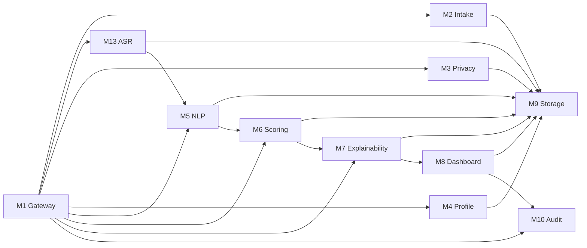

# Каталог модулей

---

## Структура документа

- [Обзор](#обзор)
- [Диаграмма 1. Карта взаимодействия модулей](#диаграмма-1-карта-взаимодействия-модулей)
- [M1 Gateway](#m1-gateway)
- [M2 Intake](#m2-intake)
- [M3 Privacy](#m3-privacy)
- [M4 Profile](#m4-profile)
- [M5 NLP](#m5-nlp)
- [M6 Scoring](#m6-scoring)
- [M7 Explainability](#m7-explainability)
- [M8 Dashboard](#m8-dashboard)
- [M9 Storage](#m9-storage)
- [M10 Audit](#m10-audit)
- [M13 ASR](#m13-asr)

---

## Обзор

Этот документ собирает полное функциональное описание backend-модулей в одном месте. Он отделяет модульную документацию от общей архитектуры и API, чтобы описание каждого блока не смешивалось с системным уровнем.

---

## Диаграмма 1. Карта взаимодействия модулей

---

## M1 Gateway

### Назначение

`M1` является публичной backend-точкой входа. Он публикует HTTP endpoints, координирует активный pipeline и возвращает нормализованные API envelopes.

### Функциональная зона

- публикует intake endpoints;
- публикует full pipeline submit endpoints;
- публикует direct M6 scoring endpoints;
- координирует порядок вызова модулей;
- нормализует успешные и error responses.

### Вход

- сырые payloads заявок;
- canonical `SignalEnvelope` для direct scoring routes;
- batch-массивы для последовательной обработки.

### Выход

- intake responses с идентификаторами кандидатов;
- pipeline responses со score и explanation;
- direct scoring и evaluation responses.

### Файлы

| Файл | Ответственность |
|---|---|
| `backend/app/modules/m1_gateway/router.py` | Публичные routes |
| `backend/app/modules/m1_gateway/orchestrator.py` | Orchestration всего pipeline |

---

## M2 Intake

### Назначение

`M2` валидирует входящую заявку и создает первичную запись кандидата, на которую опирается остальной pipeline.

### Функциональная зона

- валидирует структуру заявки;
- считает начальный completeness;
- извлекает административные eligibility signals;
- сохраняет первичную intake record;
- возвращает `candidate_id` и intake state.

### Вход

- сырые данные application form;
- выбранная программа;
- ссылки на контент, включая essay и video.

### Выход

- идентификатор intake record;
- completeness;
- initial eligibility и data flags.

### Файлы

| Файл | Ответственность |
|---|---|
| `backend/app/modules/m2_intake/schemas.py` | Intake contracts |
| `backend/app/modules/m2_intake/service.py` | Validation и persistence |
| `backend/app/modules/m2_intake/router.py` | Intake endpoint |

---

## M3 Privacy

### Назначение

`M3` реализует privacy separation и формирует безопасный model-facing payload для AI и ML модулей.

### Функциональная зона

- разделяет candidate input на три слоя;
- оставляет PII только в Layer 1;
- сохраняет operational metadata в Layer 2;
- формирует redacted model-safe content в Layer 3;
- редактирует явные идентификаторы в тексте.

### Вход

- raw candidate payload;
- ASR transcript и quality flags при наличии.

### Выход

- Layer 1 secure PII vault payload;
- Layer 2 operational metadata payload;
- Layer 3 safe model input payload.

### Файлы

| Файл | Ответственность |
|---|---|
| `backend/app/modules/m3_privacy/redactor.py` | Text redaction |
| `backend/app/modules/m3_privacy/separator.py` | Layer split logic |
| `backend/app/modules/m3_privacy/service.py` | Persistence и orchestration |

---

## M4 Profile

### Назначение

`M4` собирает unified `CandidateProfile` из privacy-safe материалов и operational metadata.

### Функциональная зона

- объединяет Layer 2 и Layer 3 в один profile;
- переносит completeness и data flags;
- включает ASR metadata для downstream-модулей;
- отдает нормализованный объект для NLP и scoring.

### Вход

- Layer 2 operational metadata;
- Layer 3 safe model input.

### Выход

- canonical `CandidateProfile`.

### Файлы

| Файл | Ответственность |
|---|---|
| `backend/app/modules/m4_profile/schemas.py` | Candidate profile schema |
| `backend/app/modules/m4_profile/assembler.py` | Profile assembly |
| `backend/app/modules/m4_profile/service.py` | Profile coordination |

---

## M5 NLP

### Назначение

`M5` извлекает structured decision signals из безопасного текста, транскрипта, internal test answers и project descriptions.

### Функциональная зона

- нормализует safe inputs в source bundles;
- вызывает Gemini для grouped signal extraction;
- применяет heuristic fallback extraction при необходимости;
- использует embeddings и consistency checks как advisory-слой;
- отдает canonical `SignalEnvelope` для `M6`.

### Вход

- candidate id;
- selected program;
- essay text;
- redacted transcript;
- internal test answers;
- project descriptions;
- experience summary;
- completeness и data flags.

### Выход

- `SignalEnvelope`;
- signal-level `value`, `confidence`, `source`, `evidence` и `reasoning`;
- `program_id` normalization для scoring.

### Файлы

| Файл | Ответственность |
|---|---|
| `backend/app/modules/m5_nlp/schemas.py` | Request schema и validation |
| `backend/app/modules/m5_nlp/source_bundle.py` | Shared safe-source assembly |
| `backend/app/modules/m5_nlp/gemini_client.py` | Gemini provider integration |
| `backend/app/modules/m5_nlp/extractor.py` | Heuristic fallback extraction |
| `backend/app/modules/m5_nlp/signal_extraction_service.py` | Grouped extraction flow |
| `backend/app/modules/m5_nlp/embeddings.py` | Similarity и embedding utilities |
| `backend/app/modules/m5_nlp/ai_detector.py` | Advisory authenticity checks |
| `backend/app/modules/m5_nlp/client.py` | Safe local-media transcription fallback |

---

## M6 Scoring

### Назначение

`M6` преобразует structured signals в review-priority score, recommendation category, ranking fields и review-routing output.

### Функциональная зона

- считает deterministic sub-scores;
- считает rule-based baseline score;
- уточняет score через `GradientBoostingRegressor`;
- применяет program-aware weighting profiles;
- формирует confidence, uncertainty и review-routing fields;
- готовит explainability-ready outputs для `M7`.

### Вход

- canonical `SignalEnvelope`;
- selected program и canonical `program_id`;
- completeness и data flags.

### Выход

- `CandidateScore`;
- `review_priority_index`;
- `recommendation_status`;
- `manual_review_required`;
- `human_in_loop_required`;
- `uncertainty_flag`;
- strengths, risks и decision summary.

### Файлы

| Файл | Ответственность |
|---|---|
| `backend/app/modules/m6_scoring/m6_scoring_config.yaml` | Core policy config |
| `backend/app/modules/m6_scoring/m6_scoring_config.py` | Typed config loader |
| `backend/app/modules/m6_scoring/program_policy.py` | Program-specific policy lookup |
| `backend/app/modules/m6_scoring/rules.py` | Baseline sub-score logic |
| `backend/app/modules/m6_scoring/confidence.py` | Confidence и uncertainty |
| `backend/app/modules/m6_scoring/decision_policy.py` | Final category и review policy |
| `backend/app/modules/m6_scoring/ml_model.py` | GBR refinement model |
| `backend/app/modules/m6_scoring/service.py` | Public scoring service |
| `backend/app/modules/m6_scoring/evaluation.py` | Evaluation helpers |
| `backend/app/modules/m6_scoring/optimization.py` | Threshold search |
| `backend/app/modules/m6_scoring/synthetic_data.py` | Synthetic fixtures |
| `backend/app/modules/m6_scoring/ranker.py` | Batch ranking |

---

## M7 Explainability

### Назначение

`M7` преобразует `SignalEnvelope + CandidateScore` в reviewer-facing explanations, которые можно показывать в dashboard или отчете.

### Функциональная зона

- собирает concise candidate summary;
- выбирает top strengths и caution blocks;
- сопоставляет evidence snippets с факторами;
- формирует reviewer guidance text;
- готовит auditable explanation output без пересчета score.

### Вход

- canonical `SignalEnvelope`;
- `CandidateScore` из `M6`.

### Выход

- summary;
- positive factors;
- caution blocks;
- evidence items;
- reviewer guidance.

### Файлы

| Файл | Ответственность |
|---|---|
| `backend/app/modules/m7_explainability/schemas.py` | Explainability contracts |
| `backend/app/modules/m7_explainability/factors.py` | Factor и caution titles |
| `backend/app/modules/m7_explainability/evidence.py` | Evidence mapping |
| `backend/app/modules/m7_explainability/service.py` | Explainability assembly |

---

## M8 Dashboard

### Назначение

`M8` зарезервирован под reviewer-facing dashboard API.

### Текущее состояние

- placeholder в этой ветке;
- предназначен для ranking lists, candidate detail views и reviewer actions.

### Файлы

| Файл | Ответственность |
|---|---|
| `backend/app/modules/m8_dashboard/router.py` | Future dashboard routes |
| `backend/app/modules/m8_dashboard/service.py` | Future dashboard logic |
| `backend/app/modules/m8_dashboard/schemas.py` | Future dashboard contracts |

---

## M9 Storage

### Назначение

`M9` предоставляет repository и persistence layer, которые используют активные модули.

### Функциональная зона

- хранит candidate records и layer payloads;
- хранит NLP signals, scores и explanations;
- предоставляет repository methods для чтения и записи;
- выступает persistence backbone всего pipeline.

### Файлы

| Файл | Ответственность |
|---|---|
| `backend/app/modules/m9_storage/models.py` | SQLAlchemy models |
| `backend/app/modules/m9_storage/repository.py` | Repository methods |

---

## M10 Audit

### Назначение

`M10` зарезервирован под audit logging и reviewer action traceability.

### Текущее состояние

- placeholder в этой ветке;
- предназначен для decision overrides, reviewer actions и pipeline audit events.

### Файлы

| Файл | Ответственность |
|---|---|
| `backend/app/modules/m10_audit/logger.py` | Future audit logging helpers |
| `backend/app/modules/m10_audit/service.py` | Future audit service |
| `backend/app/modules/m10_audit/router.py` | Future audit routes |

---

## M13 ASR

### Назначение

`M13` транскрибирует interview audio или video и формирует transcript quality markers для остального pipeline.

### Функциональная зона

- безопасно резолвит media input;
- вызывает Groq `whisper-large-v3-turbo`;
- нормализует transcript segments;
- считает confidence и quality flags;
- отдает `requires_human_review` для низкокачественных transcription cases.

### Вход

- candidate id;
- media path или URL;
- optional language hints.

### Выход

- transcript text;
- segment list;
- confidence values;
- quality flags;
- `requires_human_review`.

### Файлы

| Файл | Ответственность |
|---|---|
| `backend/app/modules/m13_asr/schemas.py` | ASR contracts |
| `backend/app/modules/m13_asr/downloader.py` | Safe media resolution |
| `backend/app/modules/m13_asr/transcriber.py` | Groq Whisper integration |
| `backend/app/modules/m13_asr/quality_checker.py` | Quality analysis |
| `backend/app/modules/m13_asr/service.py` | ASR orchestration |

---

Projet Documentation
