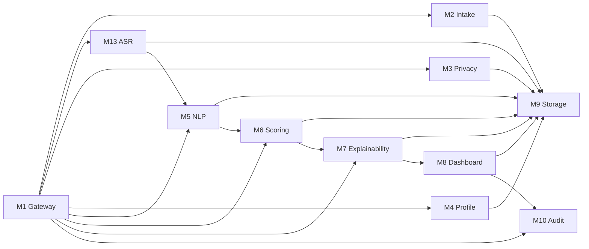

# Каталог модулей

---

## Структура документа

- [Обзор](#обзор)
- [Диаграмма 1. Карта взаимодействия модулей](#диаграмма-1-карта-взаимодействия-модулей)
- [M1 Gateway](#m1-gateway)
- [M2 Intake](#m2-intake)
- [M3 Privacy](#m3-privacy)
- [M4 Profile](#m4-profile)
- [M5 NLP](#m5-nlp)
- [M6 Scoring](#m6-scoring)
- [M7 Explainability](#m7-explainability)
- [M8 Dashboard](#m8-dashboard)
- [M9 Storage](#m9-storage)
- [M10 Audit](#m10-audit)
- [M13 ASR](#m13-asr)

---

## Обзор

Этот документ собирает полное функциональное описание серверных модулей в одном месте. Он отделяет модульную документацию от общей архитектуры и API, чтобы описание каждого блока не смешивалось с системным уровнем.

---

## Диаграмма 1. Карта взаимодействия модулей

---

## M1 Gateway

### Назначение

`M1` является публичной серверной точкой входа. Он публикует HTTP-методы, координирует активный конвейер и возвращает унифицированные ответы API.

### Функциональная зона

- публикует методы приема заявок;
- публикует методы запуска полного конвейера;
- публикует методы прямого скоринга M6;
- координирует порядок вызова модулей;
- нормализует успешные и ошибочные ответы API.

### Вход

- сырые данные заявок;
- канонический `SignalEnvelope` для прямого скоринга;
- массивы заявок для последовательной пакетной обработки.

### Выход

- ответы приема заявок с идентификаторами кандидатов;
- ответы полного конвейера со скорингом и объяснениями;
- ответы прямого скоринга и оценки.

### Файлы

| Файл | Ответственность |
|---|---|
| `backend/app/modules/m1_gateway/router.py` | Публичные маршруты |
| `backend/app/modules/m1_gateway/orchestrator.py` | Координация всего конвейера |

---

## M2 Intake

### Назначение

`M2` проверяет входящую заявку и создает первичную запись кандидата, на которую затем опирается весь конвейер.

### Функциональная зона

- проверяет структуру заявки;
- рассчитывает начальную полноту данных;
- извлекает административные признаки допустимости;
- сохраняет начальную запись;
- возвращает `candidate_id` и состояние приема.

### Вход

- сырые данные формы;
- выбранная программа;
- ссылки на контент, включая эссе и видео.

### Выход

- идентификатор записи приема;
- полнота данных;
- первичные флаги допустимости и качества.

### Файлы

| Файл | Ответственность |
|---|---|
| `backend/app/modules/m2_intake/schemas.py` | Контракты приема заявки |
| `backend/app/modules/m2_intake/service.py` | Проверка и сохранение |
| `backend/app/modules/m2_intake/router.py` | Конечная точка приема |

---

## M3 Privacy

### Назначение

`M3` обеспечивает разделение данных по уровням доступа и формирует безопасный вход для моделей.

### Функциональная зона

- разделяет данные кандидата на три слоя;
- оставляет персональные данные только в первом слое;
- переносит служебные сведения во второй слой;
- формирует очищенное содержимое для моделей в третьем слое;
- скрывает явные идентификаторы в тексте.

### Вход

- сырые данные кандидата;
- расшифровка ASR и флаги качества, если они доступны.

### Выход

- первый слой с защищенными персональными данными;
- второй слой со служебной метаинформацией;
- третий слой с безопасными для моделей данными.

### Файлы

| Файл | Ответственность |
|---|---|
| `backend/app/modules/m3_privacy/redactor.py` | Очистка текста от персональных данных |
| `backend/app/modules/m3_privacy/separator.py` | Логика разделения по слоям |
| `backend/app/modules/m3_privacy/service.py` | Сохранение и координация слоев |

---

## M4 Profile

### Назначение

`M4` собирает единый `CandidateProfile` из безопасных материалов и служебной метаинформации.

### Функциональная зона

- объединяет второй и третий слой в один профиль;
- переносит полноту данных и технические флаги;
- включает метаданные ASR для следующих модулей;
- отдает нормализованный объект для NLP и скоринга.

### Вход

- второй слой со служебной метаинформацией;
- третий слой с безопасным содержимым.

### Выход

- канонический `CandidateProfile`.

### Файлы

| Файл | Ответственность |
|---|---|
| `backend/app/modules/m4_profile/schemas.py` | Схема профиля кандидата |
| `backend/app/modules/m4_profile/assembler.py` | Сборка профиля |
| `backend/app/modules/m4_profile/service.py` | Координация сборки профиля |

---

## M5 NLP

### Назначение

`M5` извлекает структурированные сигналы решений из безопасного текста, расшифровки интервью, ответов внутреннего теста и описаний проектов.

### Функциональная зона

- нормализует безопасные входы в переиспользуемые наборы источников;
- вызывает Gemini для группового извлечения сигналов;
- использует резервное эвристическое извлечение при необходимости;
- применяет эмбеддинги и проверки согласованности как вспомогательный слой;
- формирует канонический `SignalEnvelope` для `M6`.

### Вход

- candidate id;
- selected program;
- essay text;
- redacted transcript;
- internal test answers;
- project descriptions;
- experience summary;
- completeness и data flags.

### Выход

- `SignalEnvelope`;
- значения сигналов, уверенность, источники, доказательства и краткие обоснования;
- нормализованный `program_id` для скоринга.

### Файлы

| Файл | Ответственность |
|---|---|
| `backend/app/modules/m5_nlp/schemas.py` | Валидация запроса и ограничений |
| `backend/app/modules/m5_nlp/source_bundle.py` | Сбор безопасных текстовых источников |
| `backend/app/modules/m5_nlp/gemini_client.py` | Интеграция с Gemini |
| `backend/app/modules/m5_nlp/extractor.py` | Резервное эвристическое извлечение |
| `backend/app/modules/m5_nlp/signal_extraction_service.py` | Координация извлечения сигналов |
| `backend/app/modules/m5_nlp/embeddings.py` | Семантическое сравнение и эмбеддинги |
| `backend/app/modules/m5_nlp/ai_detector.py` | Вспомогательные проверки на неаутентичность |
| `backend/app/modules/m5_nlp/client.py` | Безопасный резервный путь локальной расшифровки |

---

## M6 Scoring

### Назначение

`M6` преобразует структурированные сигналы в итоговый балл приоритетности, категорию рекомендации, поля ранжирования и правила маршрутизации на проверку.

### Функциональная зона

- рассчитывает детерминированные промежуточные оценки;
- рассчитывает базовый балл по правилам;
- уточняет балл через `GradientBoostingRegressor`;
- применяет профили весов по программам;
- формирует уверенность, неопределенность и поля направления на проверку;
- готовит поля для объяснений в `M7`.

### Зачем нужен `program_fit`

`program_fit` отвечает за соответствие между направлением кандидата и выбранной программой. Он показывает, совпадают ли цели, проекты, интересы и примеры кандидата с программой, на которую он подается.

Это нужно, чтобы система различала:

- сильного кандидата в целом;
- сильного кандидата именно для этой программы.

### Почему важны веса

Веса в `M6` определяют, какие измерения сильнее влияют на итоговый балл. Базовый профиль выше всего оценивает:

- лидерский потенциал;
- траекторию роста;
- ясность мотивации;
- инициативность и способность учиться.

Дальше профили по программам смещают акцент под контекст направления. Например, для медиа выше значимость ясности коммуникации, а для государственного управления выше значимость этического мышления.

### Вход

- канонический `SignalEnvelope`;
- выбранная программа и канонический `program_id`;
- полнота данных и технические флаги.

### Выход

- `CandidateScore`;
- `review_priority_index`;
- `recommendation_status`;
- `manual_review_required`;
- `human_in_loop_required`;
- `uncertainty_flag`;
- сильные стороны, риски и краткое итоговое пояснение.

### Файлы

| Файл | Ответственность |
|---|---|
| `backend/app/modules/m6_scoring/m6_scoring_config.yaml` | Основная конфигурация правил и весов |
| `backend/app/modules/m6_scoring/m6_scoring_config.py` | Типизированная загрузка конфигурации |
| `backend/app/modules/m6_scoring/program_policy.py` | Подбор профиля по программе |
| `backend/app/modules/m6_scoring/rules.py` | Базовая логика промежуточных оценок |
| `backend/app/modules/m6_scoring/confidence.py` | Уверенность и неопределенность |
| `backend/app/modules/m6_scoring/decision_policy.py` | Финальные рекомендации и правила проверки |
| `backend/app/modules/m6_scoring/ml_model.py` | Уточняющая модель GBR |
| `backend/app/modules/m6_scoring/service.py` | Координация скоринга |
| `backend/app/modules/m6_scoring/evaluation.py` | Средства оценки |
| `backend/app/modules/m6_scoring/optimization.py` | Подбор порогов |
| `backend/app/modules/m6_scoring/synthetic_data.py` | Синтетические примеры |
| `backend/app/modules/m6_scoring/ranker.py` | Пакетное ранжирование |

---

## M7 Explainability

### Назначение

`M7` преобразует `SignalEnvelope + CandidateScore` в понятные объяснения для проверяющего, которые можно показывать в интерфейсе или отчете.

### Функциональная зона

- собирает краткое описание кандидата;
- выбирает главные сильные стороны и предупреждающие блоки;
- связывает доказательства с факторами;
- формирует рекомендации для проверяющего;
- готовит проверяемый результат без повторного скоринга.

### Вход

- канонический `SignalEnvelope`;
- `CandidateScore` из `M6`.

### Выход

- summary;
- positive factors;
- caution blocks;
- evidence items;
- reviewer guidance.

### Файлы

| Файл | Ответственность |
|---|---|
| `backend/app/modules/m7_explainability/schemas.py` | Контракты объяснений |
| `backend/app/modules/m7_explainability/factors.py` | Названия факторов и предупреждений |
| `backend/app/modules/m7_explainability/evidence.py` | Связь факторов с доказательствами |
| `backend/app/modules/m7_explainability/service.py` | Сборка объяснения |

---

## M8 Dashboard

### Назначение

`M8` зарезервирован под API проверяющего интерфейса.

### Текущее состояние

- в этой ветке это только заготовка;
- в будущем должен отдавать списки ранжирования, карточки кандидатов и действия проверяющего.

### Файлы

| Файл | Ответственность |
|---|---|
| `backend/app/modules/m8_dashboard/router.py` | Будущие маршруты интерфейса |
| `backend/app/modules/m8_dashboard/service.py` | Будущая логика интерфейса |
| `backend/app/modules/m8_dashboard/schemas.py` | Будущие контракты интерфейса |

---

## M9 Storage

### Назначение

`M9` предоставляет слой хранения и доступа к данным, который используют активные модули.

### Функциональная зона

- хранит записи кандидатов и слои данных;
- хранит сигналы NLP, оценки и объяснения;
- предоставляет методы чтения и записи;
- служит опорой хранения для всего конвейера.

### Файлы

| Файл | Ответственность |
|---|---|
| `backend/app/modules/m9_storage/models.py` | SQLAlchemy-модели |
| `backend/app/modules/m9_storage/repository.py` | Методы доступа к данным |

---

## M10 Audit

### Назначение

`M10` зарезервирован под журналы аудита и отслеживание действий проверяющего.

### Текущее состояние

- в этой ветке это только заготовка;
- в будущем должен хранить изменения решений, действия проверяющих и события конвейера.

### Файлы

| Файл | Ответственность |
|---|---|
| `backend/app/modules/m10_audit/logger.py` | Будущие средства журналирования |
| `backend/app/modules/m10_audit/service.py` | Будущий сервис аудита |
| `backend/app/modules/m10_audit/router.py` | Будущие маршруты аудита |

---

## M13 ASR

### Назначение

`M13` расшифровывает аудио или видео интервью и формирует показатели качества расшифровки для остального конвейера.

### Функциональная зона

- безопасно принимает медиавход;
- вызывает Groq `whisper-large-v3-turbo`;
- нормализует сегменты расшифровки;
- рассчитывает уверенность и флаги качества;
- выставляет `requires_human_review` для низкокачественной расшифровки.

### Вход

- candidate id;
- media path или URL;
- дополнительные языковые подсказки.

### Выход

- текст расшифровки;
- список сегментов;
- значения уверенности;
- флаги качества;
- `requires_human_review`.

### Файлы

| Файл | Ответственность |
|---|---|
| `backend/app/modules/m13_asr/schemas.py` | Контракты ASR |
| `backend/app/modules/m13_asr/downloader.py` | Безопасная работа с медиавходом |
| `backend/app/modules/m13_asr/transcriber.py` | Интеграция с Groq Whisper |
| `backend/app/modules/m13_asr/quality_checker.py` | Оценка качества расшифровки |
| `backend/app/modules/m13_asr/service.py` | Координация расшифровки |

---

Projet Documentation
