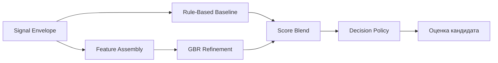

# Scoring и decision policy

---

## Структура документа

- [Назначение](#назначение)
- [Входные данные](#входные-данные)
- [Критерии оценки](#критерии-оценки)
- [Почему выбраны именно эти критерии](#почему-выбраны-именно-эти-критерии)
- [Что означает Program Fit](#что-означает-program-fit)
- [Формула оценки](#формула-оценки)
- [Почему важны веса](#почему-важны-веса)
- [Профили весов с учетом программы](#профили-весов-с-учетом-программы)
- [AI Detect как дополнительный сигнал](#ai-detect-как-дополнительный-сигнал)
- [Категории решений](#категории-решений)
- [Human-in-the-Loop routing](#human-in-the-loop-routing)
- [Контур оценки](#контур-оценки)

---

## Назначение

Этап `Scoring` преобразует структурированный output extraction в auditable decision-support output для приемной комиссии. Он объединяет deterministic scoring, ML refinement, confidence estimation, program-aware routing и явную эскалацию в manual review.

В интерфейсе главный числовой результат показывается как **Оценка кандидата**. В API и backend-коде он по-прежнему соответствует persisted field `rpi_score`.

---

## Входные данные

Этап `Scoring` потребляет canonical signal envelope, включающий:

- id кандидата
- выбранную программу
- canonical program id
- completeness
- data flags
- structured signals
- дополнительные caution markers из `AI Detect`, если они доступны

Каждый structured signal содержит:

- normalized value
- confidence
- source list
- evidence snippets
- compact reasoning

---

## Критерии оценки

Scoring policy использует следующие критерии:

| Критерий | Смысл |
|---|---|
| `leadership_potential` | лидерское поведение, ответственность, координация |
| `growth_trajectory` | устойчивость, обучение, прогресс после ошибок |
| `motivation_clarity` | ясность целей и причины подачи |
| `initiative_agency` | самостоятельное действие и проактивность |
| `learning_agility` | способность быстро адаптироваться и учиться |
| `communication_clarity` | ясность, структура и внятность коммуникации |
| `ethical_reasoning` | справедливость, качество суждений, гражданская ответственность |
| `program_fit` | соответствие траектории кандидата выбранной программе |

---

## Почему выбраны именно эти критерии

Scoring design намеренно избегает одного непрозрачного “впечатления” о кандидате. Каждый критерий изолирует один значимый для reviewer аспект потенциала:

- `leadership_potential` проверяет, берет ли кандидат ответственность и влияет ли на результат
- `growth_trajectory` проверяет, учится ли кандидат на ошибках и показывает ли восходящую динамику
- `motivation_clarity` проверяет, понимает ли кандидат, зачем он подается
- `initiative_agency` проверяет, действует ли кандидат без ожидания идеальных условий
- `learning_agility` проверяет, умеет ли кандидат адаптироваться и воспринимать feedback
- `communication_clarity` проверяет, может ли кандидат достаточно ясно объяснять идеи для совместной учебы и работы
- `ethical_reasoning` проверяет, проявляет ли кандидат справедливость, ответственность и зрелость суждений
- `program_fit` проверяет, соответствует ли выбранный академический трек заявленной траектории кандидата

Эти критерии выбраны так, чтобы выявлять ранний потенциал, а не только polished self-presentation.

---

## Что означает Program Fit

`program_fit` не означает демографическое, социальное или личностное соответствие. Он означает только одно узкое и проверяемое свойство:

- насколько цели, интересы, примеры и словарь кандидата согласуются с выбранной академической программой

На уровне конфигурации `program_fit` сейчас вычисляется из upstream alignment signals, построенных на этапе extraction. Эти сигналы должны опираться только на safe evidence:

- transcript content
- essay intent
- examples, приведенные кандидатом
- reasoning в internal answers, где это уместно

Это важно, потому что даже сильный кандидат может быть слабо согласован именно с тем треком, который он выбрал.

---

## Формула оценки

### Rule-based baseline

Базовая оценка рассчитывается из взвешенных критериев:

```text
baseline_rpi =
  w1 * leadership_potential +
  w2 * growth_trajectory +
  w3 * motivation_clarity +
  w4 * initiative_agency +
  w5 * learning_agility +
  w6 * communication_clarity +
  w7 * ethical_reasoning +
  w8 * program_fit
```

Точные веса настраиваются в:

- `backend/app/modules/scoring/scoring_config.yaml`

### ML refinement

Слой ML refinement использует `GradientBoostingRegressor`:

```text
final_raw_score = blend(baseline_rpi, ml_rpi)
```

### Decision policy

Финальный decision layer применяет:

- threshold bands
- completeness penalties, если они включены
- confidence и uncertainty logic
- manual-review routing
- program-aware policy profiles

---

## Почему важны веса

Веса — это policy layer, который определяет, какие критерии должны сильнее влиять на итоговую оценку кандидата, когда evidence смешанное.

Базовый профиль по умолчанию:

| Критерий | Вес по умолчанию | Почему это важно |
|---|---:|---|
| `leadership_potential` | `0.20` | Система должна поднимать будущих changemakers, поэтому ответственность и влияние важнее всего. |
| `growth_trajectory` | `0.18` | Рост и устойчивость критичны для early-stage applicants. |
| `motivation_clarity` | `0.15` | Сильное намерение снижает риск случайной или слабосвязанной подачи. |
| `initiative_agency` | `0.15` | Инициативность — ключевой маркер раннего потенциала. |
| `learning_agility` | `0.12` | Скорость обучения важна, но не должна доминировать над ростом и инициативой. |
| `communication_clarity` | `0.10` | Ясная речь важна, но не должна чрезмерно вознаграждать только polished style. |
| `ethical_reasoning` | `0.05` | Этическое суждение важно, но работает как балансирующий критерий. |
| `program_fit` | `0.05` | Fit важен, но не должен чрезмерно наказывать сильных кандидатов за несовершенную формулировку. |

---

## Профили весов с учетом программы

Разные треки требуют разного акцента, поэтому `Scoring` переопределяет базовый профиль через program-aware weights.

### Зачем нужны эти профили

Их цель не в том, чтобы оценивать кандидатов через личностные стереотипы. Их цель — сместить веса в сторону evidence, наиболее релевантного конкретному треку.

### Текущая логика по программам

| Программа | Основной акцент | Почему |
|---|---|---|
| `general_admissions` | лидерство, рост, мотивация | Нейтральный baseline для смешанных или неопределенных кейсов. |
| `creative_engineering` | инициативность, обучаемость, program fit | Engineering tracks поощряют эксперименты и problem-solving action. |
| `digital_products_and_services` | инициативность, коммуникация, program fit | Product work требует проактивности и ясной коммуникации. |
| `sociology_of_innovation_and_leadership` | лидерство, ethical reasoning, program fit | Этот трек ценит системное мышление и people-centered leadership. |
| `public_governance_and_development` | ethical reasoning, коммуникация, лидерство | Governance tracks требуют ответственности и институционального мышления. |
| `digital_media_and_marketing` | коммуникация, инициативность, мотивация | Media и marketing опираются на ясность, awareness аудитории и проактивное создание. |

### Диаграмма 1. Поток scoring



---

## AI Detect как дополнительный сигнал

`AI Detect` — это дополнительный этап, а не замена решению комиссии.

Он может вносить:

- consistency checks между transcript, essay и safe content
- caution markers вроде authenticity risk
- дополнительное evidence для explanation blocks и review комиссии

Эти сигналы предназначены для того, чтобы:

- информировать `Scoring`
- обогащать `Explanation`
- поддерживать human review

Их нельзя интерпретировать как полностью автономный plagiarism verdict.

---

## Категории решений

Основные recommendation categories:

- `STRONG_RECOMMEND`
- `RECOMMEND`
- `WAITLIST`
- `DECLINED`

Эти категории отделены и от manual-review routing, и от финального решения комиссии.

---

## Human-in-the-Loop routing

Поля review-routing:

- `manual_review_required`
- `human_in_loop_required`
- `uncertainty_flag`
- `review_recommendation`

Это позволяет этапу `Scoring` выражать отдельно:

- стабильную recommendation category
- решение об эскалации
- confidence signal

---

## Контур оценки

Evaluation bundle расположен в:

`backend/tests/scoring/`

Он поддерживает:

- сравнение baseline и GBR
- balanced и stress scenarios
- threshold и decision-policy optimization
- notebook review
- экспорт CSV и JSON-отчетов
