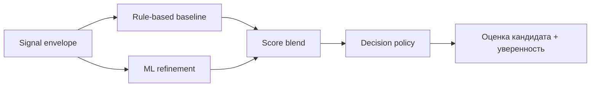
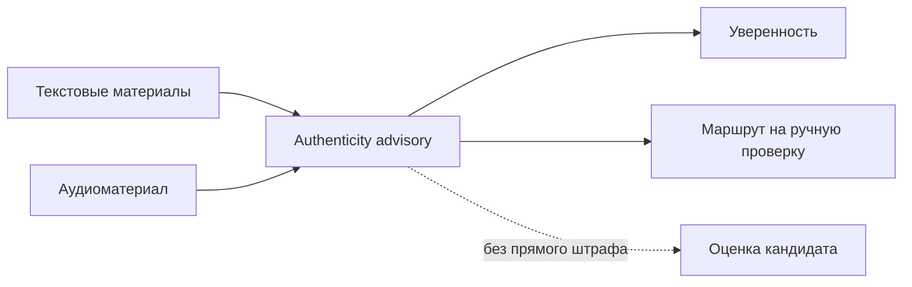

# Скоринг и advisory-контур аутентичности

---

## Назначение

Этап `Scoring` преобразует структурированный результат extraction в решение-подсказку для приемной комиссии. На выходе формируются:

- оценка кандидата
- уверенность
- рекомендательный статус
- маршрут на ручную проверку
- caution flags

Оценка кандидата не является финальным решением о зачислении. Итоговое решение принимает комиссия.

---

## Входные данные

Скоринг использует canonical signal envelope, в который входят:

- id кандидата
- выбранная программа
- completeness
- data flags
- извлеченные сигналы
- evidence из эссе и транскрипции
- advisory-флаги аутентичности, если они доступны

---

## Базовые критерии

Текущая оценка строится по восьми критериям:

| Критерий | Смысл |
|---|---|
| `leadership_potential` | ответственность, координация, влияние |
| `growth_trajectory` | рост после ошибок, устойчивость |
| `motivation_clarity` | ясность целей и причин подачи |
| `initiative_agency` | самостоятельное действие и проактивность |
| `learning_agility` | скорость адаптации и обучения |
| `communication_clarity` | ясность и структура выражения мысли |
| `ethical_reasoning` | справедливость, ответственность, зрелость суждений |
| `program_fit` | соответствие выбранной академической траектории |

---

## Структура оценки

Скоринг состоит из трех слоев:

1. rule-based baseline
2. ML refinement
3. decision policy и confidence routing

В интерфейсе главный числовой результат показывается как **Оценка кандидата**.

### Диаграмма 1. Сборка оценки

---

## Уверенность и маршрутизация

Уверенность хранится отдельно от оценки.

Это позволяет:

- сохранять стабильную оценку кандидата
- снижать уверенность при слабом качестве evidence
- переводить деградировавшие кейсы в manual review
- показывать caution flags без автоматического отказа кандидату

Поля review-routing:

- `manual_review_required`
- `human_in_loop_required`
- `uncertainty_flag`
- `review_recommendation`

---

## Advisory-контур аутентичности

Система больше не описывает этот слой как жесткий `AI detect`.

Теперь используется **Authenticity advisory** — вспомогательный контур, который формирует:

- риск неаутентичного текста
- сигналы рассогласования между источниками
- риск синтетической речи
- caution flags для комиссии

Эти сигналы:

- **не** снижают напрямую оценку кандидата
- могут снижать уверенность
- могут усиливать или включать manual review
- показываются комиссии как advisory-сигналы

### Аутентичность аудио

Аудиоконтур может выставить флаг `speech_authenticity_risk`, если запись выглядит неестественно ровной. Это caution-сигнал, а не автоматическое доказательство синтетической речи.

### Диаграмма 2. Поведение advisory-контура

---

## Веса с учетом программы

Скоринг использует program-aware weight profiles, чтобы разные программы делали акцент на разных типах evidence. Цель не в том, чтобы кодировать стереотипы, а в том, чтобы соотнести веса с требованиями академического трека.

Примеры:

- цифровые медиа и маркетинг: коммуникация, инициатива, мотивация
- creative engineering: инициатива, обучаемость, fit
- public governance: этическое мышление, коммуникация, лидерство

---

## Категории решений

Основные recommendation categories:

- `STRONG_RECOMMEND`
- `RECOMMEND`
- `WAITLIST`
- `DECLINED`

Эти категории отделены от:

- уверенности
- маршрутизации на manual review
- итогового решения председателя комиссии

---

## Позиционирование оценки

Текущую систему нужно защищать как **decision-support и triage platform**, а не как полностью валидированную автономную admissions-модель.

На текущем этапе:

- синтетическая оценка используется для development и stress testing
- финальное решение всегда остается у комиссии
- authenticity advisory — это caution-layer, а не plagiarism verdict
- degraded pipeline должен показываться явно

---

## Текущая реализация

Конфигурация скоринга находится в:

- `backend/app/modules/scoring/scoring_config.yaml`

Тесты и evaluation artifacts расположены в:

- `backend/tests/scoring/`

Рекомендуемые эксплуатационные метрики:

- average latency
- p95 latency
- degraded pipeline rate
- manual review rate
- authenticity advisory rate
- ASR low-confidence rate
