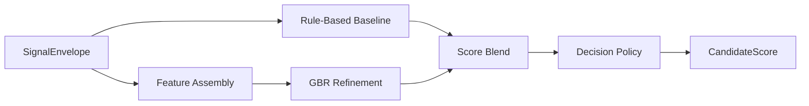
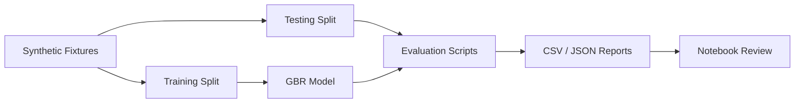

# Скоринг и правила решений

---

## Структура документа

- [Назначение](#назначение)
- [Входные данные](#входные-данные)
- [Sub-scores](#sub-scores)
- [Зачем нужны эти sub-scores](#зачем-нужны-эти-sub-scores)
- [Что означает program_fit](#что-означает-program_fit)
- [Формула скоринга](#формула-скоринга)
- [Почему важны веса](#почему-важны-веса)
- [Program-aware profiles](#program-aware-profiles)
- [Категории решений](#категории-решений)
- [Human-in-the-Loop routing](#human-in-the-loop-routing)
- [Evaluation workflow](#evaluation-workflow)

---

## Назначение

`M6` преобразует structured NLP signals в auditable decision-support output для приемной комиссии. Модуль совмещает deterministic scoring, ML refinement, confidence estimation, program-aware routing и явную manual-review эскалацию.

---

## Входные данные

`M6` принимает canonical `SignalEnvelope`, который содержит:

- candidate id
- selected program
- canonical program id
- completeness
- data flags
- structured signals

Каждый сигнал содержит:

- normalized value
- confidence
- source list
- evidence snippets
- compact reasoning

---

## Sub-scores

В scoring policy используются следующие sub-score группы:

| Sub-score | Смысл |
|---|---|
| `leadership_potential` | лидерство, ownership, coordination |
| `growth_trajectory` | resilience, learning, progress after setbacks |
| `motivation_clarity` | ясность мотивации и целей |
| `initiative_agency` | self-started action и proactive behavior |
| `learning_agility` | скорость адаптации и обучения |
| `communication_clarity` | ясность, структура, articulation |
| `ethical_reasoning` | fairness, decision quality, civic orientation |
| `program_fit` | соответствие кандидата выбранной программе |

---

## Зачем нужны эти sub-scores

Скоринг не должен быть одним непрозрачным impression score. Каждый sub-score вынесен отдельно, чтобы комиссия видела:

- есть ли у кандидата признаки лидерства;
- показывает ли он рост и способность учиться;
- понимает ли он, зачем подается;
- действует ли он проактивно;
- умеет ли он адаптироваться и обучаться;
- может ли ясно излагать мысли;
- есть ли у него здоровая этическая логика;
- насколько он попадает в выбранную программу.

Эти оси выбраны, чтобы ловить ранний потенциал, а не только умение красиво себя описать.

---

## Что означает program_fit

`program_fit` в `M6` не означает ни social fit, ни personality fit, ни demographic fit. Он означает только одно:

- насколько цели, интересы, проекты, примеры и язык кандидата совпадают с выбранной академической программой.

Сейчас на уровне конфига `program_fit` численно опирается на `program_alignment`, который приходит из `M5`. Этот upstream signal должен опираться только на безопасные источники:

- transcript;
- essay;
- project descriptions;
- internal test reasoning.

`program_fit` важен, потому что сильный по общему потенциалу кандидат может быть не оптимален для конкретной программы. Система должна отделять:

- высокий общий потенциал;
- высокий потенциал именно для этой траектории.

---

## Формула скоринга

### Rule-Based Baseline

Сначала считается deterministic baseline из взвешенных sub-scores:

```text
baseline_rpi =
  w1 * leadership_potential +
  w2 * growth_trajectory +
  w3 * motivation_clarity +
  w4 * initiative_agency +
  w5 * learning_agility +
  w6 * communication_clarity +
  w7 * ethical_reasoning +
  w8 * program_fit
```

Точные веса задаются в:

- `backend/app/modules/m6_scoring/m6_scoring_config.yaml`

### ML Refinement

ML layer использует `GradientBoostingRegressor` для refinement baseline score.

```text
final_raw_score = blend(baseline_rpi, ml_rpi)
```

### Decision Policy

Финальный decision layer применяет:

- threshold bands
- completeness penalties where configured
- confidence и uncertainty logic
- manual-review routing
- program-aware policy profiles

---

## Почему важны веса

Веса в `M6` это policy layer, который решает, какие оси должны сильнее влиять на финальный score, когда evidence смешанное. Без них каждый sub-score был бы равноважным, что для admissions support было бы слишком грубо.

Базовый profile выглядит так:

| Sub-score | Вес | Зачем |
|---|---:|---|
| `leadership_potential` | `0.20` | Система ищет будущих change agents, поэтому ownership и influence важнее всего. |
| `growth_trajectory` | `0.18` | Для школьного возраста рост и resilience не менее важны, чем текущий result. |
| `motivation_clarity` | `0.15` | Ясная мотивация снижает риск случайной или weak-fit подачи. |
| `initiative_agency` | `0.15` | Инициатива является ключевым маркером раннего потенциала. |
| `learning_agility` | `0.12` | Способность к обучению очень важна, но не должна перекрывать initiative и growth. |
| `communication_clarity` | `0.10` | Система не должна переоценивать одну только polished communication. |
| `ethical_reasoning` | `0.05` | Этическая логика важна, но работает как балансирующее измерение. |
| `program_fit` | `0.05` | Fit важен, но не должен наказывать promising candidate только за imperfect wording. |

Эта схема специально уменьшает шанс, что кандидат получит высокий score только за polished style или keyword stuffing.

---

## Program-aware profiles

Разные программы требуют разных акцентов, поэтому `M6` меняет веса в зависимости от `program_id`.

### Зачем это нужно

Цель не в том, чтобы судить кандидатов по personality stereotypes. Цель в том, чтобы больше весить те evidence types, которые наиболее важны для конкретной траектории.

### Текущая логика по программам

| Program | Основной акцент | Почему |
|---|---|---|
| `general_admissions` | leadership, growth, motivation | Нейтральный admissions baseline для смешанных случаев. |
| `creative_engineering` | initiative, learning agility, program fit | Инженерные треки сильнее завязаны на build mindset, прототипирование и problem solving through action. |
| `digital_products_and_services` | initiative, communication, program fit | Product-направления требуют proactive execution, user thinking и понятного product communication. |
| `sociology_of_innovation_and_leadership` | leadership, ethical reasoning, program fit | Здесь важны values, inclusion, people-centered leadership и social systems thinking. |
| `public_governance_and_development` | ethical reasoning, communication, leadership | Governance-треки сильнее завязаны на judgment, public responsibility и institutional reasoning. |
| `digital_media_and_marketing` | communication, initiative, motivation | Медиа и маркетинг сильнее опираются на clarity, storytelling, audience awareness и proactive content creation. |

### Важное ограничение

Program-aware weighting меняет только важность explainable sub-scores. Он не добавляет в scoring gender, region, family background, income proxies или другие запрещенные fields.

### Диаграмма 1. Flow скоринга M6



---

## Категории решений

Основные recommendation categories:

- `STRONG_RECOMMEND`
- `RECOMMEND`
- `WAITLIST`
- `DECLINED`

---

## Human-in-the-Loop routing

Review-routing поля:

- `manual_review_required`
- `human_in_loop_required`
- `uncertainty_flag`
- `review_recommendation`

Это позволяет `M6` отдельно выражать:

- recommendation category;
- escalation decision;
- confidence signal.

---

## Evaluation workflow

Evaluation bundle расположен в:

`backend/tests/m6_scoring/`

Он поддерживает:

- baseline vs GBR comparison
- balanced vs stress scenarios
- threshold и decision-policy optimization
- notebook review
- CSV и JSON report export

### Диаграмма 2. Evaluation workflow



---

Projet Documentation
