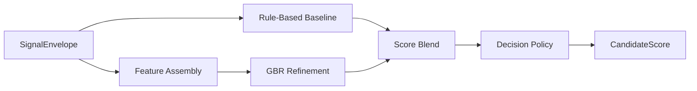
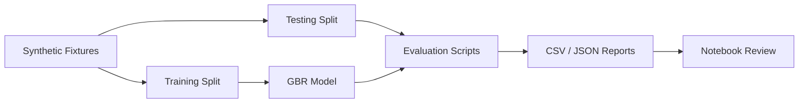

# Скоринг и правила решений

---

## Структура документа

- [Назначение](#назначение)
- [Входные данные](#входные-данные)
- [Sub-scores](#sub-scores)
- [Формула скоринга](#формула-скоринга)
- [Категории решений](#категории-решений)
- [Human-in-the-Loop routing](#human-in-the-loop-routing)
- [Evaluation workflow](#evaluation-workflow)

---

## Назначение

`M6` преобразует structured NLP signals в auditable decision-support output для приемной комиссии. Модуль совмещает deterministic scoring, ML refinement, confidence estimation, program-aware routing и явную manual-review эскалацию.

---

## Входные данные

`M6` принимает canonical `SignalEnvelope`, который содержит:

- candidate id
- selected program
- canonical program id
- completeness
- data flags
- structured signals

Каждый сигнал содержит:

- normalized value
- confidence
- source list
- evidence snippets
- compact reasoning

---

## Sub-scores

В scoring policy используются следующие sub-score группы:

| Sub-score | Смысл |
|---|---|
| `leadership_potential` | лидерство, ownership, coordination |
| `growth_trajectory` | resilience, learning, progress after setbacks |
| `motivation_clarity` | ясность мотивации и целей |
| `initiative_agency` | self-started action и proactive behavior |
| `learning_agility` | скорость адаптации и обучения |
| `communication_clarity` | ясность, структура, articulation |
| `ethical_reasoning` | fairness, decision quality, civic orientation |
| `program_fit` | соответствие кандидата выбранной программе |

---

## Формула скоринга

### Rule-Based Baseline

Сначала считается deterministic baseline из взвешенных sub-scores:

```text
baseline_rpi =
  w1 * leadership_potential +
  w2 * growth_trajectory +
  w3 * motivation_clarity +
  w4 * initiative_agency +
  w5 * learning_agility +
  w6 * communication_clarity +
  w7 * ethical_reasoning +
  w8 * program_fit
```

Точные веса задаются в:

- `backend/app/modules/m6_scoring/m6_scoring_config.yaml`

### ML Refinement

ML layer использует `GradientBoostingRegressor` для refinement baseline score.

```text
final_raw_score = blend(baseline_rpi, ml_rpi)
```

### Decision Policy

Финальный decision layer применяет:

- threshold bands
- completeness penalties where configured
- confidence и uncertainty logic
- manual-review routing
- program-aware policy profiles

### Диаграмма 1. Flow скоринга M6



---

## Категории решений

Основные recommendation categories:

- `STRONG_RECOMMEND`
- `RECOMMEND`
- `WAITLIST`
- `DECLINED`

---

## Human-in-the-Loop routing

Review-routing поля:

- `manual_review_required`
- `human_in_loop_required`
- `uncertainty_flag`
- `review_recommendation`

Это позволяет `M6` отдельно выражать:

- recommendation category;
- escalation decision;
- confidence signal.

---

## Evaluation workflow

Evaluation bundle расположен в:

`backend/tests/m6_scoring/`

Он поддерживает:

- baseline vs GBR comparison
- balanced vs stress scenarios
- threshold и decision-policy optimization
- notebook review
- CSV и JSON report export

### Диаграмма 2. Evaluation workflow



---

Projet Documentation
