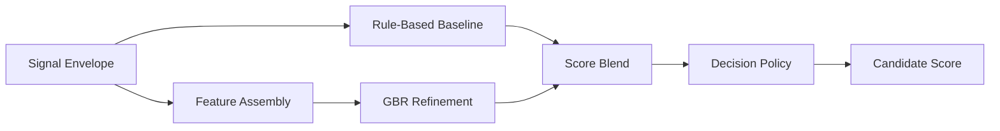

# РЎРєРѕСЂРёРЅРі Рё правила решений

---

## Структура документа

- [Назначение](#назначение)
- [Входные данные](#входные-данные)
- [Оценочные измерения](#оценочные-измерения)
- [Зачем нужны эти измерения](#зачем-нужны-эти-измерения)
- [Что означает program fit](#что-означает-program-fit)
- [Формула скоринга](#формула-скоринга)
- [Почему важны веса](#почему-важны-веса)
- [Program-aware profiles](#program-aware-profiles)
- [AI Detect как дополнительный сигнал](#ai-detect-как-дополнительный-сигнал)
- [Категории рекомендаций](#категории-рекомендаций)
- [Human-in-the-Loop routing](#human-in-the-loop-routing)
- [Evaluation workflow](#evaluation-workflow)

---

## Назначение

Этап `Scoring` преобразует структурированные extraction-результаты в auditable decision-support output для приемной комиссии. Он совмещает deterministic scoring, ML refinement, confidence estimation, program-aware routing и явную manual-review эскалацию.

В интерфейсе основной числовой результат показывается как **Оценка кандидата**. В API и backend-коде эта величина по-прежнему хранится в поле `rpi_score`.

---

## Входные данные

Этап `Scoring` принимает канонический signal envelope, в который входят:

- candidate id
- selected program
- canonical program id
- completeness
- data flags
- structured signals
- дополнительные caution markers из `AI Detect`, если они доступны

Каждый структурированный сигнал содержит:

- normalized value
- confidence
- source list
- evidence snippets
- compact reasoning

---

## Оценочные измерения

В scoring policy используются следующие измерения:

| Измерение | Смысл |
|---|---|
| `leadership_potential` | лидерство, ownership, coordination |
| `growth_trajectory` | resilience, learning, progress after setbacks |
| `motivation_clarity` | ясность целей и причины подачи |
| `initiative_agency` | self-started action Рё proactive behavior |
| `learning_agility` | способность быстро адаптироваться и учиться |
| `communication_clarity` | ясность, структура, articulation |
| `ethical_reasoning` | fairness, decision quality, civic orientation |
| `program_fit` | соответствие траектории кандидата выбранной программе |

---

## Зачем нужны эти измерения

Скоринг не должен быть одним непрозрачным impression score. Каждое измерение вынесено отдельно, чтобы комиссия видела:

- есть ли у кандидата признаки лидерства и ответственности
- показывает ли он рост и способность учиться на ошибках
- понимает ли он, зачем подается
- действует ли он проактивно
- умеет ли он адаптироваться
- может ли ясно формулировать мысли
- есть ли у него здоровая этическая логика
- насколько он действительно попадает в выбранную программу

Эти оси выбраны, чтобы система фиксировала ранний потенциал, а не только polished self-presentation.

---

## Что означает program fit

`program_fit` не означает demographic fit, social fit или personality fit. Он означает только одно:

- насколько цели, интересы, примеры и язык кандидата совпадают с выбранной академической программой

На уровне конфигурации `program_fit` сейчас опирается на upstream alignment-сигналы из extraction-этапа. Эти сигналы должны строиться только на безопасных evidence:

- transcript content
- essay intent
- candidate examples
- internal-answer reasoning

Это важно, потому что сильный по общему потенциалу кандидат может быть не лучшим совпадением именно для выбранного трека.

---

## Формула скоринга

### Rule-Based Baseline

Базовый score считается из взвешенных оценочных измерений:

```text
baseline_rpi =
  w1 * leadership_potential +
  w2 * growth_trajectory +
  w3 * motivation_clarity +
  w4 * initiative_agency +
  w5 * learning_agility +
  w6 * communication_clarity +
  w7 * ethical_reasoning +
  w8 * program_fit
```

Точные веса задаются в:

- `backend/app/modules/scoring/scoring_config.yaml`

### ML Refinement

ML refinement layer использует `GradientBoostingRegressor`:

```text
final_raw_score = blend(baseline_rpi, ml_rpi)
```

### Decision Policy

Финальный decision layer применяет:

- threshold bands
- completeness penalties where configured
- confidence Рё uncertainty logic
- manual-review routing
- program-aware policy profiles

---

## Почему важны веса

Веса являются policy layer, который решает, какие измерения должны сильнее влиять на итоговую оценку кандидата, когда evidence смешанное.

Базовый профиль выглядит так:

| Измерение | Вес | Зачем |
|---|---:|---|
| `leadership_potential` | `0.20` | Система ищет будущих change agents, поэтому ownership и influence важнее всего. |
| `growth_trajectory` | `0.18` | Для школьного возраста рост и resilience не менее важны, чем текущий результат. |
| `motivation_clarity` | `0.15` | Ясная мотивация снижает риск случайной или weak-fit подачи. |
| `initiative_agency` | `0.15` | Инициатива является ключевым маркером раннего потенциала. |
| `learning_agility` | `0.12` | Способность к обучению очень важна, но не должна перекрывать initiative и growth. |
| `communication_clarity` | `0.10` | Система не должна переоценивать только polished communication. |
| `ethical_reasoning` | `0.05` | Этическая логика важна, но работает как балансирующее измерение. |
| `program_fit` | `0.05` | Fit важен, но не должен избыточно наказывать promising candidate за imperfect wording. |

---

## Program-aware profiles

Разные программы требуют разных акцентов, поэтому `Scoring` меняет веса в зависимости от `program_id`.

### Зачем это нужно

Цель не в том, чтобы судить кандидатов по personality stereotypes. Цель в том, чтобы сильнее весить те evidence types, которые наиболее релевантны конкретной траектории.

### Текущая логика по программам

| Program | Основной акцент | Почему |
|---|---|---|
| `general_admissions` | leadership, growth, motivation | Нейтральный baseline для смешанных случаев. |
| `creative_engineering` | initiative, learning agility, program fit | Инженерные треки сильнее завязаны на experimentation и problem solving through action. |
| `digital_products_and_services` | initiative, communication, program fit | Product-направления требуют proactive execution и ясной коммуникации. |
| `sociology_of_innovation_and_leadership` | leadership, ethical reasoning, program fit | Здесь важны values, people-centered leadership и social systems thinking. |
| `public_governance_and_development` | ethical reasoning, communication, leadership | Governance-треки сильнее завязаны на judgment и public responsibility. |
| `digital_media_and_marketing` | communication, initiative, motivation | Media и marketing опираются на clarity, audience awareness и proactive creation. |

### Диаграмма 1. Flow этапа Scoring



---

## AI Detect как дополнительный сигнал

`AI Detect` является дополнительным этапом, а не заменой решения комиссии.

Он может давать:

- consistency checks между transcript, essay и safe content
- caution markers РїРѕ authenticity risk
- дополнительные evidence для explanation blocks и committee review

Эти сигналы предназначены для того, чтобы:

- информировать `Scoring`
- обогащать `Explanation`
- поддерживать human review

Их нельзя трактовать как полностью автономный plagiarism verdict.

---

## Категории рекомендаций

Основные recommendation categories:

- `STRONG_RECOMMEND`
- `RECOMMEND`
- `WAITLIST`
- `DECLINED`

Эти категории отделены и от manual-review routing, и от финального решения комиссии.

---

## Human-in-the-Loop routing

Review-routing поля:

- `manual_review_required`
- `human_in_loop_required`
- `uncertainty_flag`
- `review_recommendation`

Это позволяет этапу `Scoring` отдельно выражать:

- recommendation category
- escalation decision
- confidence signal

---

## Evaluation workflow

Evaluation bundle расположен в:

`backend/tests/scoring/`

Он поддерживает:

- baseline vs GBR comparison
- balanced vs stress scenarios
- threshold Рё decision-policy optimization
- notebook review
- CSV Рё JSON report export
